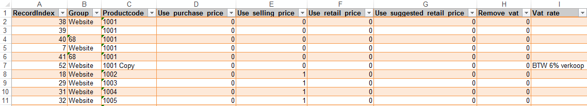

<properties>
	<page>
		<title>Importeren</title>
		<description>Importeren</description>
	</page>
	<menu>
		<position>Modules / Productenbeheer</position>
		<title>Producten importeren</title>
		<sort>D</sort>
	</menu>
</properties>

## Importeren Producten ##

Zoek in start naar Importeren

Om te importeren klik je eerst op 
*Producten importeren - Exporteren*

De geëxporteerde excel sheet bevat meerdere tabbladen, 
Kies het juiste tabblad de rest kan je verwijderen

**In de kolom Search_Field word aangegeven naar welk veld het systeem moet kijken tijdens het inlezen, in het tabel onder Search_field kan je de naam van de kolom ingeven** *Over het algemeen worden de velden productcode of recordindex gebruikt*

Je krijgt een hele lijst met kolommen, de kolommen die je niet gebruikt kan je verwijderen zodat je een overzicht houd, behalve de kolom Search_Field. Zie voor uitleg kolommen hieronder

(rechtermuisknop op de kolom en dan verwijderen)

Vul vervolgens alle kolommen in die nodig zijn. als je er niks aan hoef te veranderen kan je de waarde laten staan of geheel leeg maken (geen 0 van maken dan zal het overschreden worden)

Nu kan je het exportbestand opslaan op je bureaublad en afsluiten.

**Importeren**

Gebruik nu de knop "Klik hier om producten te importeren" om de producten te importeren. 
Zoek het juiste bestand op en selecteer deze.
Na de import verschijnt er een internet pagina met daarin het resultaat van de import.

 Je moet het Excel bestandje sluiten voordat je hem gaat importeren anders zal die een fout melding aangeven 

Je kan nu in Hybrid SaaS bij de producten de geïmporteerde gegevens terugvinden.

## De kolommen ##

# Blad Products #

Tabblad staat aangegeven tussen de ()

- RecordIndex
	- Identieke nummer van het product
- Search field
	- Veld om op te zoeken
- Productcode
	- *(Informatie)* **Productcode**
		- Bestaande worden overgenomen. Nieuwe worden aangemaakt (!Let op hoofdletters en kleine letters)
- Supplier
	- *(Informatie)* **Leverancier**
		- Bestaande worden overgenomen. Nieuwe worden aangemaakt (!Let op hoofdletters en kleine letters)
- Description
	- *(Informatie)* **Beschrijving**
- Details
	- *(Details)* **Details** 
- EAN13
	- *(Informatie)* **EAN13**
- Barcode
	- *(Informatie)* **Barcode**
- Purhase price advice
	- *(Prijzen)* **Advies inkoopprijs**
- Selling price
	- *(Prijzen)* **Verkoopprijs**
- Retail price factor
	- *(Prijzen) (Advies verkoop prijs)* **Bereken via factor op verkoopprijs**
- Retail price
	- *(Prijzen)* Advies verkoop prijs
- Suggested retail factor
	- *(Prijzen) (Voorgestelde verkoopprijs)* **Bereken via factor op verkoopprijs**

- Suggested retail price
	- *(Prijzen)* **Voorgestelde verkoopprijs**
- Vat
	- *(Prijzen) (Verkoopprijs)* **BTW** 
		- Alleen in te vullen met: De orginele benaming zoals in het systeem aangegeven
- Category
	- *(Informatie) (Subgroep)* **Hoofdgroep**
		- Bestaande worden overgenomen. Nieuwe worden aangemaakt (!Let op hoofdletters en kleine letters)
- Subcategory
	- *(Informatie)* **Subgroep**
		- Bestaande worden overgenomen. Nieuwe worden aangemaakt (!Let op hoofdletters en kleine letters)
- Unit
	- *(Informatie)* **Eenheid**
- Color
	- *(Informatie)* **Kleur**
		- Bestaande worden overgenomen. Nieuwe worden aangemaakt (!Let op hoofdletters en kleine letters)
- Used materials
	- *(Informatie)* **Materialen**
- Dimensions
	- *(Informatie)* **Maat**
		- Bestaande worden overgenomen. Nieuwe worden aangemaakt (!Let op hoofdletters en kleine letters, zelf de maataanduiding erbij vermelden)
- Purchase price
	- *(Prijzen)* **Inkoopprijs** 
- Packing unit
	- *(Instellingen)* **Verpakkings eenheid**
- Supplier number
	- *(Informatie)* **Lev. Code**
- Weight
	- *(Informatie)* **Gewicht**
- Taric code
	- *(Informatie)* **Goederen code**
- Country of origin
- Remarks
	- *(Details)* **Opmerkingen**
- Tags
	- *(Kenmerken)* **Kenmerken**
		- Bestaande worden overgenomen. Nieuwe worden aangemaakt (!Let op hoofdletters en kleine letters)
			- Via deze kolom word het product extra toegevoegd aan de kenmerk die je invult
- Replace tags
	- *(Kenmerken)* **Vervangende kenmerken**
		- Bestaande worden overgenomen. Nieuwe worden aangemaakt (!Let op hoofdletters en kleine letters)
			- Via deze kolom worden alle bestaande kenmerken verwijders uit het product en toegevoegd aan het kenmerk wat je hier invult
- Part of productcode
	- 

- Stockminimum
	- *(Instellingen)* **Minimale voorraad**
- Stock purchase delivery advice
	- *(Instellingen)* **Nabestel hoeveelheid**
- Collections
	- *(Collecties)* **Collecties**
		- Bestaande worden overgenomen. Nieuwe worden aangemaakt (!Let op hoofdletters en kleine letters)
- Product seasonality
	- *(Seizoenen)* **Seizoenen**
		- Alleen in te vullen met: De orginele benaming zoals in het systeem aangegeven
- Product brand
	- *(Informatie)* **Merk**
		- Bestaande worden overgenomen. Nieuwe worden aangemaakt (!Let op hoofdletters en kleine letters)
- Stockitem
	- *(Informatie)* **Voorraadverwerking vinkje**
		- Alleen in te vullen met: WAAR is vinkje aan/ONWAAR is vinkje uit
- Hidden
	- *(Informatie)* **Gearchiveerd vinkje**
		- Alleen in te vullen met: WAAR is vinkje aan/ONWAAR is vinkje uit
- Fixed price
	- *(Instellingen)* **Variable verkoop prijs uitschakelen voor dit product vinkje**
		- Alleen in te vullen met: WAAR is vinkje aan/ONWAAR is vinkje uit
- Fixed purchase price
	- *(Instellingen)* **Variable inkoop prijs uitschakelen voor dit product vinkje**
		- Alleen in te vullen met: WAAR is vinkje aan/ONWAAR is vinkje uit
- Base selling price
	- *(Instellingen)* **Basis verkoop prijs**
- Base purchase price
	-  *(Instellingen)* **Basis inkoop prijs**
- Product price	
- Length
	- *(Instellingen)* **Lengte (cm)**
- Width
	- *(Instellingen)* **Breedte (cm)**
- Height
	- *(Instellingen)* **Hoogte (cm)**
- Fixed discount
	- 

- Fixed discount
- Recurring cost
- Release date
	- *(Instellingen)* **Introductiedatum**
- Product dimension table
- Product color table
- Pre sale product
- Webshop
	- *(Informatie)* **Weergeven op webshop vinkje**

----------

# Blad Product NL#

- ReacordIndex
	- Identieke nummer van het product
- Search field
	- Veld om op te zoeken
- Productcode
	- **Productcode**
		- Bestaande worden overgenomen. Nieuwe worden aangemaakt (!Let op hoofdletters en kleine letters)
- CMS website NL
	- *(Titel)* **Website**
- CMS description NL
	- *(Titel)* **Omschrijving**
- CMS unit NL
	- *(Titel)* **Eenheid**
- CMS unit  materials NL
	- *(Titel)* **Materialen**
- CMS color NL
	- *(Titel)* **Kleur**
- CMS details NL
	- *(Titel)* **Details**
- CMS url NL
	- *(Titel)* **URL**
- CMS title NL
	- *(Titel)* **Titel**
- CMS keywords NL
	- *(Titel)* **Keywords**
- CMS CSS class NL
	- *(Titel)* **CSS class website**

----------
# Blad Prices#

Om deze te kunnen gebruiken moet je tabblad Product NL laten staan en deze sorteren op productcode
in het blad prices verwijder je de kolom recordindex

!LET OP, na elke inlezing van het importscript word er een nieuwe prijsmodel aangemaakt, je kan hem dus niet aanpassen op deze manier

- RecordIndex
	- Identieke nummer van het product
- Productcode
	- *(Informatie)* **Productcode**
		- deze moet gelijk zijn aan het product welke al bekend is in het systeem
- Factor
	- *(Prijzen)(Afwijkende prijsmodel)* **Factor**
- Division
	- *(Prijzen)(Afwijkende prijsmodel)* **Deler**
- Discount
	- *(Prijzen)(Afwijkende prijsmodel)* **Korting %**
- Original price
	- *(Prijzen)(Afwijkende prijsmodel)* **Originele prijs**
- Selling price
	- *(Prijzen)(Afwijkende prijsmodel)* **Verkoopprijs**
- Ammount
	- *(Prijzen)(Afwijkende prijsmodel)* **Vanaf aantal**
- Name
	- *(Prijzen)(Afwijkende prijsmodel)* **Groep**
		- Alleen in te vullen met: De orginele benaming zoals in het systeem aangegeven, anders blijft het leeg