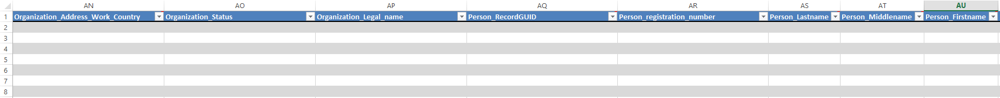
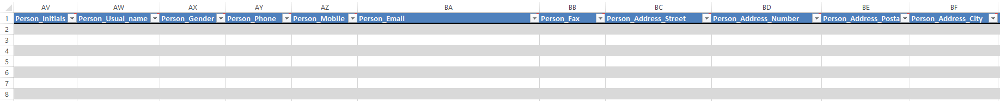
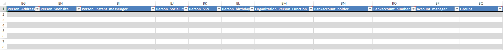
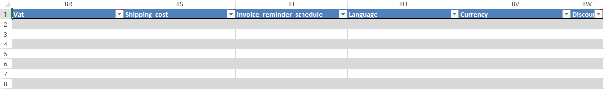

<properties>
	<page>
		<title>Relatie-import</title>
		<description>Relatie-import</description>
	</page>
	<menu>
		<position>Modules / Relatiebeheer</position>
		<title>Relatie importeren</title>
		<sort>D</sort>
	</menu>
</properties>

## Relatie importeren ##

<description>Om op een eenvoudige manier relaties in de database te krijgen is er een import module aanwezig. Hiermee kan je eenvoudig nieuwe relaties toevoegen of bestaande relaties aanpassen. Dit doe je niet als je voor één relaties iets wilt aanpassen maar vaak als je een massa mutatie gaat uitvoeren, waarbij je bijvoorbeeld bij iedere relaties iets wilt toevoegen en/of wijzigen.
</description>

**Om bestaande relaties te veranderen heb je de juiste relatiecode nodig. deze zal dan overschreden worden met de nieuwe informatie**

Zoek in start naar Importeren

Om te importeren klik je eerst op 
*Bedrijven importeren - Voorbeeldsheet*

Je krijgt een hele lijst met kolommen, Zie voor uitleg kolommen hieronder

Nu kan je het exportbestand opslaan op je bureaublad en afsluiten.

**Importeren**

Gebruik nu de knop "Klik hier om bedrijven te importeren" om de bedrijven te importeren. 
Zoek het juiste bestand op en selecteer deze.
Na de import verschijnt er een internet pagina met daarin het resultaat van de import.

 Je moet het Excel bestandje sluiten voordat je hem gaat importeren anders zal die een fout melding aangeven 

Je kan nu in Hybrid SaaS bij de Relaties de geïmporteerde gegevens terugvinden.

----------

## De kolommen ##

Tabblad staat aangegeven tussen de () en de veldnaam is **dik** gedrukt

# Blad Products #

- Organization address work country
- Organization status
	- *(N.A.W.)* **Status**
- Organization legal name
- Person recordGUID
	- **Persoonlijke recordnummer**
- Person registration number
	- *(Registratie/Familie)* **Registratienummer**
- Person lastname
	- *(N.A.W.)* **achternaam**
- Person middlename
	- *(N.A.W.)* **t.v.**
- Person firstname
	- *(N.A.W.)* **Voornaam**

- Person initials
	- *(N.A.W.)* **Initialen**
- Person usual Name
	- *(N.A.W.)* **Roepnaam**
- Person gender
	- *(N.A.W.)* **Geslacht**
- Person mobile
	- *(N.A.W.)* **Mobiel**
- Person email
	- *(N.A.W.)* **E-mail**
- Person fax
	- *(N.A.W.)* **Fax**
- Person address street
	- *(N.A.W.)* **Straat**
- Person address number
	- *(N.A.W.)* **Nummer**
- Person address postal code
	- *(N.A.W.)* **Postcode**
- Person address city
	- *(N.A.W.)* **Plaats**

- Person address
- Person website
	- *(N.A.W.)* **Website**
- Person instant messenger
	- *(N.A.W.)* **Messenger**
- Person social media
	- *(N.A.W.)* **Sociale media**
- Person SSN
	- *(Registratie/Familie)* **BSN nummer**
- Person Birthday
	- *(Registratie/Familie)* **Geboortedatum**
- Organization person function
	- *(N.A.W.)* **Functie**
- Bankaccount holder
	- *(Stamgegevens)* **Rekeninghouder**
- Bankaccount number
	- *(Stamgegevens)* **Oud rekeningnummer**
- Account manager
	- *(Stamgegevens)* **Account manager**
- Groups
	- *(Groepen)* **Groep**

- Vat
	- *(Stamgegevens)* **Verkoop btw**
- Shipping cost
	- *(Stamgegevens)* **Verzendkosten**
- Invoice reminder schedule
	- *(Stamgegevens)* **Document schema**
- Language
	- *(Stamgegevens)* **Taalcode**
- Currency
	- *(Stamgegevens)* **Valuta**
- Discount
	- *(Stamgegevens)* **Korting**

----------