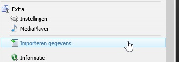
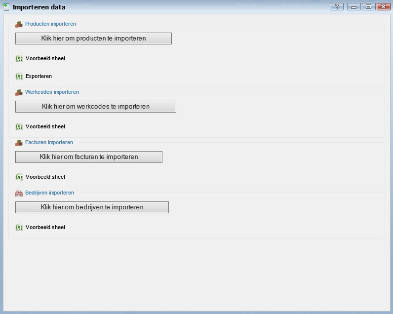
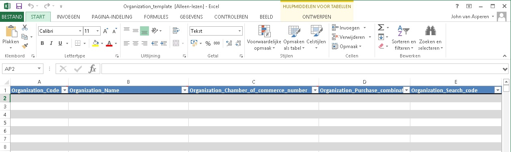
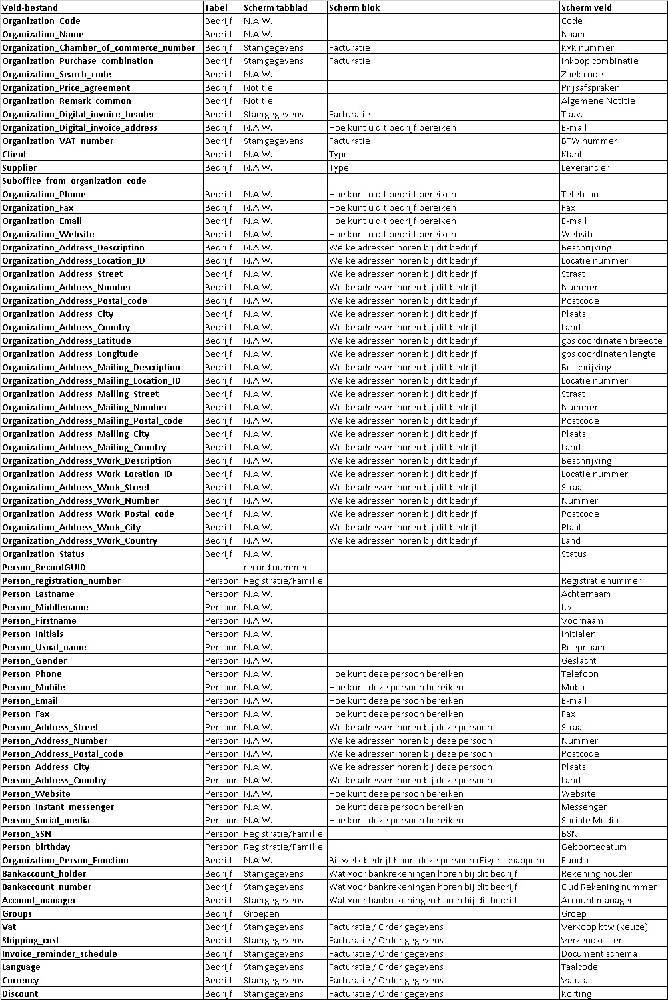
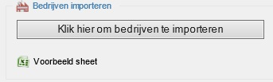
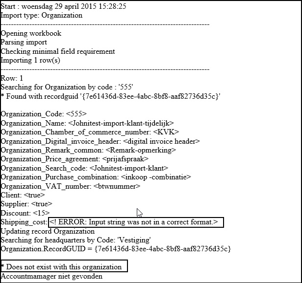

<properties>
	<page>
		<title>Relatie-import</title>
		<description>Relatie-import</description>
	</page>
	<menu>
		<position>Modules / Relatiebeheer</position>
		<title>Relatie importeren</title>
		<sort>D</sort>
	</menu>
</properties>

## Relatie importeren ##

<description>Om op een eenvoudige manier relaties in de database te krijgen is er een import module aanwezig. Hiermee kan je eenvoudig nieuwe relaties toevoegen of bestaande relaties aanpassen. Dit doe je niet als je voor één relatie iets wilt aanpassen maar vaak als je een massa mutatie gaat uitvoeren, waarbij je bijvoorbeeld bij iedere relatie iets wilt toevoegen en/of wijzigen.
</description>

**Voorbereiden en aanmaken importbestand**

Als je via de START knop naar Extra, Importeren gegevens gaat dan krijg je een scherm waarbij je een 4-tal imports kan kiezen.

Voor de relaties kies je "Bedrijven importeren".
Als je dit voor het eerst doet, dan begin je met het downloaden van de voorbeeld sheet. Er wordt dan een excel sheet geopend.

Hierin krijg je horizontaal alle mogelijke velden die je kan invullen en daarna importeren. Vul handmatig of kopieer de gewenste velden in dit importbestand.

In onderstaande matrix zie je welk importveld correspondeert met het database veld uit Hybrid SaaS.
 
- Veld bestand			
	- Veldnaam uit de het bestand (Engels)
- Tabel
	- De tabel waar de data wordt weggeschreven (Bedrijf en Persoon)
- Scherm tabblad
	- Het tabblad in het relatie scherm waar de gegevens zichtbaar worden
- Scherm blok
	- Het gedeelte binnen het tabblad waar de gegevens zichtbaar worden
- Scherm veld
	- Het daadwerkelijke veld op het scherm waar de gegevens zichtbaar worden

**Importeren van het importbestand**

Zodra je alle gegevens in het importbestand hebt verwerkt en dit bestand hebt opgeslagen kan je deze gaan importeren. Dit doe je door in het "Importeren Data" scherm de knop "Klik hier om bedrijven te importeren". Zoek het juiste importbestand en klik op "Openen". Het bestand wordt ingelezen.

LET OP: het bestand mag niet geopend zijn op het moment dat je gaat importeren. Dan geeft het systeem een ERROR.

Als de import is uitgevoerd wordt er in je Internet Explorer een rapport getoond. Hierin staan als het goed is geen fouten. Mochten er toch fouten in het rapport voorkomen, pas dan het initiële importbestand aan en lees het bestand opnieuw in.

**Voorbeeld Rapport**

- Shipping_cost = verkeerd formaat ingevoerd
- Accountmanager = De ingevoerde accountmanager bestaat niet in het systeem. (validatie op tabel "accountmanager")

----------

