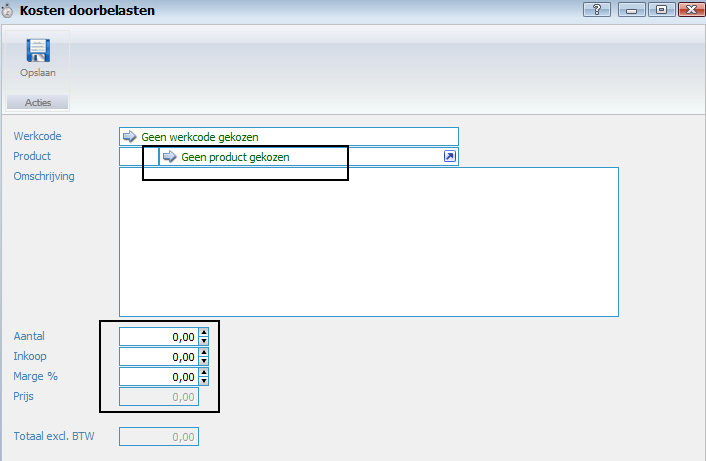

<properties>
	<page>
		<title>Product toevoegen</title>
		<description>Product toevoegen</description>
	</page>
	<menu>
		<position>Modules / Tijdregistratie</position>
		<title>Product toevoegen</title>
	</menu>
</properties>

## Product toevoegen aan je tijdregistratie ##

Je kan als je de uren hebt ingevoerd ook op tabblad “Kostenregistratie” nog extra kosten opvoeren, Dit kunnen producten zijn.
Voeg het product en het aantal toe,

Sla de registratie op en keur deze daarna goed.

Als je nu de tijdregistraties gaat verwerken, wordt er één factuur aangemaakt voor zowel de gemaakte tijd en de extra kosten, totaal 7,5 * 100 euro plus 50 euro, in totaal 800 euro.

De factuur:
 

Deze kan je verder goedkeuren en verwerken en verzenden.

--------------

