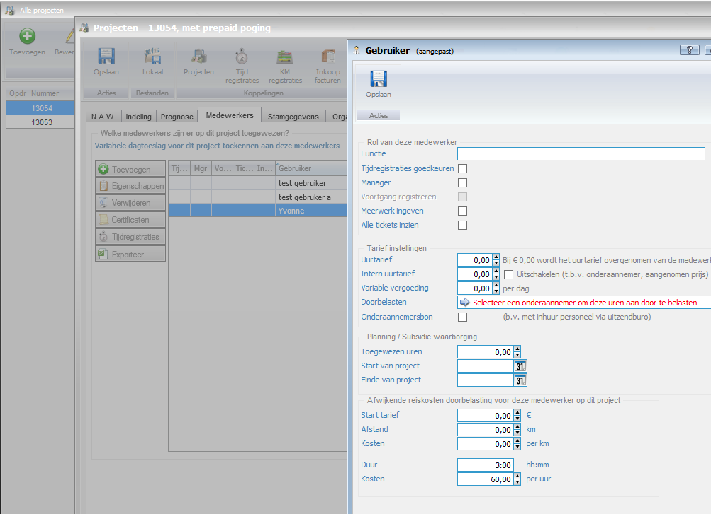
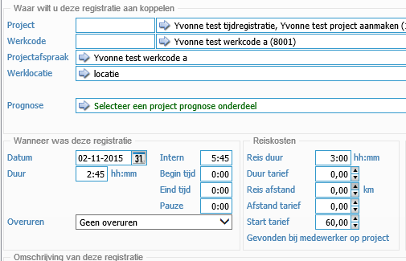
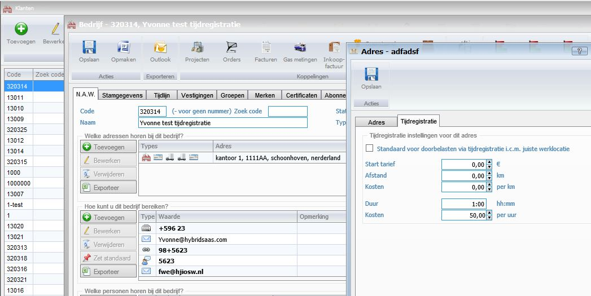
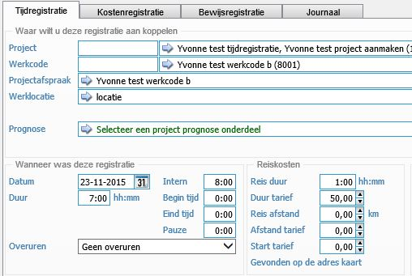
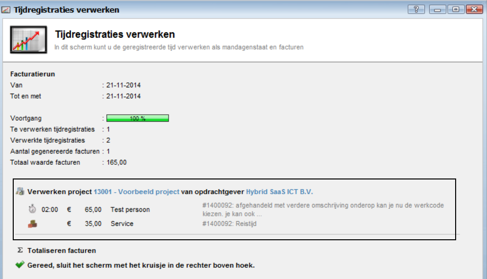
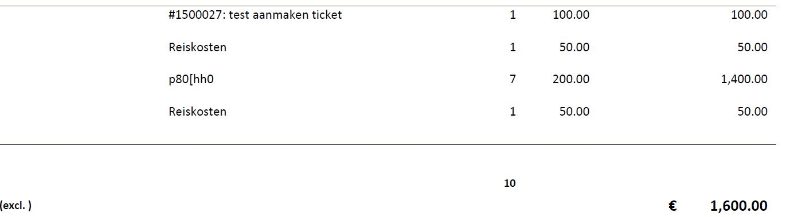

<properties>
	<page>
		<title>Reiskosten</title>
		<description>Reiskosten</description>
	</page>
	<menu>
		<position>Modules / Tijdregistratie</position>
		<title>Reiskosten</title>
	</menu>
</properties>

##Reiskosten doorbelasten##

Je kan op 2 manieren de reiskosten automatisch laten verrekenen.

* Optie 1: Via de medewerker op de projectkaart.
* Optie 2: Standaard reiskosten op basis van het werkadres van de klant.

**Optie 1**

Je kan bij de medewerker op de projectkaart een standaard reistijd invoeren, 

deze wordt dan bij het tijdschijven automatisch mee gerekend.

**Optie 2**

Bij het werkadres, 

deze wordt dan bij het tijdschijven automatisch mee gerekend.

 

Als je hier een reis duur ingeeft dan wordt deze bij de tijdregistratie automatisch gevuld.

Hierna kan je de tijdregistratie´s verwerken zoals gewenst

Op de factuur worden de reiskosten los weergegeven

--------------

