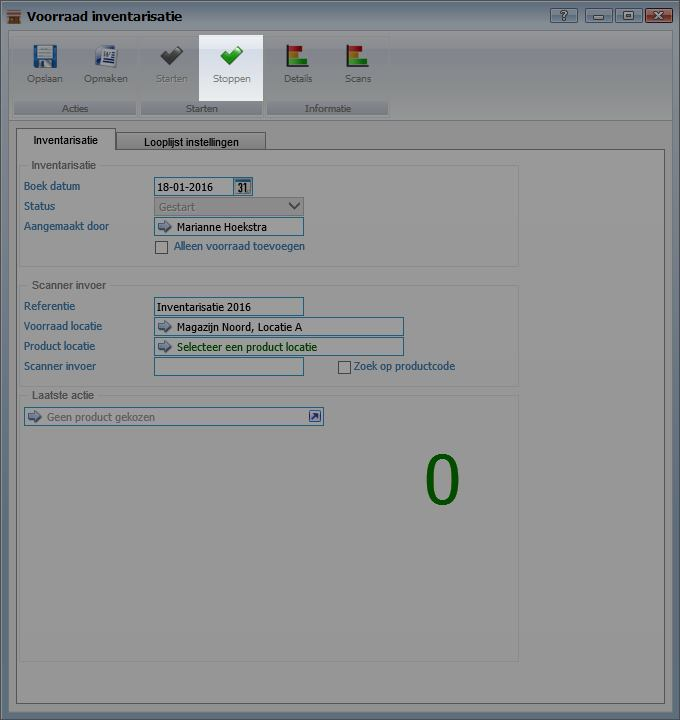

<properties>
	<page>
		<title>inventariseren</title>
		<description>inventariseren</description>
	</page>
	<menu>
		<position>Modules / Voorraadbeheer</position>
		<title>Inventariseren</title>
		<sort>a</sort>
	</menu>
</properties>

# Inventariseren/ balansen #
In dit artikel wordt het proces voor het inventariseren/ balansen beschreven. Goederenvoorraad inventariseren wil zeggen dat men de aanwezige voorraad werkelijk telt. Nadat de inventarisatie is afgerond zal Hybrid SaaS de voorraad corrigeren en de wijzigingen bijhouden in een rapport.

## Inventarisatie starten ##

Zoek "**Inventarisatie**" en kies voor "**Lopende Inventarisaties**" 

Klik op "**Toevoegen**" om een nieuwe inventarisatie te starten.

Selecteer de juiste **Voorraadlocatie** en klik vervolgens op "**Starten**"

Indien met verschillende productlocaties wordt gewerkt, welke separaat geïnventariseerd dienen te worden, dient deze ook aanvinkt te worden.

Het is mogelijk om meerdere inventarisaties te starten. Zo kunnen meerdere medewerkers andere delen van het magazijn inventariseren. Wij raden in dat geval aan om met productlocaties te werken.

## Producten scannen ##

Zet de cursor in het veld achter "scanner invoer" en scan de barcode van het betreffende product.

Er zijn 3 mogelijkheden om de producten te inventariseren.

- Scan alle producten

- Scan het aantal producten en vul het aantal getelde producten bij de barcode in met een + en scan daarna het product. Bijvoorbeeld: Er zijn 10 producten geteld, vul dan bij barcode in 10+ en scan het product.

- Tel het aantal producten en vul het aantal getelde producten bij de barcode in met een + en typ daarna de barcode van het product in. Bijvoorbeeld: Er zijn 10 producten geteld, vul bij barcode in 10+H10205566.

Barcode of productcode? Indien de producten worden ingegeven (al dan niet via een scanner) kan dit op barcode of productcode. 

 Het getal geeft het aantal gescande eenheden weer van het betreffende product in deze lopende inventarisatie.

Nadat het product is gescand wordt er een korte samenvatting over het product en een getal weergegeven. Door deze informatie in de gaten te houden kan worden gecontroleerd of de producten op de juiste locatie liggen. Elke keer nadat een product is gescand gaat de teller lopen van 1 t/m 10. Zo is het mogelijk om mee te tellen met het geluid van de scanner. Wanneer de scanner de code niet goed heeft gelezen verschijnt er ERROR in het venster (zie onderstaande afbeelding). Wij raden aan om de inventarisatie in setjes van 2 personen te doen. De eerste persoon scant te producten en de tweede persoon kijkt of het product daadwerkelijk gescand wordt.

Oranje betekent dat het product nog niet eerder is gescand in deze inventarisatie. 

Groen betekent dat het product (eerder) is gescand in deze inventarisatie. 

Error betekent dat het product niet is gevonden. Dit kan de volgende oorzaken hebben:

- Productnummer of barcode is niet bekent in de productencatalogus

- Productnummer of barcode is niet bekent in de geselecteerde voorraadlocatie

- Productnummer of barcode is niet bekent in de geselecteerde productlocatie

# Scans controleren #

Het is mogelijk om de inventarisatie tussentijds te controleren. Klik hiervoor op scans of details. Bij Scans worden alle scanpogingen weergegeven. Hier kunnen ook scans staan welke niet gelukt zijn. Bij details worden de details van de inventarisatie weergegeven. Zo is inzichtelijk hoeveel producten er zijn gescand en hoeveel producten er momenteel op voorraad zijn.

# Inventarisatie stoppen #

Wanneer de inventarisatie is afgerond kan deze worden afgerond door op de knop "**Stoppen**" te klikken. De betreffende inventarisatie zal worden afgerond

# Inventarisatie afronden en verwerken #

De laatste stap is het verwerken/ muteren van huidige voorraad met de geïnventariseerde voorraad. Klik hiervoor op de knop "**Muteren**"

LET OP! Wij raden te allen tijde aan om eerste een backup te maken huidige voorraad. Ga hiervoor naar "**Managementoverzichten**" en kies voor "**Voorraadoverzicht**" en selecteer de juiste datum. Sla de Excelsheet op.

Nadat er is gekozen voor het muteren zal het systeem om een bevestiging vragen. Alle weergegeven inventarisaties, welke zijn gestopt, zullen worden verwerkt. **Neem notie van de onderstaande opmerkingen zodat er geen verrassingen zijn na de verwerking**. 

Bij de inventarisatie is het mogelijk om de optie "alleen voorraad toevoegen" aan te vinken. Dit is van invloed op de manier waarop de voorraad wordt verwerkt.

**Vinkje aan:** Bij het muteren van de voorraad wordt de voorraad welke is geteld bij de huidige voorraad opgeteld. Voorbeeld: Huidige voorraad = 100 stuks. Er worden 50 stuks gescand. Totale voorraad zal 150 stuks worden.
Melding bij voorraadhistorie “*Alleen toevoegen – inventarisatie*”

**Vinkje uit:** Bij het muteren worden de voorraadstand van de inventarisatie overgenomen. Dit betekent dat de voorraad van artikelen op "0" wordt gezet indien deze niet in de inventarisatie naar voren zijn gekomen.
Melding bij voorraadhistorie “*Niet tegengekomen bij inventarisatie*” 

