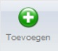

<properties>
	<page>
		<title>Vragenlijst beheren</title>
	</page>
	<menu>
		<position>Modules / Vragenlijsten</position> 
		<title>Vragenlijst beheren</title>
	<sort>B</sort>
	</menu>
</properties>

## Beheren van de vragenlijst ##

Voordat je een vragenlijst kan aanbieden moet deze samengesteld worden. Dit doe je door  via de startknop naar het menu Vragenlijsten te gaan en daar Beheren te selecteren. 

 

Door middel van de knop "Toevoegen" kan je een nieuwe vragenlijst maken. 

 

De vragenlijst bestaat uit een titel, dit is de naam die verder in de applicatie (backoffice en extranet) wordt gebruikt. Je kan een beschrijving invoeren, dit is een korte uitleg wat bijvoorbeeld de bedoeling is van deze vragenlijst, wie deze gaat gebruiken, hoe vaak deze wordt gebruikt, etc.
En verder worden er een aantal vragen toegevoegd.  

Dit doe je met de knop toevoegen. Als je in een bestaande vragenlijst aan het werken bent, kan je hier ook vragen bewerken en/of verwijderen.

Er zijn 3 soorten vragen:

- Enkele tekstregel
- Meerdere tekstregels
- Multiple choice

**Enkele tekstregel**

 

**Meerdere tekstregels**

 

**Multiple choice**

 

Voordat je de vragenlijst kan opslaan is er ook nog een tabblad "Instellingen" Hierop geef je aan waar de vragenlijst wordt weergegeven en je bent verplicht om een document layout en een email layout te selecteren.

Hieronder het resultaat van bovenstaande vragenlijst
 

**Extra actie**

Je kan bij de multiple choice vragen ook extra vragen toevoegen als een bepaald antwoord wordt gegeven.
Maak dan eerste de extra vragen aan en groepeer deze door er een ID aan te geven. Dit kan een willekeurige naam zijn. In het voorbeeld is dit "extra"

Door bij de antwoord opties een actie toe te voegen, zullen de extra vragen in de vragenlijst wel of niet worden getoond. 

- SHOW "ID"
	- vragen met hetzelfde ID worden nu zichtbaar als deze optie gekozen wordt
- HIDE "ID" 
	- vragen met hetzelfde ID worden nu verborgen als deze optie gekozen wordt

De extra vragen die je maakt kunnnen weer van de 3 verschillende types zijn,   

 

**Resultaat:** Als er voor de optie "Ja" wordt gekozen dan worden de 3 extra vragen zichtbaar. Deze kunnen dan extra beantwoord worden.

**Resultaat:** Als er voor de optie "NVT" wordt gekozen dan komen er geen extra vragen bij, deze zijn dan ook niet relevant.  

        

**Foto bij de vraag**

In sommige gevallen is het handig om een foto (upload) aan de vraag toe te voegen. Dit verduidelijkt de vraag.
Bij de vraag kan je door middel van de knop "Upload foto" een plaatje toevoegen. 

Het resultaat in de vraag:

  

Het resultaat in de vraag op extranet:

  

**Extra opties bij Multiple choice vragen**

Je kan bij de multiple choice vragen extra zaken afdwingen of laten invoeren. Zo kan je bij bepaalde keuzes een extra omschrijving laten invoeren (ook eventueel verplicht maken) je kan een bijlage toevoegen (ook deze kan verplicht gemaakt worden) en je kan indien je ook met het Hybrid SaaS ticketsysteem werkt een ticket laten aanmaken. Dit is een actie die je koppelt aan een bepaalde medewerker die hier dan verantwoordelijk voor is. 

Onderstaand scherm verschijnt, je kan nu door middel van de vinkjes de vraag uitbreiden.

Als je een extra mogelijkheid wilt creëren om informatie vast te leggen dan zet je het vinkje aan bij "Omschrijving ingave". Zodra antwoord JA word gekozen volgt er een extra invoermogelijkheid. Je kan het veld ook verplicht maken door het vinkje "Omschrijving is verplicht" aan te zetten. Bij het opslaan wordt er dan een controle uitgevoerd. 
Boven het invoerblok kan je een label meegeven, dit doe je bij de "Label omschrijving". Als een veld verplicht is, dan wordt dit vermeld achter het label. 

        

Resultaat van een extra verplicht veld bij een multiple choice vraag.

  
Verder bestaat de mogelijkheid om een bijlage toe te voegen, dit kan door het vinkje "Bijlage" aan te zetten. Wil je er een verplicht veld van maken dan zet je het vinkje "Bijlage is verplicht" aan.
Ook boven dit invoerblok kan je een label meegeven, dit doe je bij het veld "Label bijlage" 

  

Resultaat van een verplichte bijlage, je kan nu door middel van de knop "Bladeren" zoeken naar het document of de foto die je wilt toevoegen. 

  

Als laatste kan je ook van uit een bestaande vragenlijst een nieuwe vragenlijst activeren. Dit komt voor als je bij een multiple choice vraag een antwoord geeft waardoor je extra informatie wilt vragen en vastleggen.

      

----------
