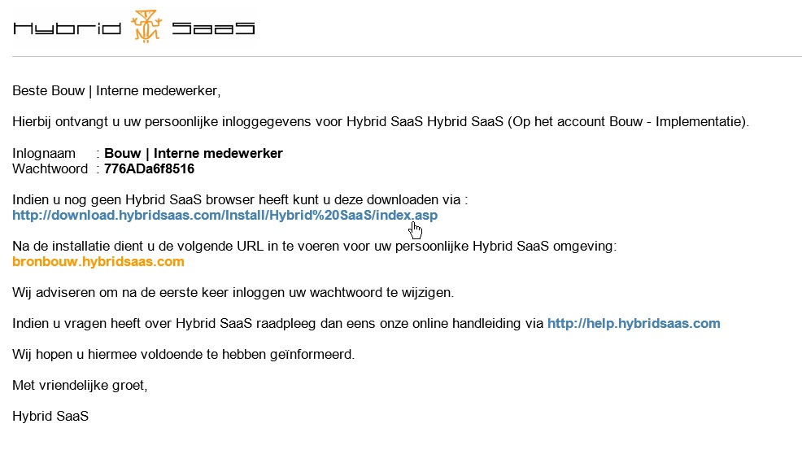
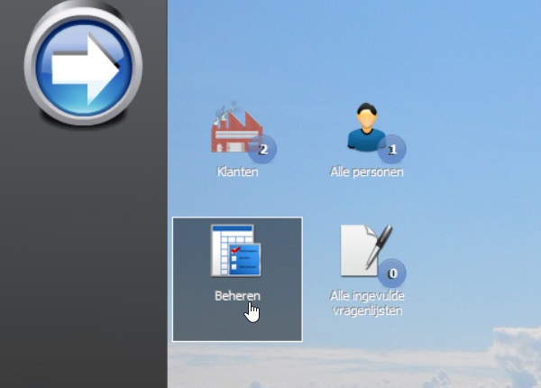
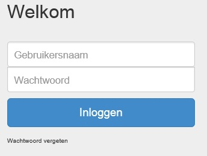
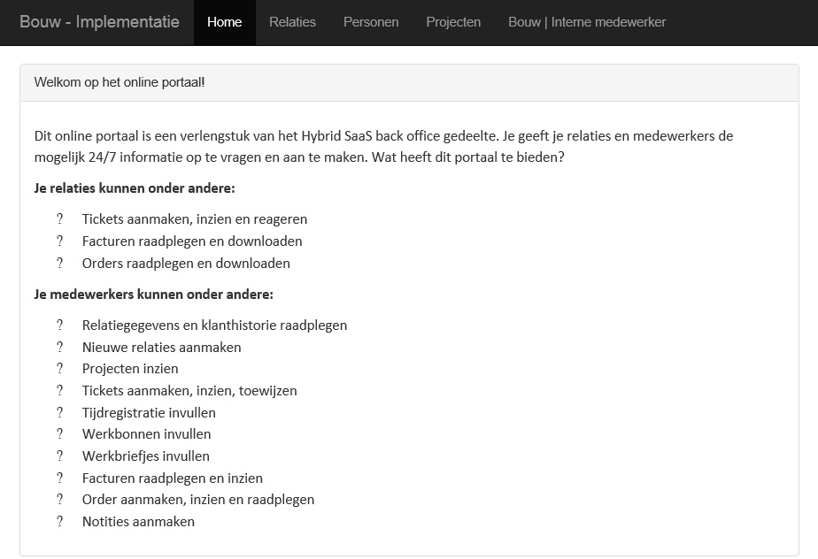
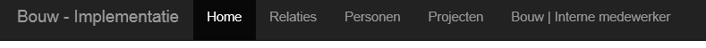

<properties>
	<page>
		<title>Implementatie bouw</title>
			</page>
	<menu>
		<position>Modules / Vragenlijsten & Equettes </position>
		<title>Implementatie </title>
	</menu>
</properties>

##Implementatie##

Als je overeen bent gekomen dat je met Hybrid SaaS gaat werken dan staan hieronder de stappen beschreven om aan de slag te gaan.
Als eerste maakt Hybrid SaaS een omgeving aan. Deze krijgt de naam van het bedrijf. Er wordt dan ook de eerste gebruiker aangemaakt en de gegevens (id + wachtwoord) worden gemaild naar deze gebruiker.
Het mailtje ziet er zo uit:

Zodra je deze gegevens hebt ontvangen kan je starten met de implementatie van Hybrid SaaS. Als eerste moet je een werkplek installatie uitvoeren om  

Ga naar  [Werkplek installatie](http://hybridsaas.support/support-site/het-systeem/hybridsaas-installeren/installeren-hybridsaas)

Start de applicatie op en log in met de aangeleverde gegevens. Je komt dan, afhankelijk van het gekozen pakket, op een standaard desktop terecht. In dit voorbeeld is gekozen voor het invullen van vragenlijsten bij bedrijven en personen.
Via de grote START knop kan je eventueel andere functies toevoegen op je desktop.
 

Met de knop Beheren open je het beheer van de vragenlijsten. Er staan hier dan branche specifieke vragenlijsten. Deze kan je gebruiken, eventueel aanpassen of je kan zelf een vragenlijst toevoegen.

Ga naar  [Vragenlijsten beheren](http://hybridsaas.support/support-site/modules/vragenlijst-equettes/beheren/vragenlijsten-beheren)

Zodra dit alles in ingericht kan je gebruikers 

Ga naar  [Extranet gebruiker + rechten](http://hybridsaas.support/support-site/modules/vragenlijst-equettes/via-extranet/vragenlijsten-extranet)

#Klaar om te starten#

Nu ben je klaar om als extranet gebruiker in te loggen en vragenlijsten in te vullen.

Ga naar een browser en tik onderstaande URL in.

**https://{bedrijfsnaam}.hybridsaas.com/extranet/login/login.asp**

voorbeeld https://bronbouw.hybridsaas.com/Extranet/login/login.asp

Er verschijnt een standaard scherm waarbij je kan inloggen met de gegevens die je via de mail hebt ontvangen.  

Als je ingelogd bent krijg je, afhankelijk van de rechten die je hebt, de bijbehorende gegevens te zien. In dit voorbeeld heb je rechten op klanten, personen en projecten. Deze staan bovenaan in het scherm genoemd. 

Ga naar [Vragenlijst invoeren](http://hybridsaas.support/support-site/modules/vragenlijst-equettes/invoeren/vragenlijst-invoeren)

 

