<properties>
	<page>
		<title>Vragenlijst invoeren</title>
	</page>
	<menu>
		<position>Modules / Vragenlijst & Equettes</position> 
		<title>Vragenlijst invoeren</title>
	<sort>B</sort>
	</menu>
</properties>

#Vragenlijst invoeren op je mobiel#

<description>Je kan op verschillende manieren een vragenlijst invoeren. een van de manieren is om dit op je mobile telefoon te doen. ga dan naar een browser en voor onderstaande URL in **https://{bedrijfsnaam}.hybridsaas.com/extranet/login/login.asp** . (sla deze als favoriet (bladwijzer) op). </description>
Voer de ontvangen gebruikersnaam en bijbehorende wachtwoord in en druk op de knop Inloggen.  

*Inlogscherm

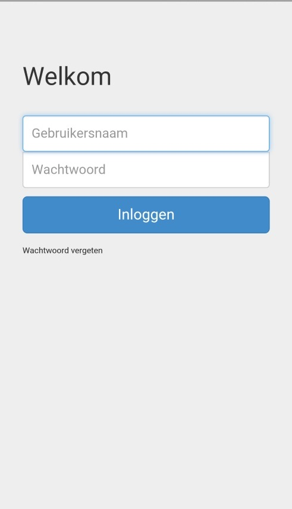

*Hoofdscherm*

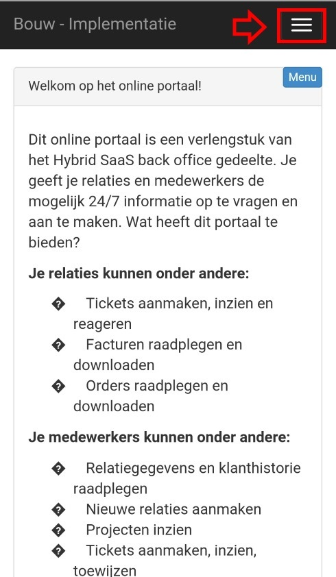

Dan kom je in het hoofdscherm. Door middel van de knop   krijg je de verschillende mogelijkheden te zien. Dit is afhankelijk van de rechten. De rechten zijn :

- Relaties
- Personen
- Projecten

Hier kan je relaties, personen en projecten bekijken, toevoegen, aanpassen en verwijderen. 
Klik op relaties om de relaties te bekijken.

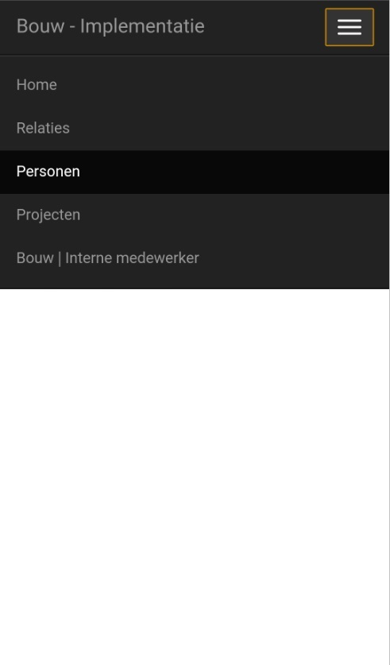 

Er volgt dan een scherm met alle relaties gesorteerd op Naam. Met het menu knopje kan je nog een extra filter gebruiken. Je kan dan kiezen uit alles en alleen klanten. "Alles" geeft ook de fabrikanten en leveranciers weer.
Door op een klant te klikken kom je in de gegevens van deze klant.
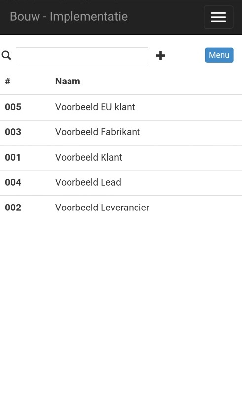 

Je hebt bij de klanten 3 categorieën die je kan tonen of bewerken.

- relatiegegevens
- adres gegevens
- contactgegevens

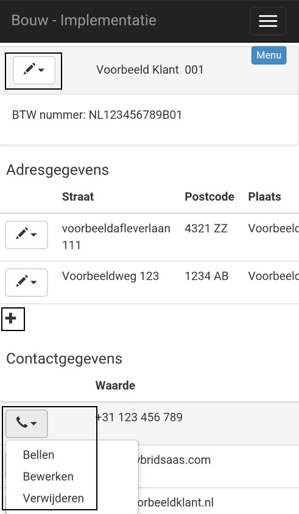

**Relatiegegevens:**
 
je kan door middel van de 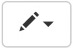  knop deze gegevens bewerken of verwijderen. Je kan de bedrijfsnaam, het btw-nummer wijzigen en je kan een opmerking toevoegen.

**Adresgegevens**

Bij adres gegevens kan je door middel van de  knop ook de adres bewerken of verwijderen. Je kan de straatnaam, het nummer, de postcode, de plaats en het land wijzigen en je kan een omschrijving toevoegen. Verder kan je met "Tonen" via Maps zien waar dit adres zich bevindt.

Met de  knop kan je een nieuw adres toevoegen

**Contactgegevens**

Bij contact gegevens kan je door middel van de  knop een contact bewerken of verwijderen. Je kan een telefoon, mobiel, emial, fax, website, IM of socialmedia wijzigen en je kan een opmerking toevoegen. Verder kan je afhankelijk van het contact direct bellen, mail, de website bezoeken, etc.
   
Ook hier kan je met de  knop kan je een nieuw contact toevoegen.

#Knop menu#

Door deze knop te gebruiken krijg je de mogelijkheden die je kan uitvoeren. Deze verschillen per categorie (relaties, personen en projecten). Als je een klant, persoon of project hebt geselecteerd en dan de knop menu kiest, dan zie je van de geselecteerde categorie alle onderliggende niveaus met daarbij het aantal. Je kan dan meteen zien hoeveel contactpersonen, projecten en vragenlijsten er aanwezig zijn

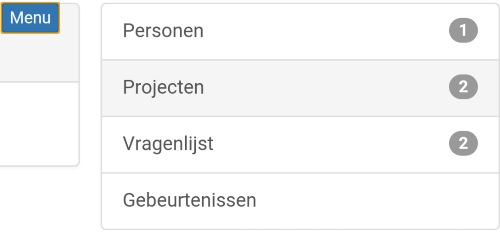

Kies je nu voor vragenlijst, dan zie je de verschillende vragenlijsten. Je kan een vragenlijst gaan invoeren door nu één van de vragenlijsten te kiezen.   

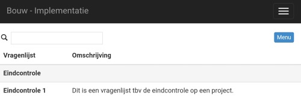

Door de  knop te selecteren kan je direct terug naar de klant gegevens, opnieuw naar de vragenlijsten en je kan naar de reeds eerder ingevulde vragenlijsten.

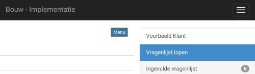  

Bij ingevulde vragenlijsten zie je wie de lijst heeft ingevuld en op welke datum en tijdstip dit is gedaan.

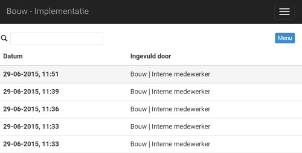

Je kan een eerder ingevulde vragenlijst openen door deze te selecteren. Je komt dan in een informatief scherm. Er zijn 2 mogelijkheden   

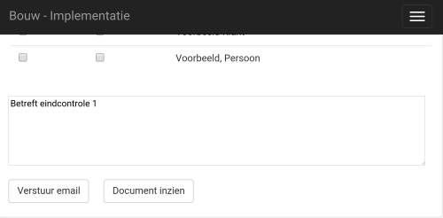

#Document inzien#
Met de knop "Document inzien" kan je de vragenlijst op je scherm openen en je kan deze ook opslaan.

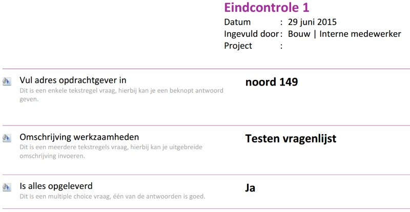

#Verstuur email#
Je kan alleen een email versturen naar personen die je vooraf hebt gedefinieerd bij de klant of bij het project. Vink de juiste personen aan, je kan dan nog kiezen of je iemand een BCC wilt sturen en druk op de knop versturen. De mail wordt dan verstuurd met de tekst die in de email sjabloon is vastgelegd en de vragenlijst wordt als bijlage meegestuurd.

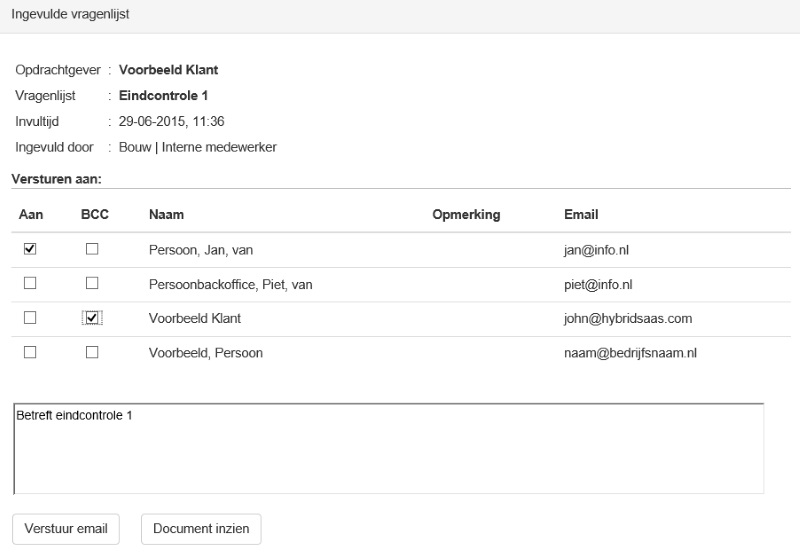

----------
