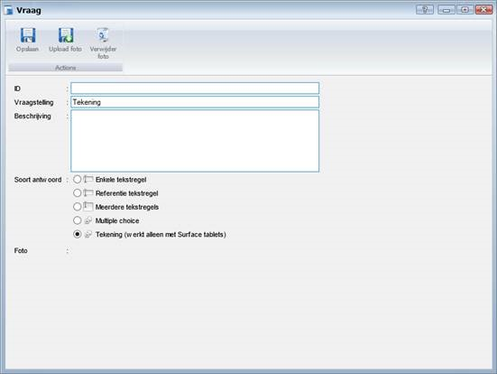
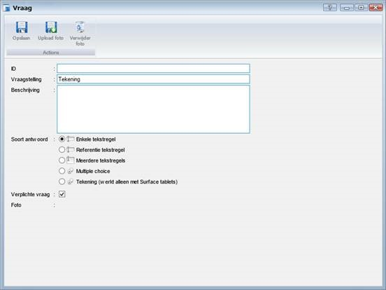
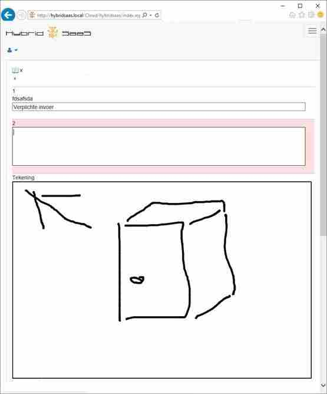
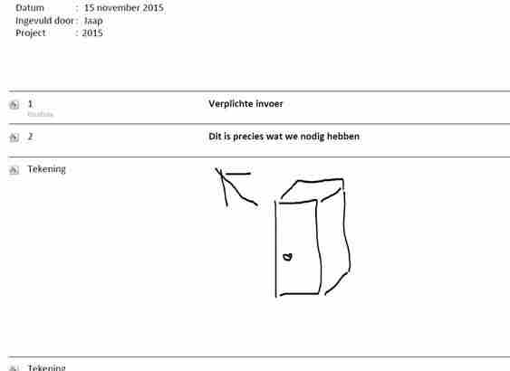

<properties>
	<page>
		<title>Een tekening toevoegen</title>
	</page>
	<menu>
		<position>Modules / Vragenlijsten</position> 
		<title>Een tekening toevoegen</title>
	<sort>B</sort>
	</menu>
</properties>

## Een tekening toevoegen aan de vragenlijst ##

Er is een nieuw type vraag bij gekomen: Tekening

 

Je kunt dit vraag type meerdere malen toepassen in een lijst.
Tevens de mogelijkheid om tekstregels als verplicht in te stellen met het vinkje verplichte vraag.

Ook gaat het menu weg als je de tablet in portrait mode zet.

 
In PDF formaat ziet het er dan zo uit.

----------
