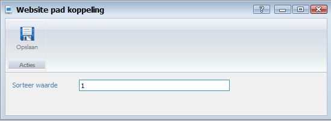
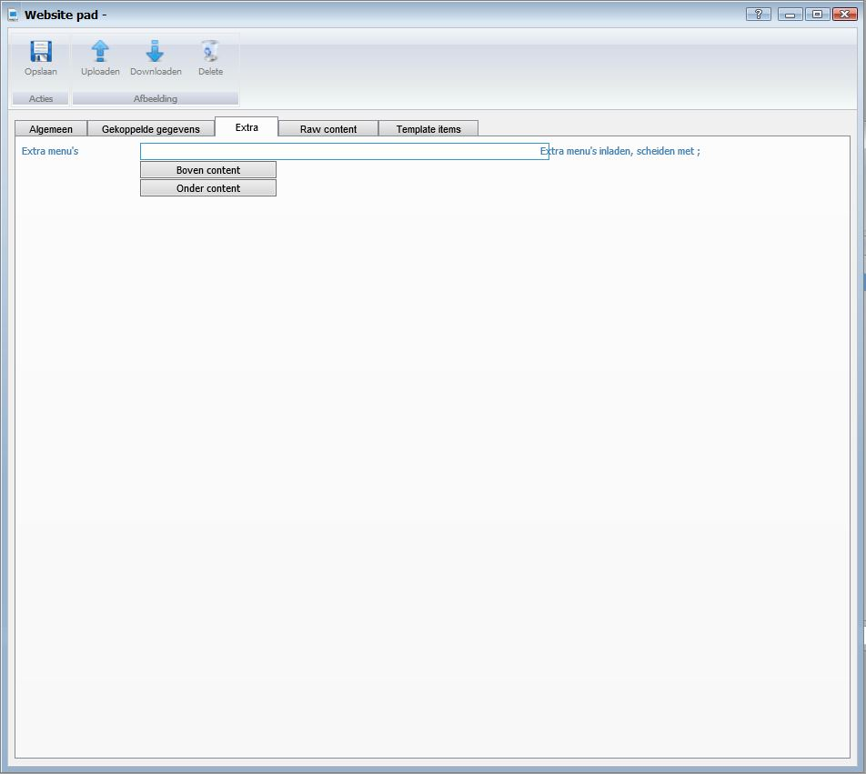
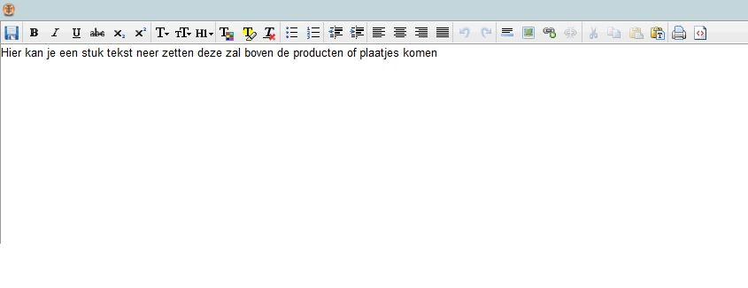
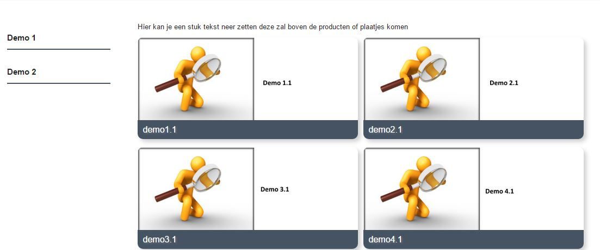
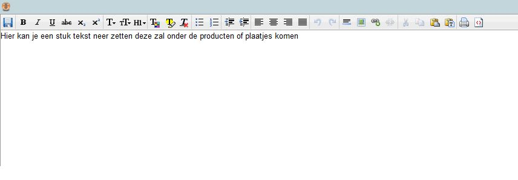
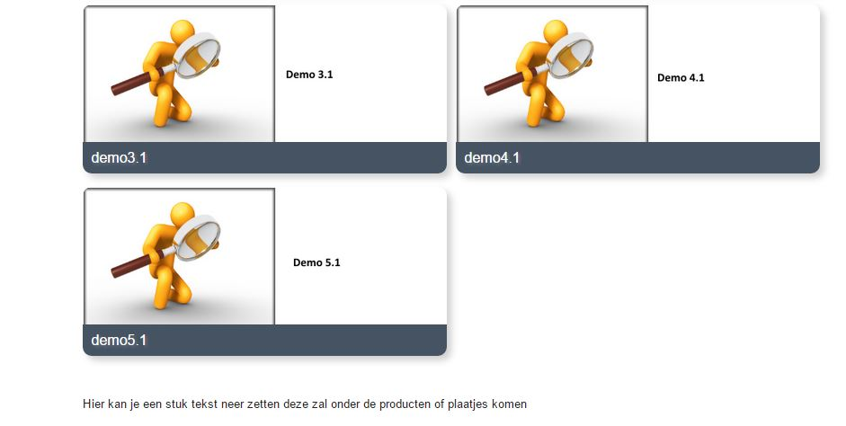
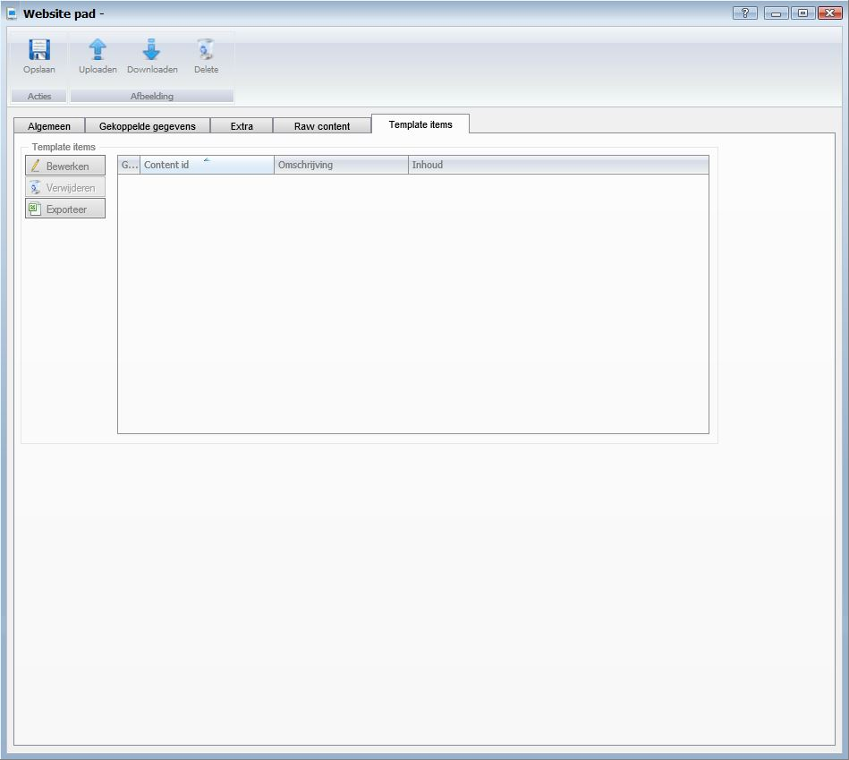

<properties>
	<page>
		<title>Website menupaden</title>
		<description>Website menupaden</description>
		<context>website-path</context>
	</page>
	<menu>
		<position>Modules / Webshop</position>
		<title>Menu paden</title>
		<sort>f</sort>
	</menu>
</properties>

# Menu paden #
Een menu pad heeft een menu nodig,
het pad verwijst je door naar de pagina waar je producten instaan, maar de naam uit het menu word op de site geplaatst.

# Start #

# Website paden #

**Acties**

- Toevoegen
- Bewerken
- Verwijderen
- Vernieuwen
- Excel

**Acties**

- Bezoek

# Algemeen #

- Website
	- Hier geef je aan voor welke website het pad bedoeld is
- Taal
	- Hier geef je de taal aan
- Template
	- Hier kan je de template kiezen
- Naam
	- Hier vul je de naam van het pad in
- Omschrijving
	- Deze word overgenomen van de naam (tenzij je het aanpast)
- Pad (url)
	- Deze word overgenomen van de naam met / (tenzij je het aanpast)
- Type weergave
	- Hier kan je de type weergave aangeven keuze uit:
		- Standaard (je krijgt gelijk je producten te zien)
		
		- Gekoppelde weergave ( je krijgt eerst nog een keuze veld met verschillende paden)
		
- Product hoofdgroep
	- Hier kan je het pad koppelen aan een hoofdgroep
- Product subgroep
	- Hier kan je het pad koppelen aan een subgroep
- Product kenmerk
	- Hier kan je het pad koppelen aan een kenmerk
- Product
	- Hier kan je het pad koppelen aan een product
- Redirect Permanent
- Pagina titel
	- Deze word overgenomen van de naam (tenzij je het aanpast)
- Meta description
	- Deze word overgenomen van de naam (tenzij je het aanpast)
- Meta keywords
	- Deze word overgenomen van de naam (tenzij je het aanpast)
- Niet zichtbaar
- Zichtbaar vanaf
- Zichtbaar t/m
- Geoptimaliseerd voor
- Belangrijkheid
- Opmerking

# Gekoppelde gegevens #

Als je een gekoppelde weergave heb aangegeven bij type weergave kan je hier de paden aangeven welke gekoppeld moeten worden aan deze pad

- Website pad
	- Om toe te voegen klikt u op de button.
- Bewerken
	- Om te bewerken selecteert u een regel en klikt op de button Bewerken.
- Inzien
- Verwijderen
	- Om te verwijderen selecteert u een regel en klikt op de button Verwijderen.
- Exporteren

Door op de regel dubbel te klikken kan je een sorteringswaarde aangeven
hij plaatst het altijd:

- 1	2
- 3	4
- 5 6
- enzo

# Extra #

- Extra menu's
- Boven content
	
	
- Onder content
	
	

# Raw content #

# Template items #

- Bewerken
	- Om te bewerken klikt u op de button Bewerken.
- Verwijderen
	- Om te verwijderen selecteert u een regel en klikt op de button Verwijderen.
- Exporteren

----------
