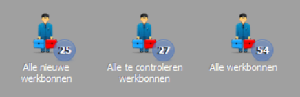
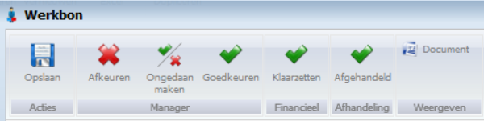
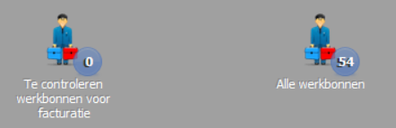
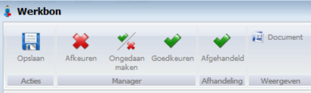
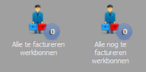
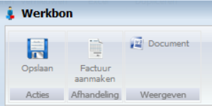
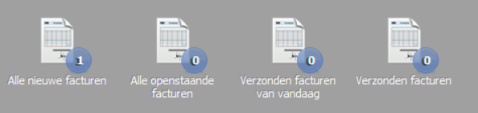

<properties>
	<page>
		<title>Proces werkbonnen</title>
		<description>Proces werkbonnen</description>
	</page>
	<menu>
		<position>Modules / Werkbonnen</position> 
		<title>Proces werkbonnen</title>
		<sort>a</sort>
	</menu>
</properties>

## Proces werkbonnen  ##

*In deze handleiding worden er 3 personen als voorbeelden gebruikt. dit is een uitleg welke je kan gebruiken als de handelingen wilt onderverdelen onder meerdere collega's*

Persoon 1 zet voor de medewerkers één week vooruit alle werkbonnen in het systeem. Deze komen in het bakje : **Alle nieuwe werkbonnen**.

De medewerkers moeten aan het eind van iedere dag de tijd registreren op de werkbonnen. 

Deze werkbonnen blijven dan in het bakje **Alle nieuwe werkbonnen** staan.

Persoon 1 heeft 3 bakjes

 
- Alle nieuwe werkbonnen
- Alle te controleren werkbonnen
- Alle werkbonnen (dit is een overzicht van alle werkbonnen, puur informatief)

Openen van een werkbon in het bakje **Alle nieuwe werkbonnen** geeft de volgende rechten,

Door op de knop **Goedkeuren** te klikken zorg je ervoor dat de werkbon naar het bakje **Alle te controleren werkbonnen** gaat.

Hier kan je ze nakijken op tijd en kosten en dan via de knop **klaarzetten** worden ze dan naar het bakje **Te controleren werkbonnen voor facturatie** doorgezet.

Persoon 2 heeft 2 bakjes

- Alle te controleren werkbonnen voor facturatie
- Alle werkbonnen (dit is een overzicht van alle werkbonnen, puur informatief)

Openen van een werkbon in het bakje **Te controleren werkbonnen voor facturatie** geeft de volgende rechten

Als de tijd en kosten zijn gecontroleerd en goed bevonden dan kan je de werkbon met de knop **Afgehandeld** klaarzetten om door Persoon 3 een factuur van te maken.

Persoon 3 heeft 2 bakjes

- Alle te factureren werkbonnen
- Alle nog te factureren werkbonnen (dit zijn werkbonnen die verzameld worden om op een later tijdstip gefactureerd te worden, bijvoorbeeld per kwartaal)

Openen van een werkbon in het bakje **Alle te factureren werkbonnen** geeft de volgende rechten

Persoon 3 kan nu d.m.v. de knop **Factuur aanmaken** een factuur genereren vanuit de werkbon. De nieuwe factuur komt in het bakje **Alle nieuwe facturen**

Persoon 3 kan nu de factuur verder verwerken.

----------