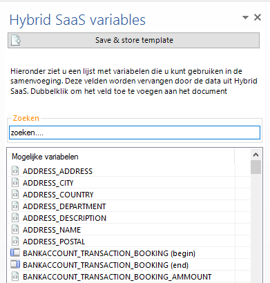
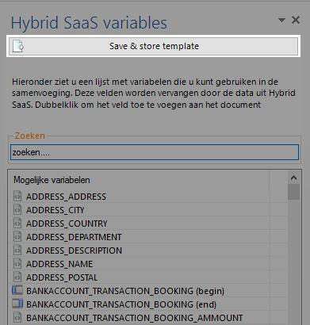
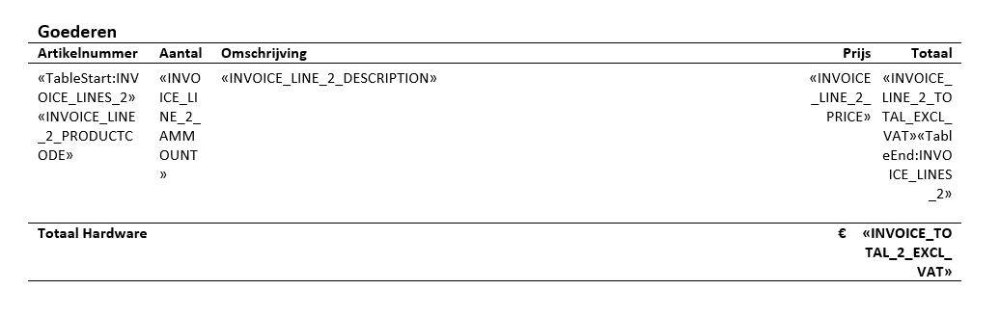
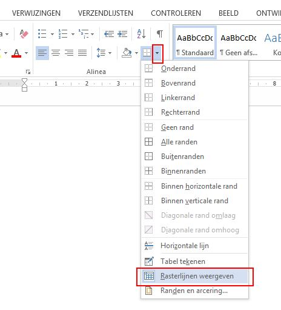

<properties>
	<page>
		<title>handige-weetjes</title>
		<description>handige-weetjes</description>
	</page>
	<menu>
		<position>Modules / Word Add-In</position>
		<title>Handige weetjes</title>
		<sort>a</sort>
	</menu>
</properties>

# Handige weetjes #
In deze rubriek laten we aan aantal voorbeelden zien voor het aanpassen van documentsjablonen in Hybrid SaaS. Denk hierbij aan factuursjabloon, ordersjabloon, herinneringen enz. Hybrid SaaS maakt gebruik van Microsoft Word voor de opmaak van documenten. Binnen Word zijn tal van mogelijkheden. Wij zullen een aantal functies uitleggen die makkelijk zijn om zelf sjablonen aan te passen.

# Document bewerken, toevoegen en opslaan #

Zoek "Wordsjablonen"

Selecteer het betreffende sjabloon en klik op bewerken

Microsoft Word zal worden geopend en het geselecteerde sjabloon zal worden weergegeven. Aan de rechterkant verschijnt een overzicht van alle velden welke ingevoegd kunnen worden. Afhankelijk van het type "tabel" welke is geselecteerd bij het sjabloon worden de mogelijke velden weergegeven.

In het zoekveld kan worden gezocht op velden welke ingevoegd dienen te worden. Alle benamingen zijn in het Engels. Mocht je een veld niet kunnen vinden neem dan contact met ons op.

Er zijn twee verschillende soorten velden:
- Velden welke op zichzelf staan zoals "ADRES", "FACTUURNUMMER", "FACTUURTOTAAL"
- Velden welke herhaald worden zoals "FACTUURREGELS" en "ORDERREGELS". Deze velden vallen onder een zogenaamde herhalingstabel. Dit betekent dat deze velden enkel werken als deze in een tabel staan en dat de tabel een `MERGEFIELD TABLESTART:` en `MERGEFIELD TABLEEND:` bevat.

Indien het document naar wens ia aangepast dient het document worden geüpload in Hybrid SaaS.

Klik hiervoor in het Word document op "Save & Store Template" 

## Basis weetjes voor het bewerken van documenten ##

ALT+F9 		| Onzichtbare onderdelen zichtbaar maken. Bijvoorbeeld veldcode `«INVOICE_NUMBER»` wordt zichtbaar als `{ MERGEFIELD INVOICE_NUMBER \* MERGEFORMAT }`
CTRL+ENTER 	| Nieuwe Pagina invoegen
CTRL+A		| Alles Selecteren
CTRL+C		| Selectie Kopiëren
CTRL+V		| Selectie Plakken (Met de rechtermuisknop kan ook "speciaal" worden geplakt. Eventuele opmaak van de bron kan dan worden behouden)

## Tabellen weergeven ##
Om alle informatie op het document netjes onder elkaar weer te geven zal met tabellen gewerkt dienen te worden. Echter is het niet altijd wenselijk om de tabel daadwerkelijk weer te geven op de documentuitvoer.

In Word is de tabel onzichtbaar en is bijvoorbeeld het onderstaande zichtbaar.

Om de tabellen weer te geven selecteer de optie zoal hieronder weergegeven

De tabellen (lees rasterlijnen) zullen worden weergegeven. Voer bovenstaande bewerking nogmaals uit om de weergave te herstellen

## Aanpassen getalnotatie (Angelsaksische en Engelse notatie) ##

Getalnotaties voor bijvoorbeeld valuta kunnen op diverse manieren worden weergegeven. Hierin wordt onderscheid gemaakt tussen het het karakter voor het scheiden van duizendtallen en het karakter om decimalen weer te geven. In Nederland maken wij gebruik van de Angelsaksische notatie waarbij duizendtallen worden gescheiden dmv een "." (punt) en decimalen dmv een "," (komma). In de Engelse notatie worden deze karakters andersom gebruikt.

Bij de uitvoer van documenten met verschillende talen is het belangrijk dat de documenten goed worden ingesteld. 

### Voorkeursnotatie  ###

Ga naar de betreffende MERGEFIELD

Plaats de volgende notatie `\# "§0¤00"` vóór `\*` in het MERGEFIELD

§ = `MERGEFIELDS: CURRENCY GROUP SEPARATOR`
¤ = `MERGEFIELDS: CURRENCY DECIMAL SEPARATOR`

Voorbeeld zonder voorkeursnotatie € 12345,67: `{MERGEFIELD INVOICE_Line_Total_excl_VAT \* MERGEFORMAT}` 

Voorbeeld met voorkeursnotatie (Angelsaksisch) € 12.345,67: `{MERGEFIELD INVOICE_Line_Total_excl_VAT **\# "§0¤00"** \* MERGEFORMAT}`

Voorbeeld met voorkeursnotatie (Engels) $ 12,345.67: `{MERGEFIELD INVOICE_Line_Total_excl_VAT **\# "§0¤00"** \* MERGEFORMAT}`

## Afbeeling een vaste afmeting geven ##

Door middel van een "size" `/ size=100` toe te voegen aan de MERGEFIELD kan een gefixeerde grootte krijgen

Voorbeeld zonder: `{MERGEFIELD IMAGES:ORGANIZATION_IMAGES \* MERGEFORMAT}`

Voorbeeld met: `{MERGEFIELD IMAGES:ORGANIZATION_IMAGES **/ size=100** \* MERGEFORMAT}`

----------

# Koppen van een tabel herhalen op volgende pagina #

Het komt wel eens voor dat je meerdere orderregels of diverse in een tabel heb, als de tabel dan onder aan de pagina uitvalt wil hij hem wel eens opsplitsen in 2e naar de volgende pagina.

Dit kan je ook uitzetten dat het een nieuwe tabel word op een volgende pagina.
(via rechtermuisknop op het kruisje van de tabel)

Het vinkje staat over het algemeen aan. Als je deze uitzet word er een nieuwe tabel weergegeven op een volgende pagina. 

Uitslag:

----------