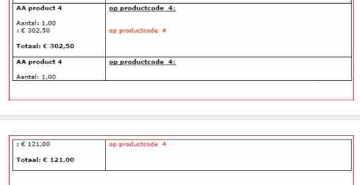
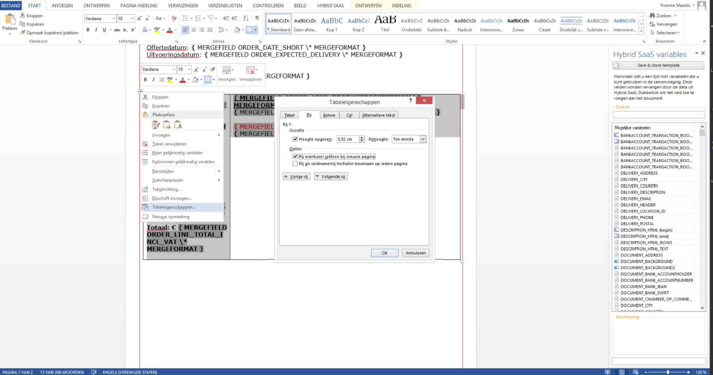
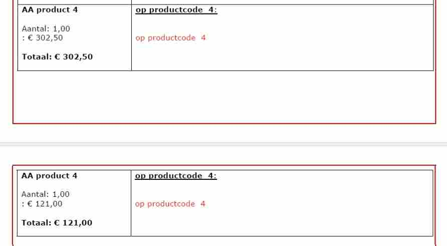

<properties>
	<page>
		<title>handige-weetjes</title>
		<description>handige-weetjes</description>
	</page>
	<menu>
		<position>Modules / Word Add-In</position>
		<title>Handige weetjes</title>
		<sort>a</sort>
	</menu>
</properties>

## Handige weetjes ##

**Bedrag weergeven met komma's en punten (€ 00.000,00)**

In het Word Document het betreffende MERGEFIELD veld opzoeken

Voorbeeld zonder € 12345.67: `{MERGEFIELD INVOICE_Line_Total_excl_VAT \* MERGEFORMAT}` 

Voorbeeld met € 12,345.67: `{MERGEFIELD INVOICE_Line_Total_excl_VAT \# .0,00 MERGEFORMAT}` 

 

**Engelse bedragen werken met een andere duizendtal notatie**

*Als het een Engels document bevat (wat is aangegeven bij de localisatie in het Word document) dien je het volgende toe te voegen*

Voorbeeld zonder € 12345,67: `{MERGEFIELD INVOICE_Line_Total_excl_VAT \* MERGEFORMAT}` 

Voorbeeld met € 12.345,67: `{MERGEFIELD INVOICE_Line_Total_excl_VAT \# ,0.00 MERGEFORMAT}`

----------

**Een maat aan de afbeelding geven**

Door middel van een size toe te voegen aan de MERGEFIELD veld kan je een afbeelding op de order ander document groter of kleiner maken

*Bij orders:*

Voorbeeld zonder: `{MERGEFIELD IMAGES:QUESTION_ATTACHMENT_IMAGES \* MERGEFORMAT}`

Voorbeeld met: `{MERGEFIELD IMAGES:QUESTION_ATTACHMENT_IMAGES / size=100 \* MERGEFORMAT}`

*Bij facturen:*

Voorbeeld zonder: `{MERGEFIELD IMAGE:ORDER_LINE_1_IMAGE \* MERGEFORMAT}`

Voorbeeld met: `{MERGEFIELD IMAGE:ORDER_LINE_1_IMAGE / size=100 \* MERGEFORMAT}`

*Bij vragenlijsten:*

Voorbeeld zonder: `{MERGEFIELD IMAGE:INVOICE_LINE_IMAGE \* MERGEFORMAT}`

Voorbeeld met: `{MERGEFIELD IMAGE:INVOICE_LINE_IMAGE / size=100 \* MERGEFORMAT}`

----------

**Een tabel opnieuw laten beginnen om een pagina**

Het komt wel eens voor dat je meerdere orderregels of diverse in een tabel heb, als de tabel dan onder aan de pagina uitvalt wil hij hem wel eens opsplitsen in 2e naar de volgende pagina.

Dit kan je ook uitzetten dat het een nieuwe tabel word op een volgende pagina.
(via rechtermuisknop op het kruisje van de tabel)

Het vinkje staat over het algemeen aan. Als je deze uitzet word er een nieuwe tabel weergegeven op een volgende pagina. 

Uitslag:

----------