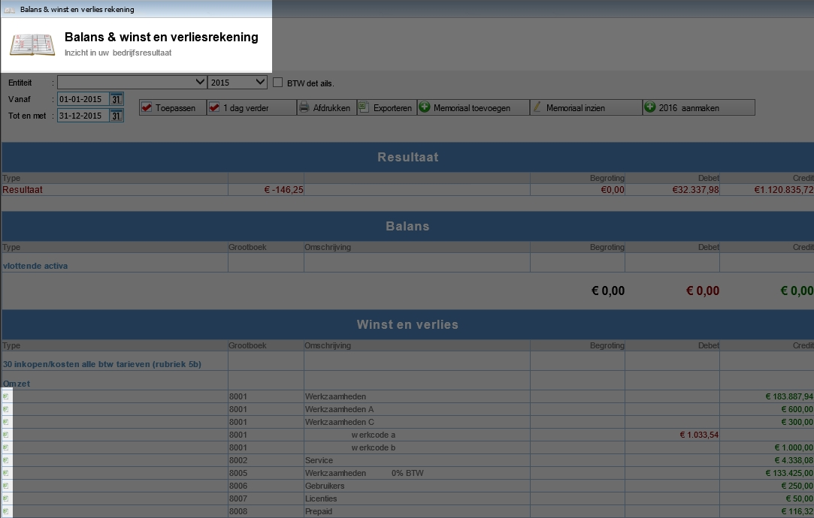
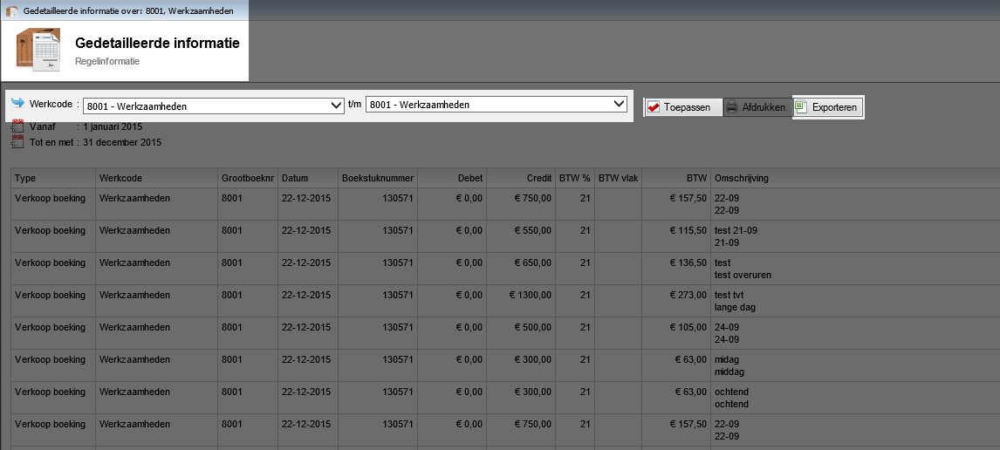
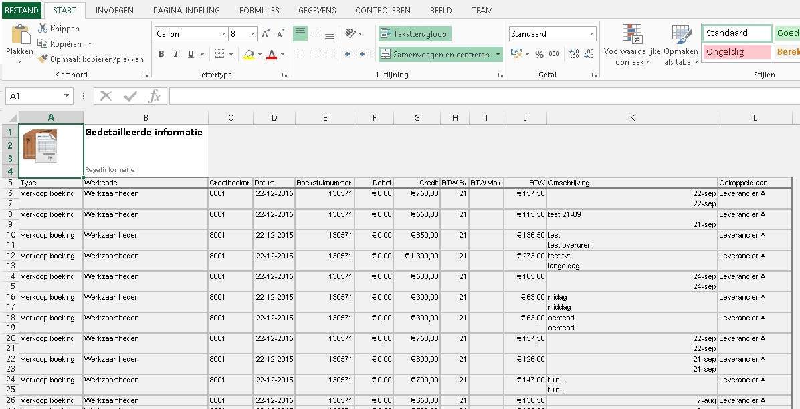

<properties>
	<page>
		<title>Lijst werkcodes uitdraaien</title>
		<description>Lijst werkcodes uitdraaien</description>
	</page>
	<menu>
		<position>Modules A - M / Balans</position> 
		<title>Lijst werkcodes uitdraaien</title>
		<sort>e</sort>
	</menu>
</properties>

## Lijst van alle transacties per werkcodes uitdraaien  ##

<description>Voor de boekhouder is het soms weleens van toepassing om een volledige lijst te hebben van alle transacties die er in Hybrid SaaS het jaar door zijn toegevoegd. Deze is te exporteren naar Excel </description>

Zoek in start naar **Winst & Verliesrekening**

Hier staan aan de rechterkant kleine symbolen van Excel.
Hier kan je op de eerste symbool klikken

Je komt dan in het volgende scherm uit

Hier kan je de selectie kiezen van de werkcodes welke je wilt hebben. Kies voor toepassen en exporteren

Na het openen of opslaan zal er een Excel bestandje worden geopend met de informatie van de werkcodes welke je hebt ingevoerd

Deze kan je Opslaan en doorsturen naar je boekhouder

----------
