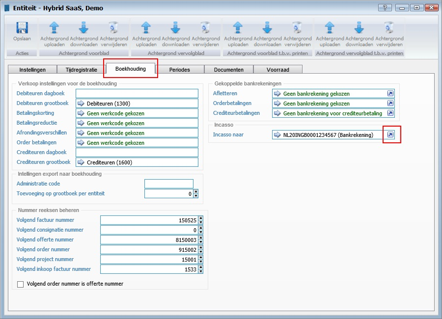
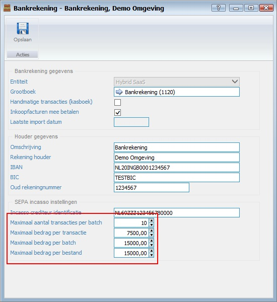
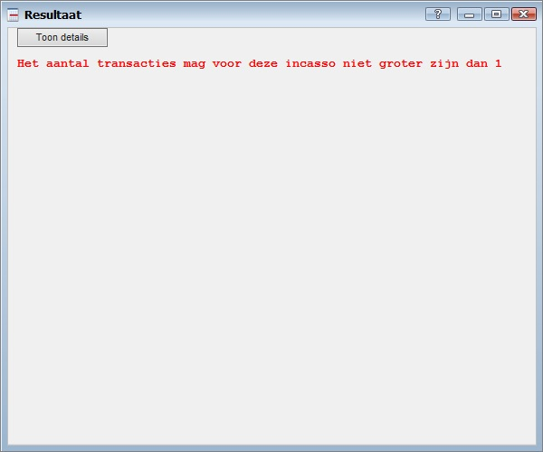

<properties>
	<page>
		<title>Automatische incasso</title>
		<description>Automatische incasso</description>
	</page>
	<menu>
		<position>Modules A - M / Bankrekeningen </position> 
		<title>Limiet instellen</title>
		<sort>d</sort>
	</menu>
</properties>

## Automatische incasso limieten instellen ##

Het is mogelijk om een controle te laten plaatsvinden van de waarde van de automatische incasso's.

Controleer in de incasso overeenkomst met je bank welke limieten van toepassing zijn.

**Limieten instellen**

Op het entiteit-dialoog kan je de incasso bankrekening instellen:

Als je de eigenschappen van de bankrekening aanpast, kan je de beperkingen instellen.

- Maximaal aantal transacties per batch
  - Het aantal transacties in een batch mag niet hoger zijn dan de ingegeven waarde.
- Maximaal bedrag per transactie
  - Het bedrag van een factuur mag niet hoger zijn dan de ingegeven waarde.
- Maximaal bedrag per batch
  -Het totaalbedrag van de facturen in een enkele batch mag niet hoger zijn dan de ingegeven waarde.
- Maximaal bedrag per bestand
  -Het totaalbedrag van alle facturen in alle batches mag niet hoger zijn dan de ingegeven waarde.

Indien de waarde '0' is ingegeven zal instelling worden genegeerd.

# Foutmelding tijdens aanmaken automatische incasso download #

Indien er tijdens het aanmaken van het incassobestand een van de limieten is overschreden zal dit in het resultaatvenster worden weergegeven:

---------
