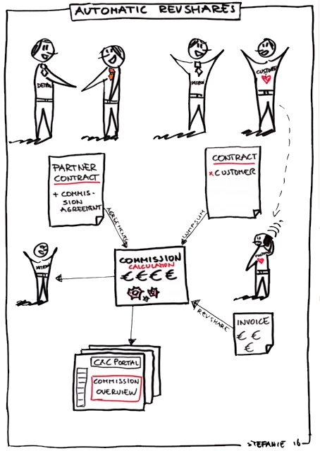
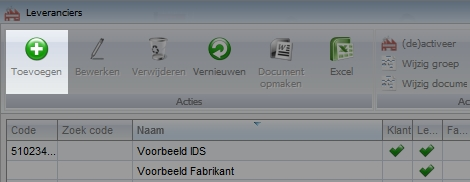
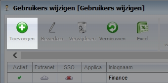
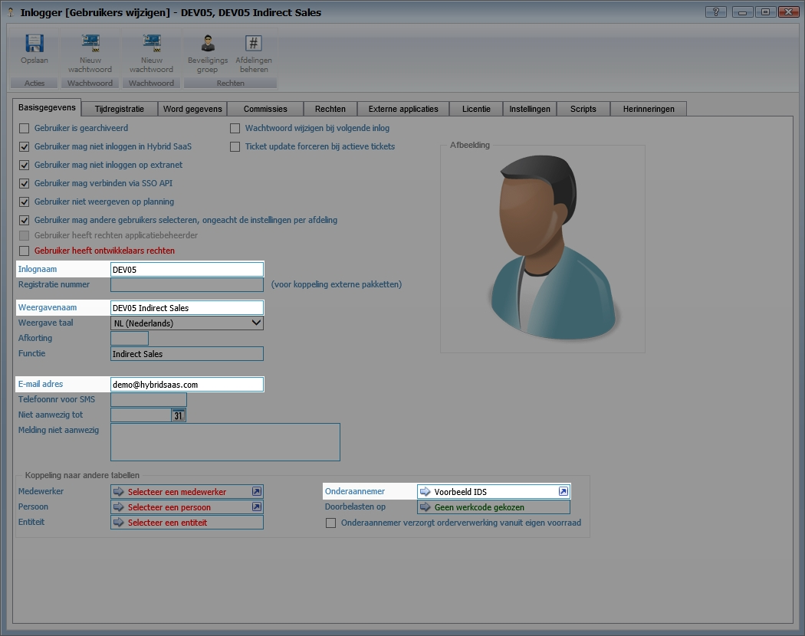

<properties>
	<page>
		<title>Partner aanmaken</title>
		<description>Partner aanmaken</description>
	</page>
	<menu>
		<position>Modules A - M /Commissiebeheer</position>
		<title>Partner aanmaken</title>
		<sort>A</sort>
	</menu>
</properties>

# Partner aanmaken #

Deze rubriek zal meer duidelijkheid te geven over het aanmaken van nieuwe partners en de instellen welke gedaan dienen te worden om de commissies op de juist manier toe te bedelen.

Er zijn een aantal verschillende instellingen welke doorlopen dienen te worden. Grofweg bestaan deze uit:
- Partner aanmaken als relatie
- Partner aanmaken als gebruiker

## Partner aanmaken als relatie ##

De partner zal worden aangemaakt als relatie voor de afdracht van commissie. Bij de commissieoverzichten zullen deze gegevens worden gebruikt.

Zoek via het startmenu naar **Leverancier**

Klik op **Toevoegen**

### NAW-gegevens partner invullen ###

Vul de benodigde NAW (naam, adres, woonplaats) gegevens in:
- Naam partner
- Vul adresgegevens in
- Controleer of het vinkje bij "leverancier" staat aangevinkt

Vul bij code het partnernummer in waaronder deze partner bekend staat. Eventuele andere systemen (SSO) zullen deze code gebruiken.

Zorg ervoor dat het vinkje bij leverancier staat aangevinkt. Indien dit niet het geval is, kan het mogelijk zijn dat de partner niet correct wordt weergegeven.

Selecteer op het tabblad Stamgegevens de juiste btw-code

## Partner aanmaken als gebruiker ##

Zoek via het startmenu naar **Gebruikers wijzigen**

Klik op toevoegen om een nieuwe gebruiker aan te maken.

Vul alle benodigde velden in en selecteer bij **Onderaannemer** de juiste relatie

Indien de partner via een SSO-connectie gekoppeld is vul dan bij Inlognaam het partnernummer in. 

-------
