<properties>
	<page>
		<title>Commissie aanpassen en herberekenen</title>
		<description>Commissie aanpassen en herberekenen</description>
	</page>
	<menu>
		<position>Modules A - M /Commissiebeheer</position>
		<title>Commissie aanpassen en herberekenen</title>
		<sort>D</sort>
	</menu>
</properties>

# Algemene informatie commissie #

In deze rubriek zal o.a. worden beschreven hoe commissies aangepast en her berekend dienen te worden. Tevens zullen algemene zaken worden besproken voor optimaal gebruik van commissiebeheer.

# Commissiepercentages aanpassen en her berekenen #

Het is mogelijk om (reeds uitgekeerde) commissies te her berekenen op basis van aangepaste percentages.

## Percentages aanpassen ##

Percentages en voorwaarden kunnen op een aantal verschillende manieren worden aangepast:

- Partner koppelen aan commissie set
- Commissie set percentage aanpassen
- Percentage op commissieregel aanpassen

### Partner koppelen aan commissie set ###
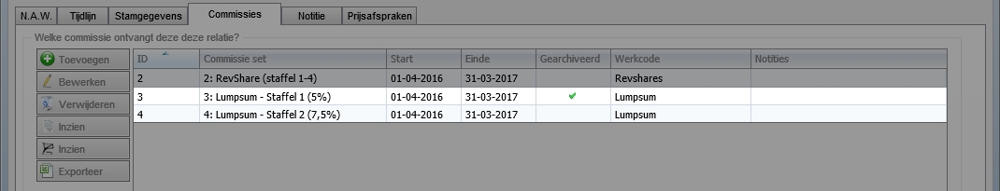

### Commissie set percentage aanpassen ###
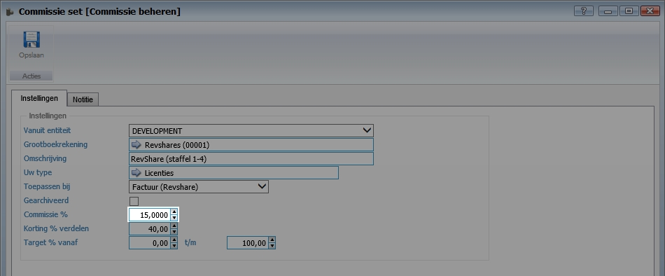

### Percentage op commissieregel aanpassen ###
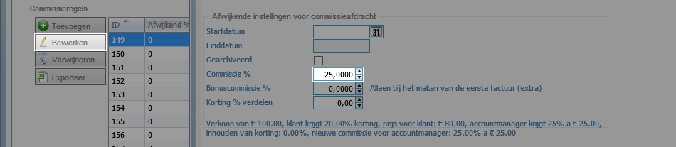

## Her berekenen met aangepast percentages ##

Nadat het percentage is aangepast dienen de commissies her berekend te worden. Hiervoor zijn een aantal verschillende manieren:

- Her berekenen op factuur- en orderniveau
- Her berekenen op bulkniveau factuur en order
- Her berekenen vanuit commissieafspraak bij partner

### Her berekenen op factuur- en orderniveau ###

**Factuur**

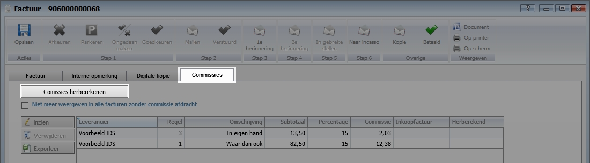

**Order**

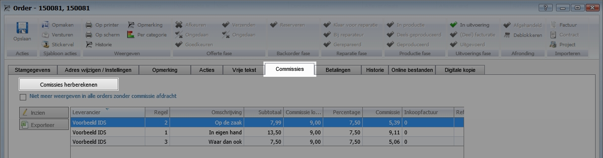

### Her berekenen op bulkniveau factuur en order ###

Ga naar "nieuwe commissieafdracht". Klik op een van de koppelingen.

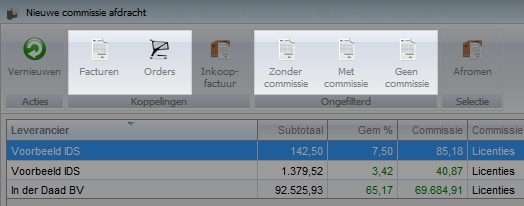

Selecteer een of meerdere regels en klik op her berekenen.

### Her berekenen op commissie set niveau ###

Ga naar "Commissie set", Selecteer één set en klik op een van de koppelingen.

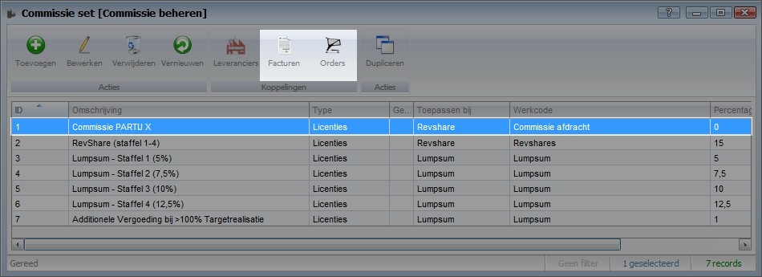

Selecteer een of meerdere regels en klik op her berekenen.

### Her berekenen vanuit commissieafspraak bij partner ###

Ga naar de commissieafspraken op de relatiekaart van de partner. Selecteer een commissieafspraak en kies voor **Inzien**.

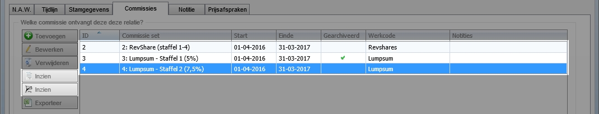

Selecteer een of meerdere regels en klik op her berekenen.

Alle commissies in de geselecteerde facturen zullen worden her berekend indien deze zijn aangepast.

## Facturen uitsluiten voor commissie ##

Het is mogelijk om facturen en orders uit te sluiten voor commissies. Hiervoor zijn een aantal manieren.
- Individueel uitsluiten per factuur of order
- Uitsluiten op bulkniveau

### Individueel uitsluiten ###

Selecteer de hieronder weergegeven opties.

**Factuur**
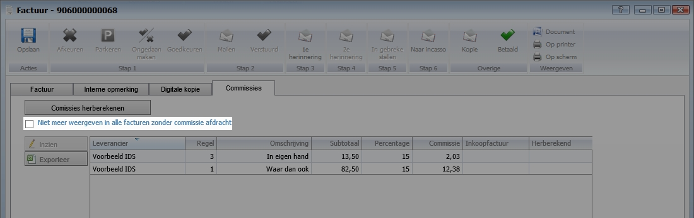

**Order**
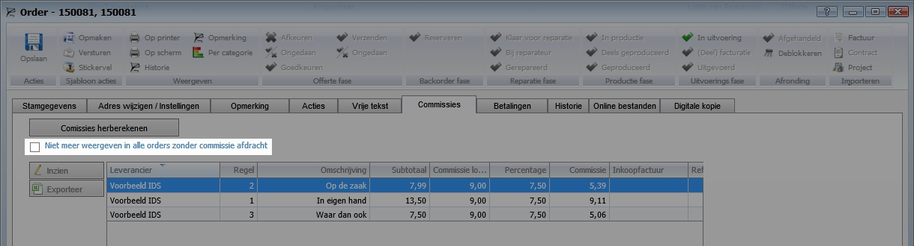

### Uitsluiten op bulkniveau ###

Ga naar **Nieuwe commissieafdracht**. Klik op een van de actieknoppen.

Selecteer een of meerdere regels en klik op her berekenen.

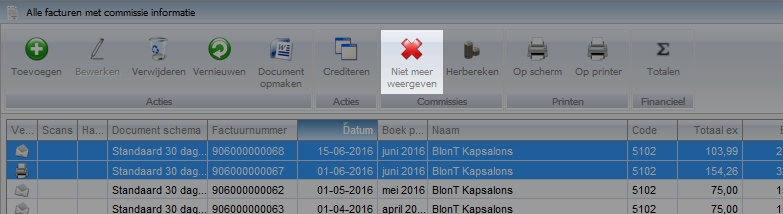

## Details commissieregel inzien ##

Selecteer een commissieregel en klik op **Inzien** om de details van de regel in te zien. Vanuit dit venster kan men naar de verschillende onderdelen.

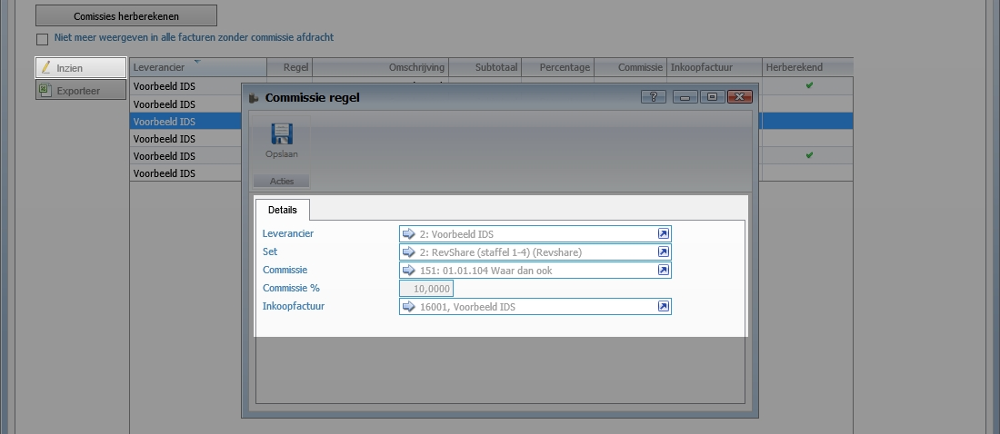

Indien de commissie wordt her berekend zal er een groen vinkje worden weergegeven. Wanneer de details worden ingezien zal worden weergegeven welke gebruiker en wanneer de actie is gedaan.

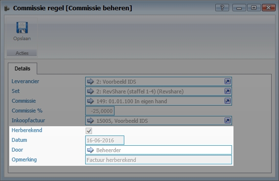

# Belangrijke weetjes #

Commissie wordt pas aangeboden voor afroming indien de verkoopfactuur is goedgekeurd en verzonden.

Commissie is pas definitief indien de inkoopfactuur (lees: commissieoverzicht) minimaal is gefiatteerd door manager.

