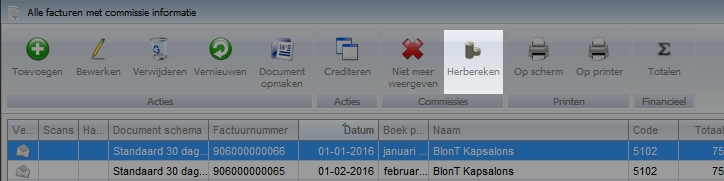

<properties>
	<page>
		<title>Commissie aanpassen en herberekenen</title>
		<description>Commissie aanpassen en herberekenen</description>
	</page>
	<menu>
		<position>Modules A - M /Commissiebeheer</position>
		<title>Commissie aanpassen en herberekenen</title>
		<sort>D</sort>
	</menu>
</properties>

# Algemene informatie commissie #

Deze rubriek zal o.a. worden beschreven hoe commissies aangepast en herberekend dienen te worden. Tevens zullen wat algemene onderdelen worden beschreven.

# Commissies herberekenen met aangepaste percentages #

Het is mogelijk om (reeds uitgekeerde) commissies te herberekenen op basis van aangepaste percentages.

## Percentages aanpassen ##

Percentages en voorwaarden op kunnen op een aantal verschillende manieren worden aangepast:

- Partner koppelen aan commissie set
- Commissieset percentage aanpassen
- Percentage op commissieregel aanpassen

### Partner koppelen aan commissie set ###

### Commissieset percentage aanpassen ###

### Percentage op commissieregel aanpassen ###

## Percentages herberekenen ##

Nadat het percentage is aangepast dienen de commissies herberekend te worden. Hiervoor zijn een aantal verschillende manieren:

- Herberekenen op factuur- en orderniveau
- Herberekenen op bulkniveau factuur en order
- Herberekenen vanuit commissieafspraak bij partner

### Herberekenen op factuur- en orderniveau ###

**Factuur**

**Order**

### Herberekenen op bulkniveau factuur en order ###

Ga naar "nieuwe commissieafdracht". Klik op één van de actieknoppen.

Selecteer één of meerdere facturen en klik op herberekenen.

### Herberekenen vanuit commissieafspraak bij partner ###

Ga naar de commissieafspraken op de relatiekaart van de partner. Selecteer een commissieafspraak en kies voor Inzien.

Selecteer één of meerdere facturen en klik op herberekenen.

## Facturen uitsluiten voor commissie ##

## Commissie raadplegen op factuurniveau ##

Test info

test warning

# Commissieproces #

Commissie wordt pas aangeboden voor afroming indien de verkoopfactuur is goedgekeurd en verzonden
Commissie is pas definitief indien de inkoopfactuur (lees: commissieoverzicht) minimaal is gefiatteerd door manager

 

