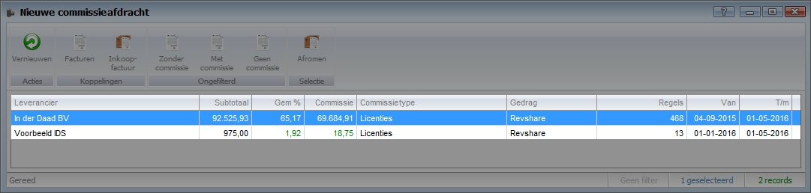
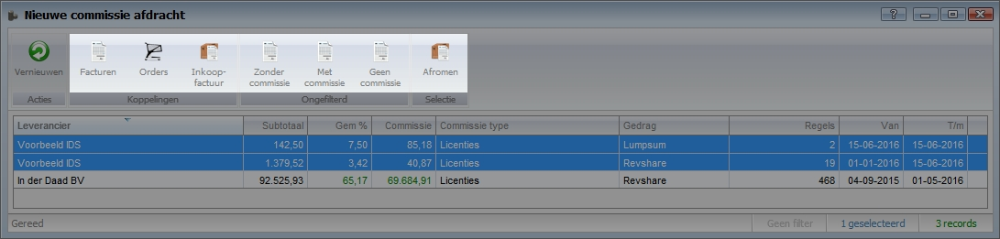
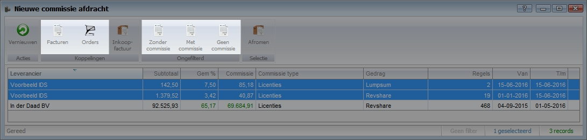
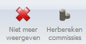
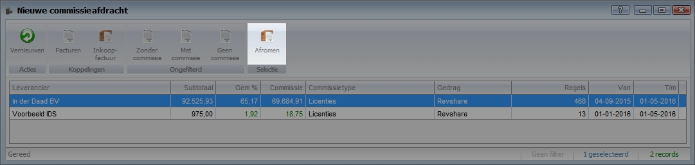
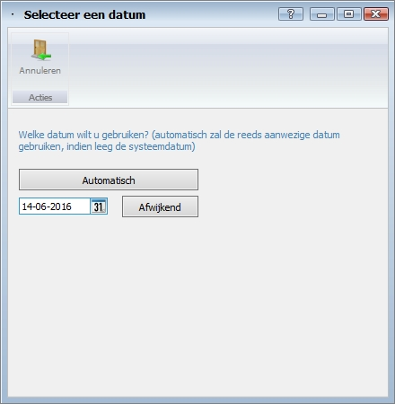
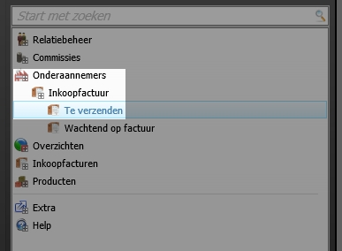
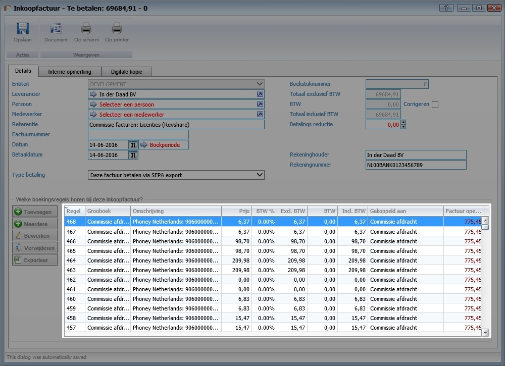
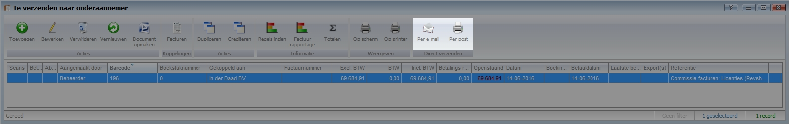
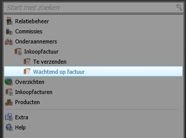

<properties>
	<page>
		<title>Commissie controleren en uitkeren</title>
		<description>Commissie controleren en uitkeren</description>
	</page>
	<menu>
		<position>Modules A - M /Commissiebeheer</position>
		<title>Controleren en uitkeren</title>
		<sort>C</sort>
	</menu>
</properties>

# Overzicht van nieuwe commissies #

Deze rubriek zal meer duidelijkheid geven over het controleren en uitkeren van commissies met commissiebeheer van Hybrid SaaS. Synoniemen voor commissies zijn onder ander provisies, courtage en procura, Revshare management. In deze beschrijving zal voormalig het woord “commissie” worden gebruikt.

## Nieuwe commissieafdracht ##

Zoek vanuit het startmenu naar **Nieuwe commissieafdracht** 

Alle nieuwe commissies worden per partner, type en gedrag weergegeven.

Van links naar rechts wordt de volgende data weergegeven.

- **Leverancier**:	Naam van de partner
- **Subtotaal**:		Subtotaal bedrag van alle factuur- of orderregels waar commissie over berekend is in deze periode
- **Gem%**:			Gemiddelde commissiepercentage (commissiebedrag/subtotaal) in deze periode
- **Commissie**:		Totale commissiebedrag in deze periode
- **Commissietype**:	Het type commissie (dit kan handmatig worden ingesteld op de commissie set)
- **Gedrag**:			Waarop is de commissie berekend (Orders of Facturen)
- **Regels**:			Het aantal regels waarover de commissie is berekend in deze periode
- **van**:			Datum van de eerste order of factuurregel waar nog geen commissie over uitbetaald is
- **t/m**:			Datum van de laatste order of factuurregel waar nog geen commissie over uitbetaald is

In dit overzicht worden alle commissies weergeven welke nog niet verwerkt zijn. Reeds uitbetaalde commissies zijn terug te vinden bij de inkoopfacturen (commissieoverzichten) van de partner.

Bovenin wordt het onderstaande actielint weergegeven

Van links naar rechts worden de volgende actieknoppen weergegeven.

- **Vernieuwen**:			Data op het scherm verversen (let op hiermee worden de commissies niet opnieuw uitgerekend)
- **Facturen**:			Alle facturen waarover commissie is berekend (Let op! enkel zichtbaar na selectie van commissieregel)
- **Orders**:				Alle orders waarover commissie is berekend (Let op! enkel zichtbaar na selectie van commissieregel)
- **Inkoop**:				Alle inkoopfacturen (commissieoverzichten) welke de status "Te verzenden" hebben
- **Zonder commissie**:	Alle facturen waarover geen commissie is berekend
- **Met commissie**:		Alle facturen waarover commissie is berekend
- **Geen commissie**:		Alle facturen waarbij is gekozen om geen commissie uit te keren
- **Afromen**:			Met deze knop is het mogelijk om de uitgerekende commissies om te zetten naar een commissieoverzicht (proforma inkoopfactuur) (Let op! enkel zichtbaar na selectie van commissieregel(s))

### Commissie her berekenen en niet meer weergeven ###

Door op een van de onderstaande knoppen te klikken worden details weergegeven. 

Wanneer een of meerdere regels worden geselecteerd zullen de onderstaande actieknoppen worden weergegeven

- **Niet meer weergeven**:	Hiermee worden de betreffende facturen uitgesloten van commissies (de facturen zullen worden weergegeven bij "Geen commissie"
- **Her berekenen commissies**: Hiermee kunnen alle commissies worden her berekend van de geselecteerde regels.

Zie voor meer informatie over her berekenen en uitsluiten http://hybridsaas.support/pages/support-site/modulesAM/commissiebeheer/commissie-aanpassen-en-herberekenen/commissie-aanpassen-en-herberekenen

### Commissies afromen ###

Met de knop **Afromen** is het mogelijk om de berekende commissies binnen een bepaalde datumreeks om te zetten in een commissieoverzicht.

Selecteer een of meerdere commissieregels

Klik op de knop **Afromen**

Het systeem vraagt om goedkeuring. Kies voor **Ja**

Er verschijnt een venster ten behoeve van de datum reeks

Automatisch: De commissie zal worden uitgerekend t/m de datum van vandaag

Afwijkend: Kies de datum t/m waar de commissie uitgerekend dient te worden en klik op de knop "afwijkend" 

## Commissieoverzicht ##

Na het verwerken van de commissie wordt er een commissieoverzicht aangemaakt in de vorm van een inkoopfactuur.

De inkoopfacturen zijn te vinden bij de inkoopfacturen bij de partner of via het menu item "**te verzenden naar onderaannemer**"

Indien de inkoopfactuur wordt verwijderd zal de berekening worden teruggedraaid en zal deze weer terug te vinden zijn bij "Nieuwe commissieafdracht"

### Details commissieoverzicht inzien ###

Vanuit de inkoopfactuur (commissieoverzicht) is het mogelijk om de details in te zien. Wanneer "Op scherm" wordt gekozen is het mogelijk om het overzicht weer te geven via een voor gedefinieerd template in pdf-formaat.

Regels inzien: Overzicht van alle van alle regels zal worden weergegeven

Factuur rapportage: Overzicht van alle factuurregels zal worden weergeven in .XLS-formaat.

Tevens is het mogelijk om de details per regel in te zien. Open hiervoor de factuurkaart en open de regel voor meer informatie.

### Commissieoverzicht versturen ###

Via de knop "Per e-mail" is het mogelijk om het commissieoverzicht per e-mail met een voor gedefinieerd template in pdf-formaat te verzenden naar de partner ter controle.

Nadat het overzicht is verzonden zal deze terug te vinden zijn "wachtend op factuur"

In dit stadium is de inkoopfactuur (commissieoverzicht) nog niet definitief. Nadat de inkoopfactuur door de partner is gefiatteerd dient deze goedgekeurd te worden. Open hiervoor de inkoopfactuur en klik op de groene vink bij "goedkeuren" Op deze manier is het commissieoverzicht definitief gemaakt en kan deze niet wijzigen. 

