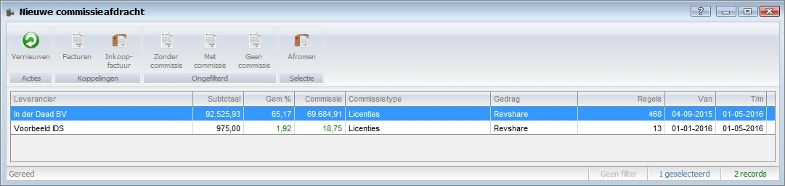

<properties>
	<page>
		<title>Commissie controleren en uitkeren</title>
		<description>Commissie controleren en uitkeren</description>
	</page>
	<menu>
		<position>Modules A - M /Commissiebeheer</position>
		<title>Controleren en uitkeren</title>
		<sort>C</sort>
	</menu>
</properties>

# Overzicht van nieuwe commissies #

Deze rubriek zal meer duidelijkheid te geven over het controleren en uitkeren van commissies met commissiebeheer van Hybrid SaaS. Synoniemen voor commissies zijn onder ander provisies, courtage en procura. In deze beschrijving zal veelal het woord “commissies” worden gebruikt.

## Nieuwe commissieafdracht ##

Zoek vanuit het startmenu naar **Nieuwe commissieafdracht** 

Alle nieuwe commissies worden per partner en per type weergegeven.

Van links naar rechts wordt de volgende data weergegeven.

- **Leverancier**:	Naam van de partner
- **Subtotaal**:		Subtotaal van alle facturen waar commissie over berekend is
- **Gem%**:			Gemiddelde commissiepercentage (commissiebedrag/subtotaal)
- **Commissie**:		Totale commissiebedrag
- **Commissietype**:	Het type commissie (dit kan handmatig worden ingesteld op de commissieregels)
- **Gedrag**:			Waarop is de commissie berekend (Orders of Facturen)
- **Regels**:			Het aantal regels waarover de commissie is berkend
- **van**:			Datum van de eerste orderof factuurregel waar nog geen commissie over uitbetaald is
- **t/m**:			Datum van de laatste orderof factuurregel waar nog geen commissie over uitbetaald is

Bovenin wordt het onderstaande actielint weergegeven

Van links naar rechts worden de volgende actieknoppen weergegeven.

- **Vernieuwen**:			Data op het scherm verversen (let op hiermee worden de commissies niet opnieuw uitgerekend)
- **Facturen**:			Alle facturen waarover commissie is berekend (Let op! enkel zichtbaar na selectie van commissieregel)
- **Inkoop**:				Alle inkoopfacturen (commissieoverzichten) welke de status "Te verzenden" hebben
- **Zonder commissie**:	Alle facturen waarover geen commissie is berekend
- **Met commissie**:		Alle facturen waarover commissie is berekend
- **Geen commissie**:		Alle facturen waarbij is gekozen om geen commissie uit te keren
- **Afromen**:			Met deze knop is het mogelijk om de uitgerekende commissies om te zetten naar een commissieoverzicht (proforma inkoopfactuur) (Let op! enkel zichtbaar na selectie van commissieregel(s))

### Commissie herberekenen en niet meer weergeven ###

Door op één van de onderstaande knoppen te klikken worden details weergegeven. 

Wanneer één of meerdere regels worden geselecteerd zullen de onderstaande actieknoppen worden weergegeven

- **Niet meer weergeven**:	Hiermee worden de betreffende facturen uitgesloten van commissies (de facturen zullen worden weergegeven bij "Geen commissie"
- **Herberekenen commissies**: Hiermee kunnen alle commissies worden herberekend van de geselecteerde regels.

### Commissies afromen ###

Met de knop **Afromen ** is het mogelijk om de berekende commissies binnen een bepaalde datumreeks om te zetten in een commissieoverzicht.

Selecteer één of meerdere commissieregels

Klik op de knop **Afromen**

Het systeem vraagt om goedkeuring. Kies voor **Ja**

Er verschijnt een venster ten behoeve van de datum reeks

Automatisch: De commissie zal worden uitgerekend t/m de datum van vandaag

Afwijkend: Kies de datum t/m de commissie uitgerekend dient te worden en klik op de knop "afwijkend" 

