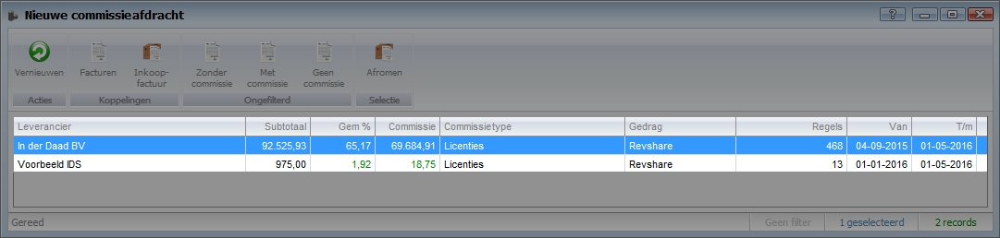

<properties>
	<page>
		<title>Commissie handige weetjes</title>
		<description>Commissie handige weetjes</description>
	</page>
	<menu>
		<position>Modules A - M /Commissiebeheer</position>
		<title>Commissie handige weetjes</title>
		<sort>D</sort>
	</menu>
</properties>

# Algemene informatie commissie #

Deze rubriek zullen handige weetjes worden beschreven over commissiebeheer van Hybrid SaaS. Synoniemen voor commissies zijn onder ander provisies, courtage en procura. In deze beschrijving zal veelal het woord “commissies” worden gebruikt.

## Commissie raadplegen op factuurniveau ##

Test info

test warning

# Commissieproces #

Commissie wordt pas aangeboden voor afroming indien de verkoopfactuur is goedgekeurd en verzonden
Commissie is pas definitief indien de inkoopfactuur (lees: commissieoverzicht) minimaal is gefiatteerd door manager

# Commissies herberekenen met aangepaste percentages #

Het is mogelijk om (reeds uitgekeerde) commissies te herberekenen op basis van aangepaste percentages.

## Percentages aanpassen ##

Percentages en voorwaarden op kunnen op een aantal verschillende manieren worden aangepast:
- Partner koppelen aan commissie set
- Commissieset percentage aanpassen
- Percentage op commissieregelniveau aanpassen

