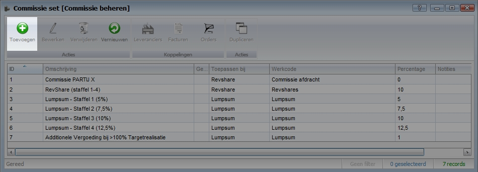
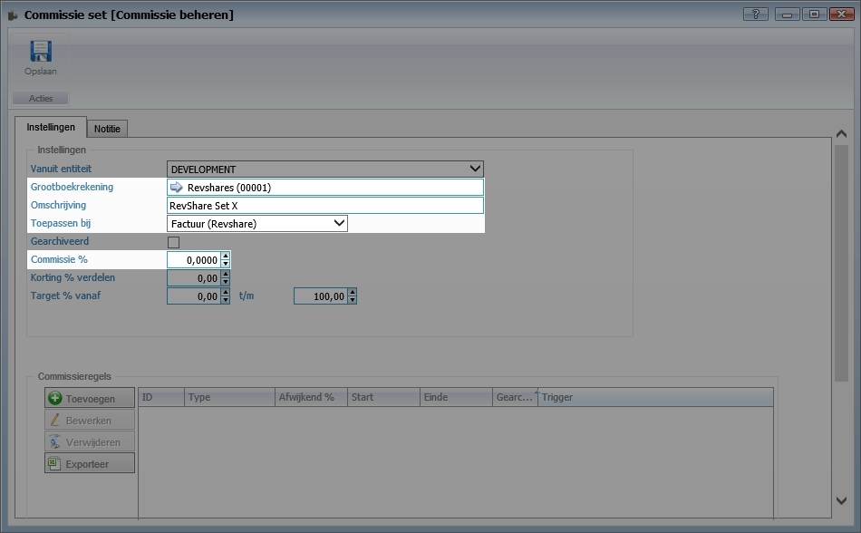
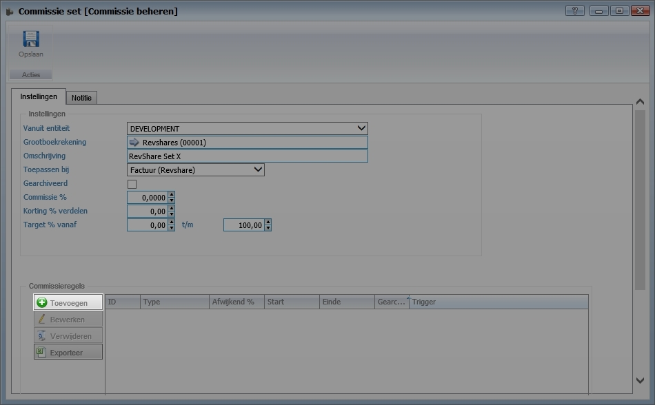
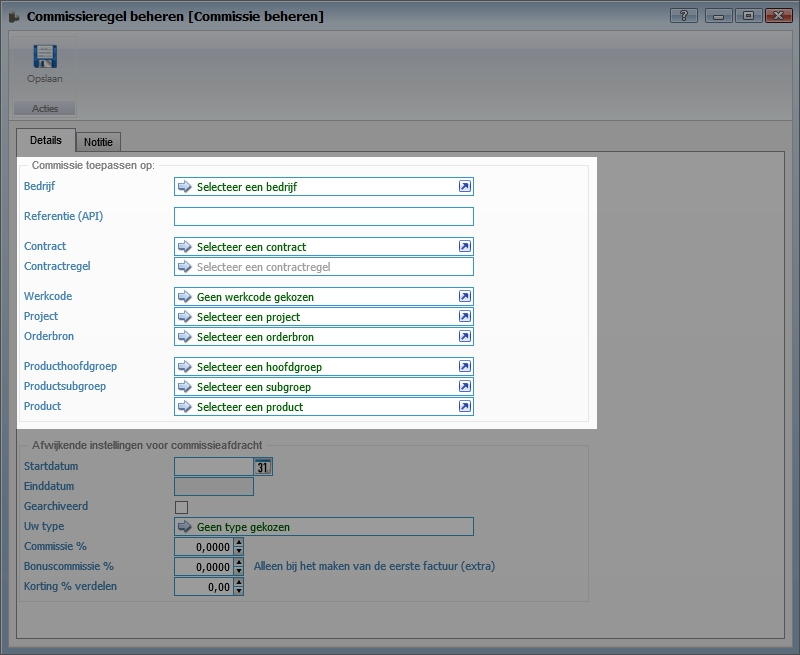
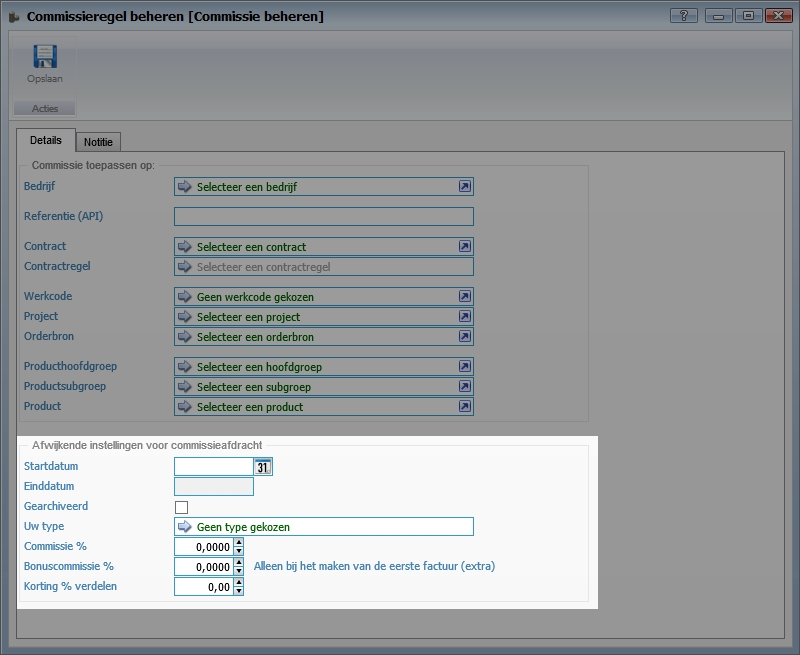
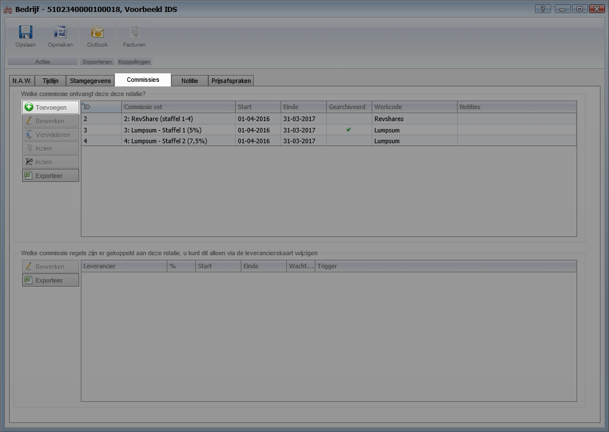
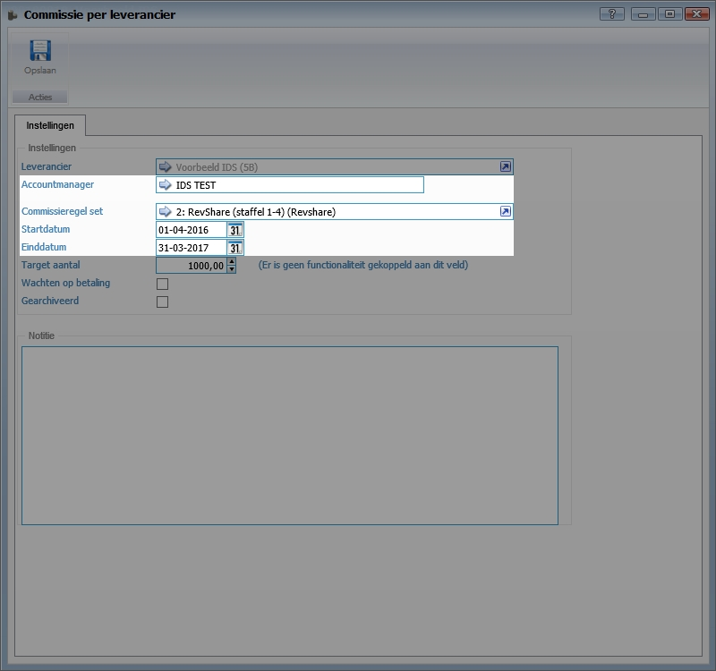

<properties>
	<page>
		<title>Commissie instellen</title>
		<description>Commissie instellen</description>
	</page>
	<menu>
		<position>Modules A - M /Commissiebeheer</position>
		<title>Commissie instellen</title>
		<sort>B</sort>
	</menu>
</properties>

# Commsissies instellen #

Deze rubriek zal meer duidelijkheid te geven over het beheren van commissies met commissiebeheer van Hybrid SaaS. Synoniemen voor commissies zijn onder ander provisies, courtage en procura. In deze beschrijving zal veelal het woord “commissies” worden gebruikt.

Om geen misverstanden te krijgen worden eerst enkele definities benoemd:

**Revenu share** (variabele prijs) : Commissie op basis van een percentage van gerealiseerde omzet (facturen)
Voorbeeld:
- Product A	€100,-	(per maand)
- Percentage		15%
- Resultaat: 100 * 15% = €15,--

**Lumpsum** (vastgestelde prijs): Commissies op basis van een percentage van orders. De som van alles orders maakt de contractwaarde. Lumpsum is het resultaat van de orderregeltotaal * looptijd * commissies percentage.
Voorbeeld: 

- Product A	€100,-	(per maand)

- Looptijd 			24 maanden

- Percentage		15%

- Resultaat: 100 * 24 * 15% = €360,--

## Commissie sets aanmaken ##
In een commissie set wordt een verzameling met afspraken vastgelegd voor de berekening van commissies op facturen en orders. In de set wordt het percentage en de onderdelen waarop deze van toepassing zijn vastgelegd. Tevens kunnen hier targets worden vastgelegd waar de set betrekking op heeft. 

Zoek vanuit het startmenu naar **Commissie set** > **Toevoegen**

### Basisgegevens commissies invullen ###

Selecteer de juiste **grootboekrekening** (GL-code)

Geef een duidelijke **omschrijving** 

Kies het **gedrag** waarop het percentage toegepast dient te worden 
-	Revshare (Factuur)
-	Lumpsum (Order)

Vul het commissiepercentage in 

Korting verdelen: Indien er korting wordt gegeven aan de klant is het mogelijk deze korting te delen met de partner. Bij het invullen van een percentage zal een voorbeeldberekening worden weergegeven.

Target. Bij Target kan het target percentage worden vastgelegd. 
Voorbeeld:
- Target 1000 stuks
- Min 35% max 80%
- Resultaat: vanaf 350 stuks t/m 800 stuks

### Commissieregels toevoegen aan commissieafspraken ###

Klik op **Toevoegen** om commissieregels toe te voegen aan de set.

## Commissieregels beheren ##

Wanneer de commissieregel wordt toegevoegd verschijnt het volgende scherm.

Selecteer de onderdelen waarop het commissiepercentage toegepast dient te worden. 

Het is veelal niet mogelijk om meerdere onderdelen te selecteren in één afspraak. Indien een tweede onderdeel wordt gekozen zal de eerste selectie komen te vervallen.

Veelal zal de commissie van toepassing zijn op een product, productsubgroep of productgroep.

Selecteer een klant bij "bedrijf selecteren" indien een speciale afspraak van toepassing is bij een specifieke klant.

### Afwijkende voorwaarden instellen op regelniveau ###

Het is mogelijk om afwijkende voorwaarden te laten prevaleren boven de voorwaarden welke in de set zijn vastgelegd. De afwijkende voorwaarden zullen worden gebruikt bij de berekening van de commissie.

 

## Set koppelen aan de partner ##

Nadat set is aangemaakt dient deze aan de juiste partner(s) gekoppeld te worden.

Zoek vanuit het startmenu naar **Leveranciers**

Open de relatiekaart van de betreffende partner

Ga naar het tabblad **Commissies**

Klik op **Toevoegen** om een commissie set te selecteren

 

Selecteer de betreffende accountmanager 

Indien deze nog niet is aangemaakt raadpleeg de volgende [handleiding](http://hybridsaas.support/pages/support-site/het-systeem/gebruikers-toevoegen-SSO-API/toevoegen "Nieuwe gebruikers toevoegen (autorisatie afhankelijk)")  

Selecteer de **commissie set**

Selecteer de **startdatum** en **einddatum** welke is terug te vinden in de partnerovereenkomst

 

Wachten op betaling: Indien deze optie is geselecteerd zal de commissie pas worden uitgekeerd indien de factuur door de klant is voldaan.

Gearchiveerd: Indien deze optie is geselecteerd zal de commissieafspraak op inactief worden gezet, waarbij de gekoppelde data zal worden bewaard.

