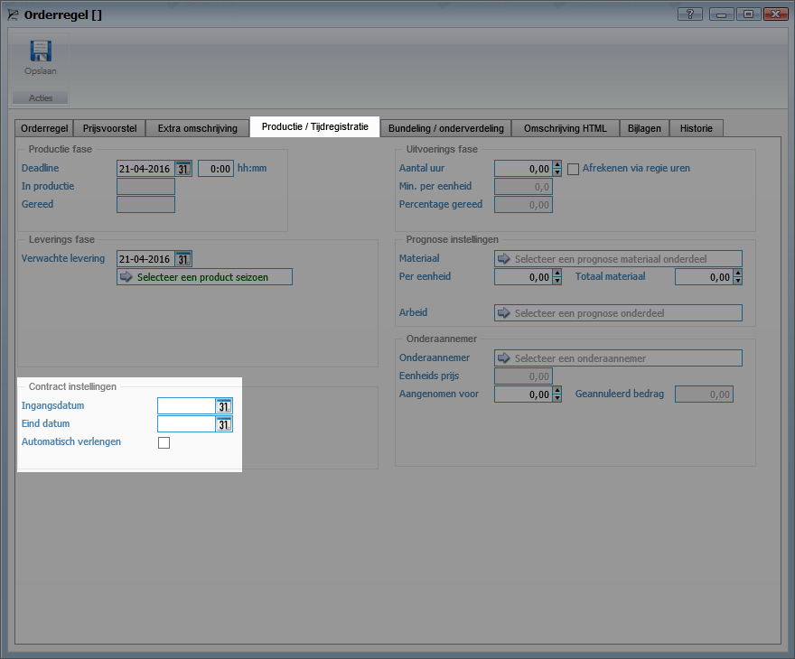

<properties>
	<page>
		<title>Handige weetjes</title>
		<description>Alles wat je over contracten moet weten</description>
	</page>
	<menu>
		<position>Modules A - M /Contractbeheer</position>
		<title>Handige weetjes</title>
		<sort>a</sort>
	</menu>
</properties>

# Handige weetjes #
In deze rubriek zal alles worden beschreven wat je dient te weten over het contractbeheer. 

## Importeren van een order in een contract ##
Door middel van een paar stappen is het mogelijk om een order om te zetten in een contract. In feite worden alle orderregels in een contract omgezet.

### Looptijden contractregel vastleggen op orderregel ###
Op de orderregel is het mogelijk om de looptijd (begin- en eindtijd) vast te leggen. Ga naar het tabblad Productie/tijdregistratie

Begindatum: Vul hier de datum in waarop de contractregel van kracht dient te gaan
Einddatum: Vul hier de datum in waarop de contractregel dient te eindigen. Indien er geen datum wordt ingevuld zal de contractregel oneindig doorlopen.
Automatisch verlengen: Vink deze optie indien de contractregel door dient te lopen nadat de einddatum is verstreken.

### Aantal van orderregel wordt als losse regels opgeslagen ###
Bij het importeren van een order in een contract zal het aantal van de orderregel als losse regels worden geïmporteerd onder het tabblad variabele looptijden. Op deze manier kan ieder product afzonderlijk worden beheert op begin- en eindtijden.

### Product aanmerken als repeterende kosten (maandelijks terugkerende kosten) ###
Producttype vastleggen. Een product kan als eenmalige maar ook als repeterend worden aangemerkt. Geef op de productkaart aan of het product repeterend is door het vinkje aan te zetten.

### Product uitsluiten om te importeren in een contract ###
Het is mogelijk om producten uit te sluiten om te importeren in een contract. Op deze manier blijven de producten op de order staan maar worden deze niet meegenomen op het contact.

## Contractwaarden splitsen op aantal of prijs ##

Indien er gebroken tijdperiodes (maanden, kwartalen, jaren e.d.) worden gefactureerd kan de splitsing belangrijk zijn. 

Hieronder wordt een voorbeeld gegeven van een contract met 10 producten per maand, tegen een maandprijs van €25,-- . De facturatie vindt per kwartaal plaats.

**Splitsen op aantal** 

Indien er met bijvoorbeeld prepaidkaarten wordt gewerkt dienen er eenheden worden opgeboekt. In dit geval dient het aantal vermenigvuldigd met de interval zodat deze correct worden verwerkt.

**Splitsen op prijs**

Bij het splitsen op prijs blijft het aantal handhaaft en wordt de prijs aangepast. 

## Generatiemomenten voor facturatie instellen ##

Het is mogelijk om de generatiemomenten voor de facturatie precies in te stellen zoals je dat zelf wilt. Hiervoor zijn drie variabelen nodig; "Moment", "Interval" en Contractwaarde. Hieronder zijn een aantal voorbeeld gegeven van Facturatiemomenten ten opzichte van de contractwaarde. 

**Contractwaarde per jaar - Facturatie per kwartaal**

**Contractwaarde per maand - Facturatie per kwartaal**

**Contractwaarde per week - Facturatie per 4 weken**

