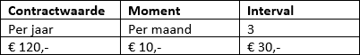
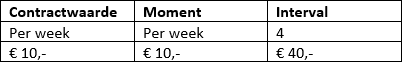

<properties>
	<page>
		<title>Algemeen gebruik</title>
		<description>Alles wat je over contracten moet weten</description>
	</page>
	<menu>
		<position>Modules A - M /Contractbeheer</position>
		<title>Algemeen gebruik</title>
		<sort>a</sort>
	</menu>
</properties>

# Handige weetjes #
Het contractbeheer van Hybrid SaaS is uitgebreid met vele functies. Sommige functies zullen makkelijker te begrijpen zijn dan andere. Deze rubriek zal antwoord geven op de meest voorkomende functies zodat het contactbeheer perfect kan worden ingericht en worden afgestemd op de organisatie.

## Importeren van een order in een contract ##
Door middel van een paar stappen is het mogelijk om een order om te zetten in een contract. 

Keur de order goed door op **Goedkeuren** te klikken, handel de order af door op **Afgehandeld** te klikken, klik vervolgens op **Contract** om de order om te zetten in een contract.

Indien er een contract wordt gevonden van dezelfde relatie zal de volgende melding worden weergegeven: "Er zijn lopende contracten gevonden wilt u deze order hier aan toevoegen?".
Ja: Kies het contract waar de order aan toegevoegd dient te worden. De orderregels zullen aan het lopende contract worden toegevoegd.
Nee: Op basis van order zal een nieuw contract worden aangemaakt.

### Looptijden contractregel vastleggen in order ###

Het is mogelijk om de looptijd (begin- en einddatum) vast te leggen.

Door een bestaand contract te koppelen in de order is het mogelijk om de begin-, einddatum en voorwaarden over te nemen.

Begindatum: Vul hier de datum in waarop de contractregel van kracht dient te gaan

Einddatum: Vul hier de datum in waarop de contractregel dient te eindigen. Indien er geen datum wordt ingevuld zal de contractregel oneindig doorlopen.

Automatisch verlengen: Vink deze optie indien de contractregel door dient te lopen nadat de einddatum is verstreken.

Eventueel is het mogelijk om afwijkende voorwaarden in te stellen op orderregelniveau

Open de orderegel en ga naar het tabblad **Productie/tijdregistratie**

Begindatum: Indien het veld wordt leeg gelaten zal de datum op het hoofd tabblad worden overgenomen

Einddatum: Indien het veld wordt leeg gelaten zal de datum op het hoofd tabblad worden overgenomen

Automatisch verlengen: Vink deze optie indien de contractregel door dient te lopen nadat de einddatum is verstreken.

Indien gewenst is het mogelijk om de de factor aan te passen. De factor is het aantal keer dat het item wordt uit gefactureerd gedurende de looptijd van het contract. Dit aantal wordt overigens niet gebruikt in het contract zelf.

### Aantal van orderregel wordt als losse regels opgeslagen ###
Bij het importeren van een order in een contract zal het aantal van de orderregel als losse regels worden geïmporteerd onder het tabblad variabele looptijden. Op deze manier kan ieder product afzonderlijk worden beheert op begin- en eindtijden.

### Product aanmerken als repeterende kosten (maandelijks terugkerende kosten) ###
Producttype vastleggen. Een product kan als eenmalige maar ook als repeterend worden aangemerkt. Geef op de productkaart aan of het product repeterend is door het vinkje aan te zetten.

Ga naar et tabblad **Prijzen**, zet het vinkje aan bij **Repeterende kosten**

### Product uitsluiten om te importeren in een contract ###
Het is mogelijk om producten uit te sluiten om te importeren in een contract. Op deze manier blijven de producten op de order staan maar worden deze niet meegenomen op het contact.

Ga naar het tabblad **Prijzen**, zet het vinkje aan bij **Niet importeren in contract**

## Contractwaarden splitsen op aantal of prijs ##

Indien er gebroken tijdperiodes (maanden, kwartalen, jaren e.d.) worden gefactureerd kan de splitsing belangrijk zijn. 

Hieronder wordt een voorbeeld gegeven van een contract met 10 producten per maand, tegen een maandprijs van €25,-- . De facturatie vindt per kwartaal plaats.

**Splitsen op aantal** 

Indien er met bijvoorbeeld prepaidkaarten wordt gewerkt dienen er eenheden worden opgeboekt. In dit geval dient het aantal vermenigvuldigd met de interval zodat deze correct worden verwerkt.

**Splitsen op prijs**

Bij het splitsen op prijs blijft het aantal handhaaft en wordt de prijs aangepast. 

## Generatiemomenten voor facturatie instellen ##

Het is mogelijk om de generatiemomenten voor de facturatie precies in te stellen zoals je dat zelf wilt. Hiervoor zijn drie variabelen nodig; "Moment", "Interval" en Contractwaarde. Hieronder zijn een aantal voorbeeld gegeven van Facturatiemomenten ten opzichte van de contractwaarde. 

Hieronder zullen een aantal voorbeelden worden gegeven van de facturatiemomenten ten opzichte van de contractwaarde.

### Contractwaarde per jaar - Facturatie per kwartaal ###

### Contractwaarde per maand - Facturatie per kwartaal ###

### Contractwaarde per week - Facturatie per 4 weken ###

## Facturen opmaken (genereren) vanuit contracten ##

Er zijn 3 verschillende methoden om facturen op te maken op basis van contracten.

**Optie 1:** Ga naar **Contracten genereren**, Selecteer de **datum** tot wanneer de contracten verwerkt dienen te worden, klik **Verwerken**

**Optie 2:** Selecteer een of meerdere contracten in het contractoverzicht , klik op **Genereren**

**Optie 3:** Open het contract, ga naar het tabblad **Planning**, **selecteer** de facturatiemomenten, klik op **Opmaken**

In alle bovenstaande gevallen zal de factuur worden weergegeven bij Nieuwe facturen. 

