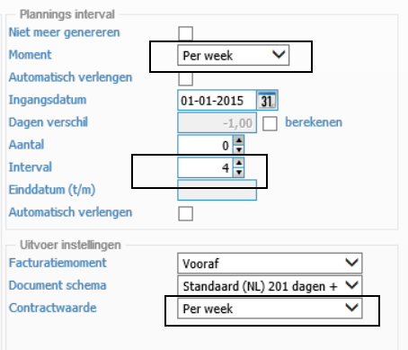
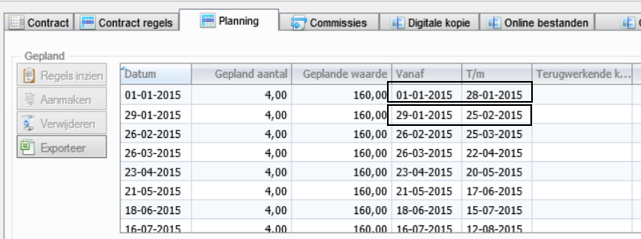

<properties>

</properties>

## Plannings interval ##

**Per 4 weken**

Je kan een periode van 4 weken inrichten waarop de factuur wordt gemaakt. Je geeft dan een contractprijs per week op en een interval van 4 (4 weken)
 

In de planning komen dat periodes van 4 weken waarop de factuur wordt gegenereerd.

----------