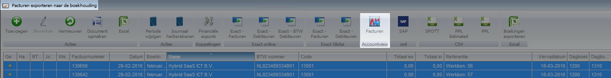

<properties>
	<page>
		<title>AccountView</title>
	</page>
	<menu>
		<position>Modules A - M / Facturatie </position> 
		<title>AccountView</title>
		<sort>a</sort>
	</menu>
</properties>

# Mutaties importeren in AccountView vanuit Hybrid SaaS #

Om de mutaties automatisch in te lezen vanuit Hybrid SaaS naar AccountView dient op de server aangegeven te worden voor welke administratie dit dient te gebeuren. Standaard staat de server ingesteld op het huidige boekjaar van de eerste administratie (indien er met meerdere administraties wordt gewerkt). In AccountView is het mogelijk om te wisselen tussen de verschillende administraties. Hybrid SaaS geeft echter geen onderscheid in de verschillende administraties op het moment van exporteren.

## Export vanuit Hybrid SaaS ##

### Rechten correct instellen ###
In Hybrid SaaS zijn verschillende soorten exports beschikbaar. Om de juiste gegevens te kunnen exporteren dienen de rechten aangepast te worden.

Let op! De rechten kunnen op het niveau van de beveiligingsgroep naar ook op gebruikersniveau aangepast worden.
* Indien de knopjes voor het recht **groen of rood** zijn, is deze enkel van toepassing op de geselecteerde gebruiker
* Indien de knopjes voor het recht **wit** zijn, is deze enkel van toepassing op de gehele beveiligingsgroep. Iedere gebruiker in deze beveiligingsgroep zal het geselecteerde recht hebben.

### Verschillende export mogelijkheden ###

Er zijn 3 verschillende menukeuzes: **verkoopfacturen**, **inkoopfacturen** en **memoriaalboekingen**.

Het is handig om de verschillende snelkoppelingen op het bureaublad te plaatsen. Klik vanuit het startmenu met de rechtermuisknop op het menu-item. Er verschijnt de keuze "Toon op bureaublad". 

Tevens is het mogelijk om de naam van de snelkoppeling te veranderen, door met de rechtermuisknop op de snelkoppeling te klikken verschijnt de keuze "Naam wijzigen" Pas de naam aan en klik op "opslaan". 

### Regels exporteren ###

Selecteer de regels welke geëxporteerd dienen te worden en klik op de knop **AccountView**.

**Verkoopfacturen:**

**Inkoopfacturen:**

**Memoriaalboekingen:**

### Regels exporteren ###

Nadat de bovenstaande actie is uitgevoerd verschijnt het onderstaande venster

Alle geëxporteerde bestanden en de (nieuwe) nog te exporteren bestanden weergegeven. Nieuwe bestanden zijn te herkennen aan het gele sterretje.
Selecteer de regel met het sterretje en kies voor **Download bestand**.
 
Bij de volgende melding wordt er gevraagd of het bestand opgeslagen of geopend dient te worden. Kies voor **opslaan** en sla het bestand op in een map op de computer. 

De exports zullen automatisch worden opgeslagen in Hybrid SaaS. Indien gewenst kunnen bestanden alsnog worden opgeslagen op de computer zodat er een extra back up is.

## Importeren exports in AccountView ##

Ga naar AccountView en kies bij **Bestand** voor **Administraties**.

Zorg dat de juiste administratie geselecteerd is en kies bij **Document** voor **Importeren** en vervolgens voor **XML**

Selecteer de juiste map om het bestand te selecteren. Ga naar de juiste map (waarin de exports zijn opgeslagen) en selecteer het bestand en kies voor **importeren**.

Sluit na het importeren de administratie.
 

 
 -----
