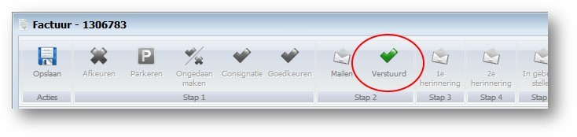
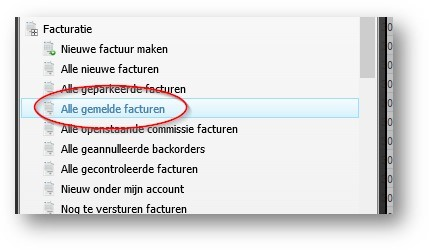
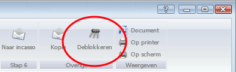
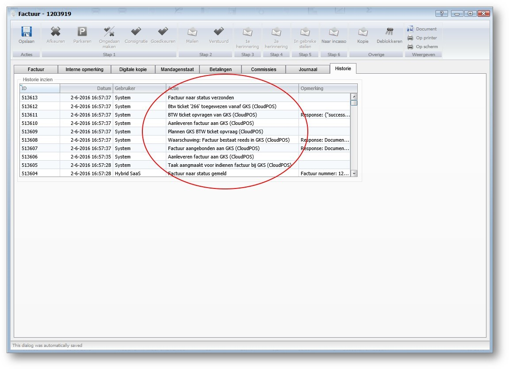
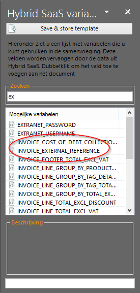

<properties>
	<page>
		<title>Export Jupa</title>
	</page>
	<menu>
		<position>Modules A - M / Facturatie / Exports </position> 
		<title>GKS</title>
		<sort>c</sort>
	</menu>
</properties>

# Exporteren facturen naar GKS #

In dit artikel zal worden beschreven welke stappen er gevolgd worden om facturen naar de blackbox van GKS te sturen

Het proces van een factuur blijft tot de stap van verstuurd het zelfde, na deze stap zijn er een paar handelingen, Dit vind allemaal op de achtergrond plaats.

## Factuur verstuurd ##

Na het verzonden zetten van de factuur (Knop Verstuurd op dialoog factuur) zal de factuur in het GKS-proces terecht komen:

In plaats van direct als verzonden te worden aangemerkt, zal de factuur de status **gemeld** krijgen. 

Alle facturen die deze status hebben zijn terug te vinden via de menu optie **Alle gemelde facturen**.

Voor deze optie is een recht nodig (Menu: Gemelde facturen)

## Proces dorosturen naar GKS ##

Na dit moment worden de facturen aangeboden bij GKS. Hierin worden ze voorzien van een BTW ticket, zolang de factuur geen BTW ticket heeft gekregen zal de factuur de status **Gemeld** houden. 

Indien er nog een BTW ticket is toegewezen zal Hybrid SaaS elke 5 minuten proberen alsnog een BTW ticket te verkrijgen.

De procedure kan worden afgebroken doormiddel van de deblokkeer knop in de factuur, de factuur zal weer terugvallen in de status **gecontroleerd**.

Als er een Btw ticket is toegewezen kan je de factuur (vanwege wettelijke bepalingen) niet meer deblokkeren.

## De historie ##

In de historie van de factuur is terug te vinden in welke procedure en de factuur zich bevind

Na het toewijzen van het Btw ticket zal de factuur automatisch de status verzonden krijgen

## BTW ticket nummer ##

Het is mogelijk om het BTW ticket nummer van GKS op de factuur te laten tonen. Dit kan doormiddel de veldcode: `{MERGEFIELD INVOICE_EXTERNAL_REFERENCE \* MERGEFORMAT}` toe te voeren aan het word document

------
