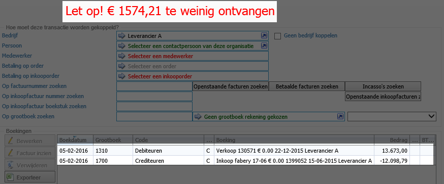

<properties>
	<page>
		<title>Een factuur afletteren op:</title>
	</page>
	<menu>
		<position>Modules A - M / Facturatie </position> 
		<title>Een factuur afletteren op:</title>
		<sort>a</sort>
	</menu>
</properties>

## Een factuur afletteren op: ##

Je kan een factuur op verschillende manieren afletteren, de stappen die hieronder worden beschreven zijn:

- Op een andere factuur
- Op een inkoop factuur
- Op een grootboek

## Op een andere factuur ##

Het kan voorkomen dat je een credit factuur wilt afletteren op een factuur die nog moet ontvangen, zodat deze tegen elkaar weg vallen of dat er nog een deel overblijft wat je nog moet ontvangen.

In dit voorbeeld gebruiken we een factuur van € 604,94 die we nog moeten ontvangen en een inkoopfactuur van € -268,86 die we nog moeten betalen, het verschil wat overblijft zal € 336,08 zijn wat we nog moeten ontvangen

Ga naar **alle openstaande facturen** en selecteer de regels welke je tegen elkaar wilt afletteren en klik op de knop **Afletteren**

Er zal nu een transactie scherm worden geopend, met onderin de regels van de facturen.
Je ziet dat hij nog niet in evenwicht is, dit komt omdat het bedrag van de factuur wat je nog moet krijgen in dit geval hoger is dan het bedrag wat je moet betalen.

Selecteer de regel welke het hoogste is en open deze door er op de dubbelklikken Hierin kunnen we het bedrag aanpassen naar het bedrag van de credit in dit geval: €268,86 en deze kan je opslaan

De boeking zal nu in evenwicht zijn, en dit scherm kan je ook opslaan

Als je nu weer terugvalt in het scherm van **alle openstaande facturen** zal je zien dat de credit nota er niet meer tussen staat en het openstaande bedrag van de andere factuur is aangepast.

Dit is nu met elkaar verrekend

----------

## Op een inkoop factuur ##

Het kan voorkomen dat je een factuur wilt afletteren op een inkoopfactuur die nog betaald moet worden, zodat deze tegen elkaar weg vallen of dat er nog een deel overblijft wat je nog moet ontvangen. 

In dit voorbeeld gebruiken we een factuur van € 13.673,00 die we nog moeten ontvangen en een inkoopfactuur van € -12.098,79 die we nog moeten betalen, het verschil wat overblijft zal € 1.574,21 zijn wat we nog moeten ontvangen

Ga naar **alle openstaande facturen** en selecteer de regel welke je wilt afletteren en klik op de knop **Afletteren**

Er zal nu een transactie scherm worden geopend, met onderin de regel van de factuur.
Je ziet dat hij nog niet in evenwicht is, dit komt omdat er nog geen andere regels is toegevoegd.
Hiervoor gaan we naar **op inkoopfactuurnummer zoeken** of gebruik de button **Openstaande inkoopfacturen zoeken**

Zoek hierin de inkoopfactuur welke je wilt afletteren en klik op selecteren

Je komt nu weer terug in het transactie scherm, met onderin de regel van de factuur en inkoopfactuur.
Je ziet dat hij nog niet in evenwicht is, dit komt omdat het bedrag van de factuur wat je nog moet krijgen in dit geval hoger is dan het bedrag wat je moet betalen.

Selecteer de regel welke het hoogste is en open deze door er op de dubbelklikken Hierin kunnen we het bedrag aanpassen naar het bedrag van de inkoopfactuur in dit geval: €12.098,79 en deze kan je opslaan

De boeking zal nu in evenwicht zijn, en dit scherm kan je ook opslaan

Als je nu weer terugvalt in het scherm van **alle openstaande facturen** openstaande bedrag van de factuur is aangepast. Als je de inkoopfactuur zal opzoeken zal je zien dat deze als betaald staat

Dit is nu met elkaar verrekend

----------

## Op een grootboek ##

Het kan voorkomen dat je een factuur wilt afletteren op een grootboekrekening, zodat deze hierop wordt afgeletterd. Dit kunnen verschillende grootboekrekeningen zijn 

In dit voorbeeld gebruiken we een factuur van € -121,00 deze boeken we weg op het grootboek inhuur extern 

Ga naar **alle openstaande facturen** en selecteer de regel welke je wilt afletteren en klik op de knop **Afletteren**

Er zal nu een transactie scherm worden geopend, met onderin de regel van de factuur.
Je ziet dat hij nog niet in evenwicht is, dit komt omdat er nog geen andere regels is toegevoegd.
Hiervoor gaan we naar **Op grootboek zoeken** of klik op de balk **geen grootboekrekening gekozen**

Zoek hierin de grootboeknummer en klik op selecteren

Je komt nu weer terug in het transactie scherm, met onderin de regel van de factuur en het grootboeknummer.
Deze is direct in evenwicht, het volledige bedrag wordt nu op deze grootboekrekening geboekt, dit scherm kan je opslaan

Als je nu weer terugvalt in het scherm van **alle openstaande facturen** zal je zien dat deze factuur er niet meer tussen staat. Dit is terug te vinden bij de grootboekrekening

Dit is nu met elkaar verrekend

----------
