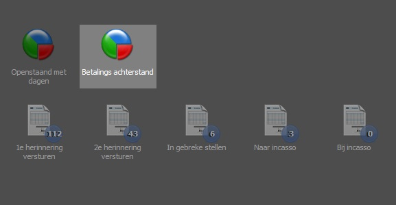

<properties>
	<page>
		<title>Betalingsherinneringen versturen per klant</title>
	</page>
	<menu>
		<position>Modules A - M / Facturatie </position> 
		<title>Herinnering per klant</title>
		<sort>C</sort>
	</menu>
</properties>

## Overzicht van de openstaande facturen met dagen ##

Er zijn twee verschillende overzichten welke facturen gegroepeerd per klant weergegeven. 
- Openstaand met dagen
- Betalingsachterstand

### Openstaand met dagen ###

In dit overzicht wordt een overzicht getoond van alle openstaande facturen gegroepeerd per klant. Hierin wordt geen onderscheid gemaakt in vervaldagen, kredietlimieten of betalingsregelingen.

### Betalingsachterstand ###

In dit overzicht wordt een overzicht getoond van alle openstaande facturen gegroepeerd per klant. Hierin wordt onderscheid gemaakt in vervaldagen, kredietlimieten of betalingsregelingen.

## Versturen ##

Indien je een overzicht wilt sturen selecteer je de betreffende klant en klik je op "Herinneren". Met deze knop wordt de herinnering per mail verzonden en worden de herinneringsdata in de factuur opgeslagen. Wil je enkel een overzicht sturen waarbij de data niet worden opgeslagen kies dan een van andere twee opties.

Er kan worden gekozen om de herinnering per e-mail of post te versturen. Je kiest hier respectievelijk de koppeling met de enveloppe of met de printer. Bij de envelop zal de herinnering met begeleidende email worden verzonden. Kies je voor de printer dan zal de herinnering op de standaard printer worden afgedrukt.

Voor instellingen van sjablonen en e-mails kan je "documentschema's" raadplegen.

"Het is mogelijk om verschillende facturen tegelijkertijd te selecteren zodat meerdere herinneringen te gelijker tijd kunnen worden verstuurd. Gebruik hiervoor de SHIFT en/of ctrl-toets voor de selectie.

----------

