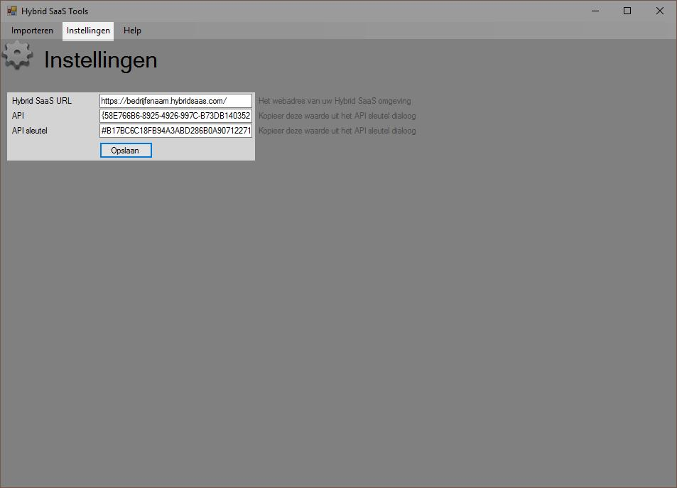
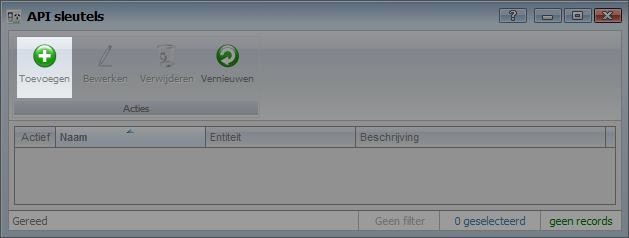
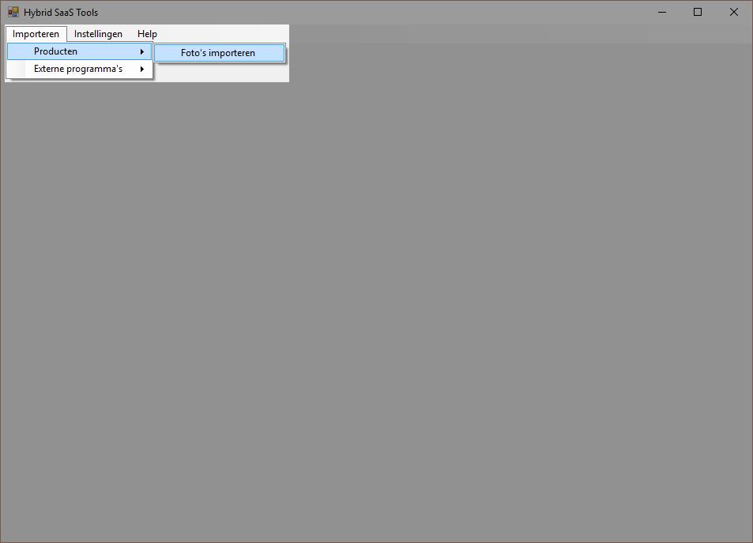
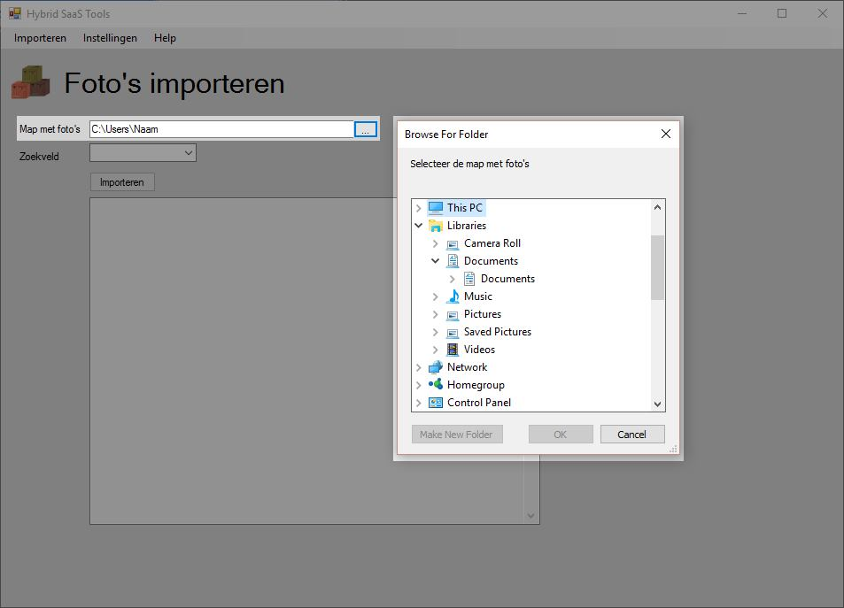
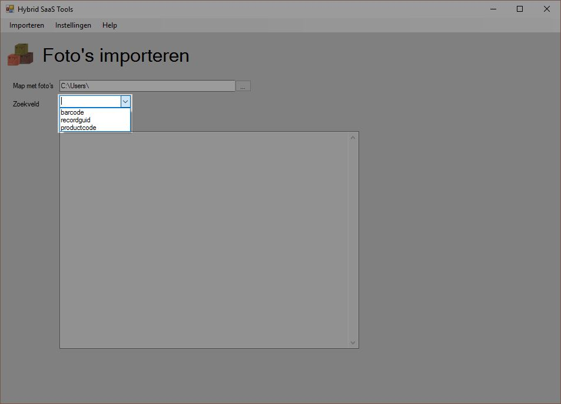

<properties>
	<page>
		<title>FotoAdapter instellen</title>
	</page>
	<menu>
		<position>Modules A - M / FotoAdapter </position> 
		<title>FotoAdapter instellen</title>
	</menu>
</properties>

# FotoAdapter #

De Hybrid SaaS FotoAdapter geeft de mogelijkheid om productafbeeldingen en foto's bij producten Hybrid SaaS te importeren. Door de bestandsnaam van de afbeelding het productnummer te geven zal deze automatisch bij het juiste product worden toegevoegd.
## DataAdapter Downloaden ##

FotoAdapter kan [hier](https://downloadsite.blob.core.windows.net/hybrid-saas-tools/tools.exe) worden gedownload. Of via onze [website](http://hybridsaas.com/support). 

## FotoAdapter instellen ##

Om de FotoAdapter te kunnen gebruiken dient deze ingesteld te worden zodat de data in de juiste Hybrid SaaS omgeving wordt geïmporteerd. Klik op "**instellingen**" om de API gegevens in te vullen.

Vul bij de gegevens in. Hybrid SaaS URL: https://**BEDRIJFSNAAM**.hybridsaas.com (vul op de plaats van "bedrijfsnaam" de bedrijfsnaam in) en geef de API ID en API KEY in.

API ID en API KEY kunnen worden aangemaakt in Hybrid SaaS. Zie de onderstaande beschrijving hoe deze aangemaakt dient te worden.

## API sleutel aanmaken ##

Zoek in Hybrid SaaS naar "API sleutels" 

Klik op toevoegen om een nieuwe sleutel aan te maken. 

Geef de sleutel een naam door bij "Naam" bijvoorbeeld "FotoAdapter" in te vullen.

Klik één maal op "Opslaan" zodat de API gegevens worden aangemaakt. Klik nogmaals op "Opslaan" om het scherm af te sluiten.

# Afbeeldingen importeren #

## Bestand(en) selecteren ##

Klik **Importeren** > **Producten** > **Foto's importeren**

Selecteer de map waar de betreffende foto's staan opgeslagen

De bestandsnaam van de afbeeldingen dient gelijk te zijn aan de productcode in de Hybrid SaaS productcatalogus.

## Selecteer Zoekveld ##

Selecteer de juiste zoeknaam waarop de afbeeldingen geïmporteerd dienen te worden. 

Kies hierbij uit:
- barcode
- GUID ID
- productcode

Klik vervolgens op "**Importeren**"

## Import controleren ##

Na het importeren kan in het log worden nagekeken of alle foto's correct zijn geïmporteerd.

Indien het log "not found" weer geeft is de betreffende afbeelding niet gevonden in de Hybrid SaaS productcatalogus. Pas de bestandsnaam aan en doe de import opnieuw. De huidige import blijft gewoon van kracht.

