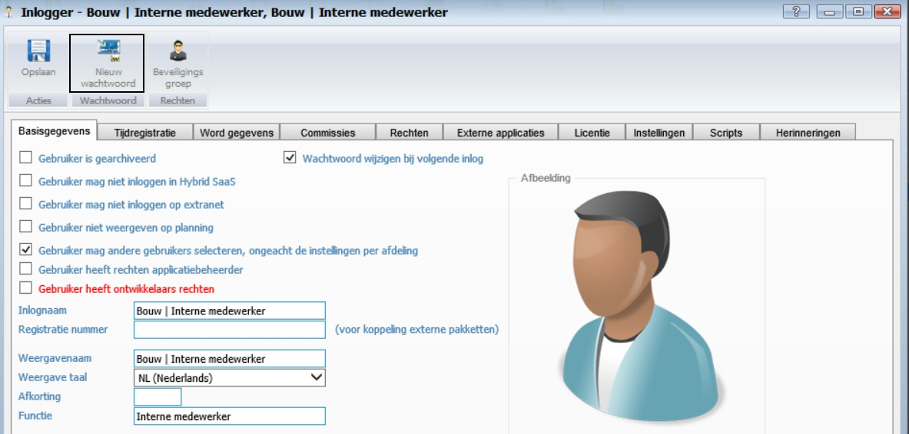
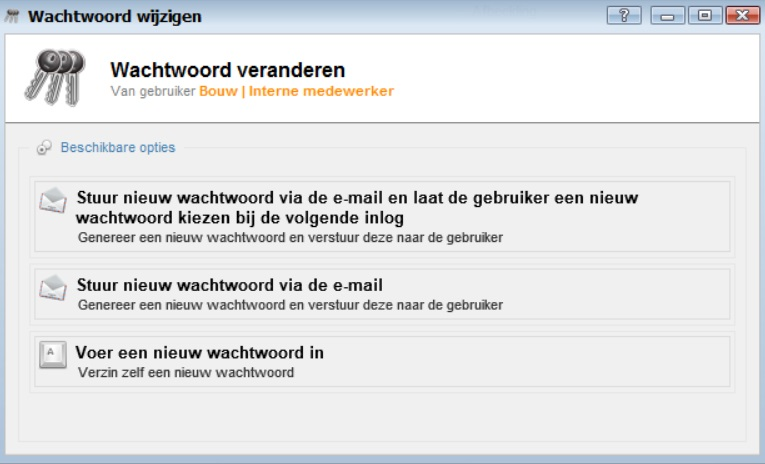
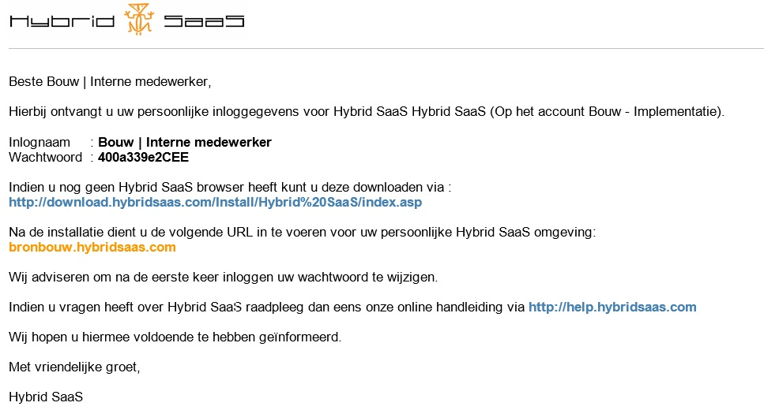
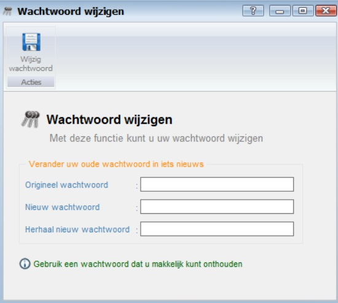
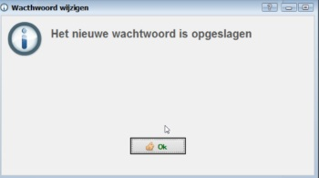
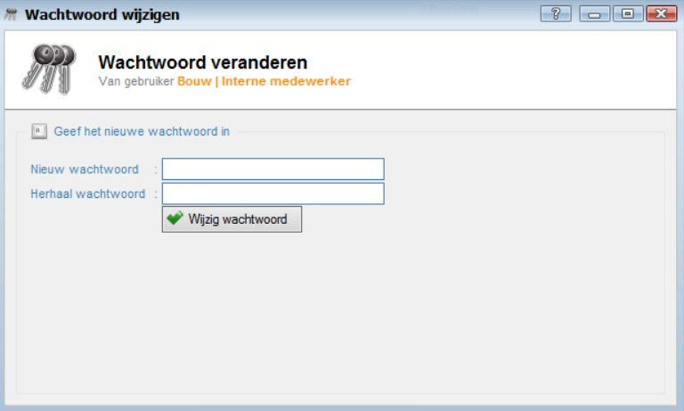

<properties>
	<page>
		<title>Wachtwoord versturen</title>
			</page>
	<menu>
		<position>Modules A - M / Gebruikers </position>
		<title>Wachtwoord versturen</title>
	</menu>
</properties>

## Wachtwoord versturen ##

Zodra een gebruiker is aangemaakt moet je deze op de hoogte brengen van zijn inlog-id en zijn initiële wachtwoord.
Hiervoor zit er bij het gebruikers scherm bovenin het scherm een knop "Nieuw wachtwoord".

Onder deze knop zitten 3 functies om een wachtwoord te wijzigen en eventueel te versturen. knop 

  

# Optie 1: Stuur nieuw wachtwoord via de e-mail en laat de gebruiker een nieuw wachtwoord kiezen bij de volgende inlog #

Zodra je deze optie kiest wordt er een e-mail gestuurd naar de gebruiker. Deze ontvangt onderstaand bericht en kan nu inloggen met de nieuwe inlognaam en wachtwoord.

Vul bij het "Origiele wachtwoord" het via de e-mail ontvangen wachtwoord in en vervolgens bij "Nieuw wachtwoord" en bij "Herhaal wachtwoord" je nieuwe wachtwoord in en druk op de knop "Wijzig wachtwoord".  

Dit scherm verschijnt, klik op OK en je bent ingelogd.

# Optie 2: Stuur nieuw wachtwoord via de e-mail #
Zodra je deze optie kiest wordt er een e-mail gestuurd naar de gebruiker. Deze ontvangt onderstaand bericht en kan nu inloggen met de nieuwe inlognaam en wachtwoord.

Vul bij het "Origiele wachtwoord" het via de e-mail ontvangen wachtwoord in en vervolgens bij "Nieuw wachtwoord" en bij "Herhaal wachtwoord" je nieuwe wachtwoord in en druk op de knop "Wijzig wachtwoord".  

Dit scherm verschijnt, klik op OK en je bent ingelogd.

# Optie 3: Voer een nieuw wachtwoord in #

Deze optie wordt vooral intern gebruikt om een wachtwoord van een medewerker om te zetten, bijvoorbeeld omdat deze vergeten is. Of om deze gelijk te zetten met een ander wachtwoord.
 

----------

