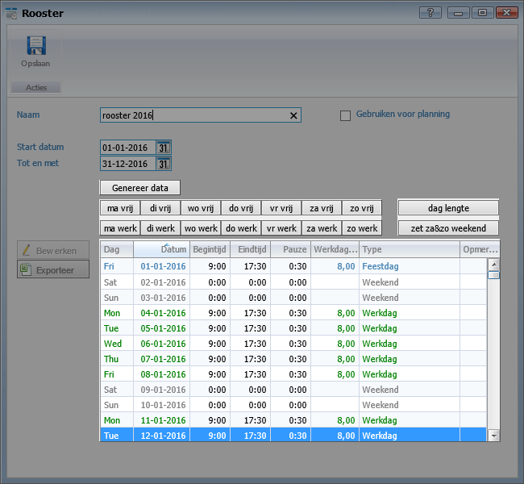
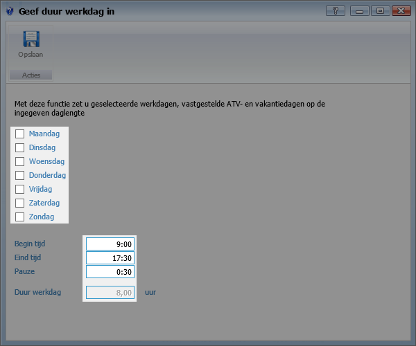
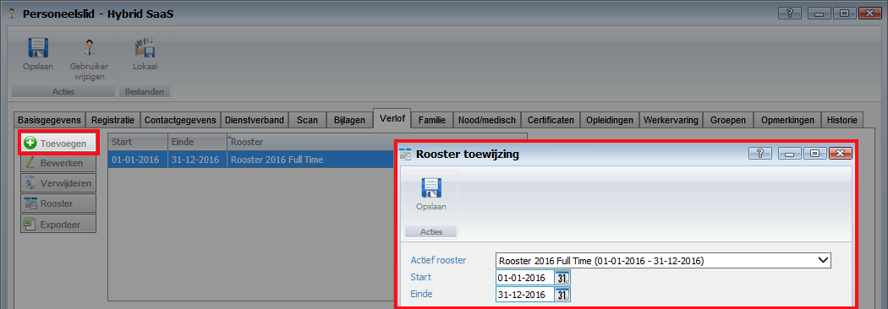
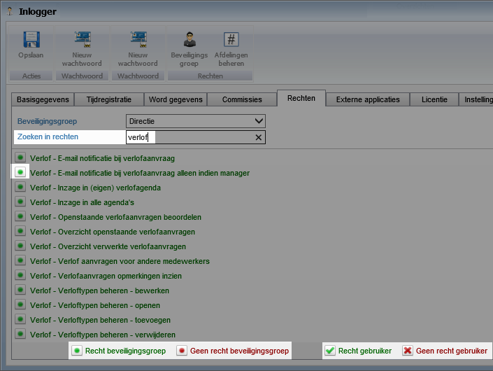
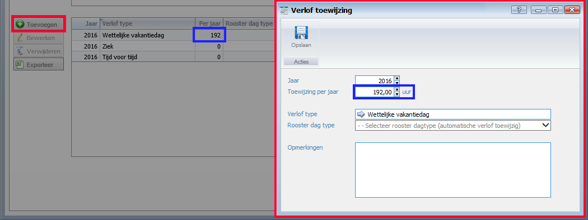
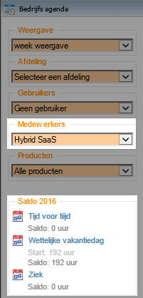

<properties>
	<page>
		<title>Verlof</title>
		<description>Verlof</description>
	</page>
	<menu>
		<position>Modules A - M /HRM /Verlof</position>
		<title>Basisgegevens</title>
		<sort>a</sort>
	</menu>
</properties>

# Basisgegevens voor het verlof en het verwerken ervan #

Deze rubriek zal meer duidelijkheid geven over de basisgegevens voor het kunnen verwerken van verlofaanvragen, hiervoor zijn de bakjes **Verlof typen, Openstaande en Verwerkte verlofaanvragen en de bedrijfsagenda** nodig, Als er ook gebruik word gemaakt van het verwerken van de dagstaten hebje ook het de bakjes voor de **dagstaten** nodig.

## Het rooster ##

Een rooster is ook van belang, hierin word aangegeven wat de lengte van een dag is. Zoek vanuit het startmenu naar **Roosters** 

Er kunnen verschillende rooster worden aangemaakt, denk hierbij aan een rooster dat fulltime is en een rooster voor partime.

De volgende data is van belang voor het maken van een rooster

- **Startdatum:**        De begindatum van het rooster
- **Einddatum:**	     De einddatum van het rooster
- **Genereer data:**     Hiermee wordt alle data opgehaald in de periode welke bij start en eind is ingegeven
- **ma/di/wo/do/vr/za/zo Vrij:** Hiermee kunnen (voorbeeld) alle  maandagen als vrij worden ingegeven
- **ma/di/wo/do/vr/za/zo Werk:** Hiermee kunnen (voorbeeld) alle  woensdagen als werkdagen worden ingegeven
- **Dag lengte:**	     Hiermee kan worden aangegeven wat de lengte van een dag is (de duur van een werkdag)
- **Zet za%zo weekend:** Hiermee kan worden aangegeven dat de zaterdag en zondag weekend dagen zijn

Dagen die niet worden aangepast worden standaard al roostervrij ingegeven

**Daglengte:**

- Er kan voor meerdere dagen worden aangegeven wat de lengte van een dag is,(voorbeeld de werkdag is van 09:00 tot 17:30 met een 00:30 pauze, de totale duur van de werkdag is dan 08:00 uur)

Per dag kan er aangegeven worden wat voor een soort type dit is

- **Werkdag**
- **Roostervrij**
- **Feestdag**
- **Vastgestelde ATV-dagen**
- **Vastgestelde vakantiedagen**
- **Weekend**

Deze diverse typen zijn voor belang voor de tijdregistratie's en verlofaanvragen. Dit heeft invloed op de uren die er worden gemaakt en of het tijd voor tijd, overuren of dergelijke betreft.

De diverse type bij het rooster zijn al standaard ingegeven door Hybrid SaaS en deze kunnen niet aangepast worden.

### Toevoegen aan de medewerker ###

Na het aanmaken van een rooster, moeten deze worden toegevoegd op de medewerkers kaart en op het tabblad verlof.

Als er al een rooster bestaat en de datum van het nieuwe rooster komt overeen met het al eerder aangegven rooster zal er een melding staan dat er een overlap is met een ander rooster, pas indien van toepassing de datum aan of verwijder het vorige rooster als deze niet meer van toepassing is.

## Rechten voor verlof ##

Om bepaalde functies wel of niet te kunnen word bepaald door rechten, iedere gebruiker heeft een rechtentabel, ook kan er voor gekozen worden om er een beveiliginsgroep te selecteren, in een beveiligingsgroep zit ook een rechtentabel hiermee kan er voor een hele groep de zelfde rechten worden aangezet

Let op! Er kan per gebruiker rechten worden aangezet maar ook per beveiligingsgroep, dit is te herkennen door:
* Als de knopjes voor het recht **groen of rood** zijn, dan word er per gebruiker iets aangepast
* Als de knopjes voor het recht **wit** zijn, dan word er per beveiligingsgroep iets aangepast, elke medewerker die hieraan gekoppeld is krijgt deze wijziging.

**Rechtentabel:**

### Voor de Medewerker ###

- **Verlof - Inzage in (eigen) verlofagenda:** Hiermee word er toegang gegeven tot eigen agenda (er is inzicht op de bedrijfagenda hoeveel uur er ergens op geboekt is)
- **Overzicht openstaande verlofaanvragen:** Indien dit recht is aangezet heeft de medeweker toegang tot de bak *Openstaande verlofaanvragen* hierin zijn alle nog openstaande verlofaanvragen te zien van alle medewekers

### Voor de Manager ###

- **Verlof - E-mail notificatie bij verlofaanvraag:** Indien gewenst kan er een e-mail worden gestuurd als er een verlofaanvraag word aangemaakt door een gebruiker
- **Verlof - E-mail notificatie bij verlofaanvraag alleen indien manager:** Indien gewenst kan er een e-mail worden gestuurd als er een verlofaanvraag word aangemaakt, indien deze gebruiker als accountmanager is aangegeven van de gebuiker die de aanvraag indient
- **Verlof - Inzage in alle agenda's:** Hiermee word er toegang gegeven voor de agenda van alle gebruikers (er is inzicht op de bedrijfagenda hoeveel uur er ergens op geboekt is)
- **Verlof - Openstaande verlofaanvragen beoordelen:** Het recht om de aanvragen te kunnen beoordelen (goed of af te keuren)
- **Verlof - Verlof aanvragen voor andere medewerkers:** Hiermee kan je andere gebruiker selecteren bij het aanvragen van verlof
- **Verlof - Verloftypen beheren:** deze diverse rechten zijn er nodig om de verlofaanvraag te kunnen toevoegen, openen, bewerken en verwijderen

## De verlof type ##

De verlof typen kunnen zelf aangemaakt worden, de verschillende soorten type worden gebruikt bij de verlofaanvragen en zijn zichtbaar op de bedrijfsagenda indien hier een saldo op geboekt is.

de meest voorkomende type zijn

- **Ziek, dokter, overige afwezigheid**
- **Wettelijke vakantiedag**
- **Bovenwettelijke vakantiedag**
- **Schooldag**
- **Tijd voor tijd**

### Toevoegen aan de medewerker ###

Na het aanmaken van een verlof type, moeten deze worden toegevoegd op de medewerkers kaart en op het tabblad verlof.

Bij het toevoegen van de verlof type kan er een begin saldo worden aangegeven, dit is over het algemeen van toepassing bij wettelijke vakantiedagen. Begin van het jaar word er begonnen met een saldo, naarmate er verlof word aangevraagd zal er saldo worden afgeboekt. In de andere gevallen waarvan onder andre tijd voor tijd en ziek, dokter en overige afwezigheid word er niet met een begin saldo begonnen, hiervan word in het loop van het jaar een saldo opgeboekt welke aan het eind van het jaar verwerkt zal worden. 

**De bedrijfagenda**

De verschillende verlof type welke aan de medewerker zijn toegevoegd zijn bij de bedrijfagenda te zien onder deze medewerker, indien er hier geen verlof type is toegevoegd zal deze ook niet worden weergegeven. 

-------

- Klik [hier](http://hybridsaas.support/pages/support-site/modulesAM/hrm/verlof/verlof-verwerken) voor het aanvragen en verwerken of verwijderen van een verlof
- Klik [hier](http://hybridsaas.support/pages/support-site/modulesAM/hrm/verlof/verlof-dagstaten) voor het verwerken van de dagstaten

-------