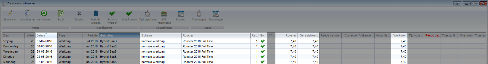

<properties>
	<page>
		<title>Verlof</title>
		<description>Verlof</description>
	</page>
	<menu>
		<position>Modules A - M /HRM /Verlof</position>
		<title>Dagstaten</title>
		<sort>d</sort>
	</menu>
</properties>

# Het verwerken van de verlof aanvragen met de dagstaten #

### Dagstaten controleren ###

Doordat er tijdregistraties zijn aangemaakt komen ze in beeld bij het controlleren van de dagstaten. Bij het controleren van de dagstaten zal er worden aangegeven dat het rooster bij een normale werkdag hoort en zal de uren van een normale werkdag noteren.

Er zouden geen uren in het tijd voor tijd bakje terecht kunnen komen, is dat wel het geval dan is er een dubbele registratie aangemaakt, dit dient dan te worden nagekeken.

Na het controleren van de dagstaat kan deze worden goedgekeurd. het proces van de dagstaten kan zoals bekend verder worden afgewerkt.

## Het verwijderen van verlof aanvragen ##

Als er een fout is gemaakt in het aanvragen van de verlofaanvraag kan deze weer ongedaan worden gemaakt. 

### Dagstaten ###

Voor het willen terugdraaien van een verlofaanvraag dient deze uit de dagstaten te worden gehaald, hoe verder in het proces van de verwerking hoe meer stappen er ondernomen moeten worden. Ze worden hier vanaf het eind aangegeven.

Als de registratie in de bak:

- **Verwerkte maandstaten** zit, moet de hele regel **verwijderd worden**
- **Maandstaten controleren** zit, moet de hele regel **verwijderd worden**
- **Gecontroleerde dagstaten** zit, moet de juiste datum(s) worden opgezocht en moet deze **verwijderd worden**

Nadat deze handelingen gebeurd zijn kan er verder worden gegaan met het [verwijderen van de verlofaanvraag]http://hybridsaas.support/pages/support-site/modulesAM/hrm/verlof/verlof-verwerken). Als de verlofaanvraag word aangepast komt deze weer terecht bij te controleren dagstaten, er kan opnieuw het process worden doorgelopen

------

