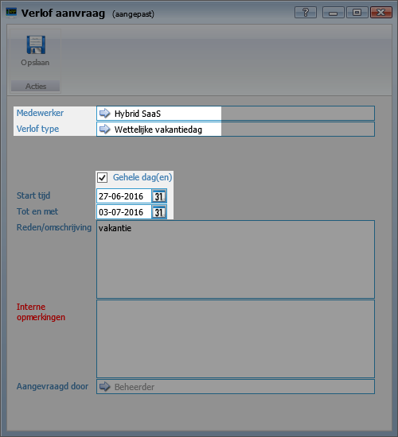
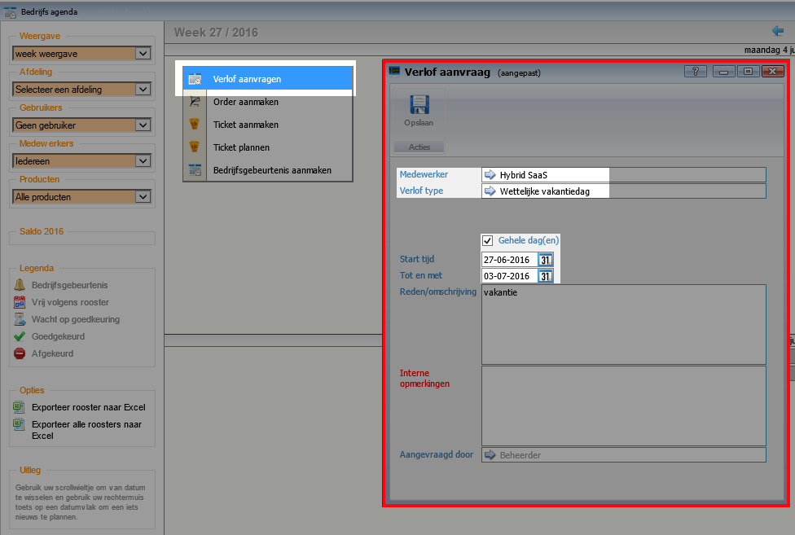
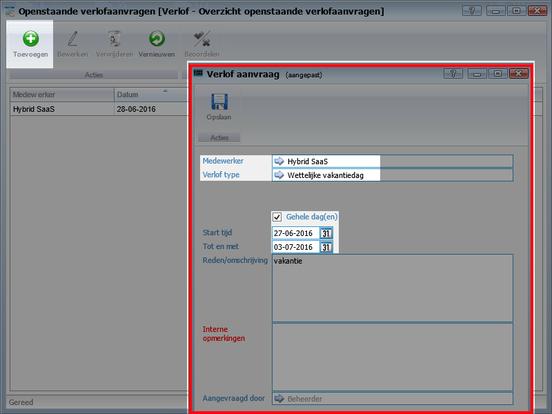
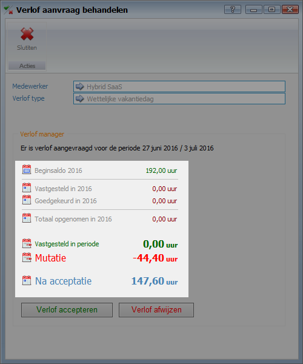
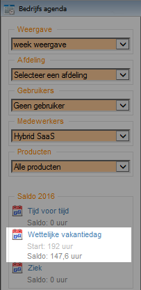
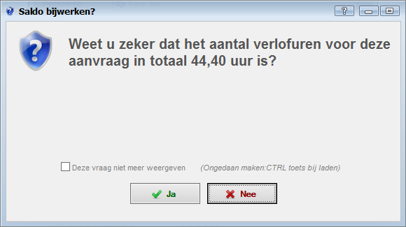

<properties>
	<page>
		<title>Verlof</title>
		<description>Verlof</description>
	</page>
	<menu>
		<position>Modules A - M /HRM /Verlof</position>
		<title>Verwerken verlofaanvraag</title>
		<sort>b</sort>
	</menu>
</properties>

# Het aanvragen, verwerken en verwijderen van een verlof aanvraag #

# Verlof aanvragen #

Als alles juist is ingesteld kan er verlof worden aangevraagd. Hier wordt een verlof type gekozen en het aantal uur, als er voor een hele dag wordt gekozen worden de uren uit het rooster overgenomen (de duur van de werkdag). 

## Verlof aanvragen via de bedrijf agenda ##

Via de bedrijf agenda kan er een verlof worden aangevraagd, door met de rechtermuisknop te klikken op een dag verschijnt er een paar opties, 1 daarvan is verlofaanvragen. Daarna verschijnt het scherm om een verlof aan te vragen.

## Verlof aanvragen via de openstaande verlofaanvragen ##

Via alle openstaande verlofaanvragen kan er ook een verlof worden toegevoegd. Gebruik hiervoor de toevoegen knop

In het bakje Alle openstaande verlofaanvragen worden alle aanvragen van alle medewerkers getoond welke nog niet verwerkt zijn.

# Verlof verwerken #

Na het toevoegen van een verlof moet deze nog beoordeeld worden. Bij akkoord kan deze geaccepteerd worden, in de melding wordt er aangegeven wat het saldo na acceptatie zal zijn. Bij de bedrijf agenda is de verlofaanvraag ook verwerkt en wat er bij saldo wordt getoond is de waarde van dit moment. Doordat er een verlofaanvraag is goedgekeurd zijn er voor deze gebruiker ook tijdregistraties aangemaakt, per dag van het verlof is er een registratie gemaakt met een totale duur van een werkdag en de omschrijving van de verlofaanvraag. Deze registraties zijn direct goedgekeurd.

 

# Verwijderen van een Verwerkte verlofaanvragen #

Klik [hier](http://hybridsaas.support/pages/support-site/modulesAM/hrm/verlof/verlof-dagstaten) voor het verwijderen van een verlofaanvraag in de dagstaten.

De betreffende verlofaanvraag dient te worden opgezocht in deze lijst. Hier kan hij opnieuw beoordeeld worden en kan er gekozen worden voor afwijzen, er zal een melding komen of het akkoord is dat het saldo weer opgeboekt zal worden. Door het afwijzen van de verlofaanvraag worden automatisch de aangemaakte tijdregistraties ook verwijderd.

Let op! Door op de knop beoordelen te klikken zal er eerst hetzelfde scherm worden getoond met de mutatiewaarden voor als deze goed gekeurd zal worden. Het saldo wat dan wordt weergegeven bij Na acceptatie is dus niet het saldo wat het zal worden maar wat het momenteel nog is.

Indien er de melding: Er zijn fouten geconstateerd! wordt getoond zit de aanvraag nog ergens verwerkt in het hier bovenstaande traject, deze dient te worden opgezocht en vanaf daar kunnen de stappen worden teruggedraaid.

## Openstaande verlofaanvragen ##

De verlofaanvraag is nu weer beschikbaar bij alle openstaande verlofaanvragen, hier kan deze naar wens worden aangepast of worden verwijderd.

-------
