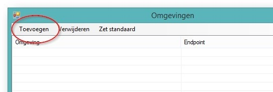
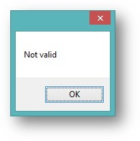
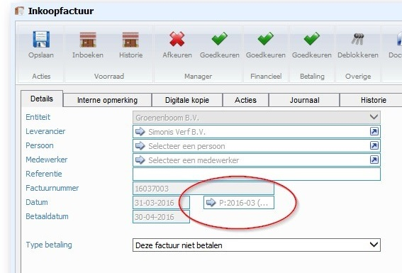
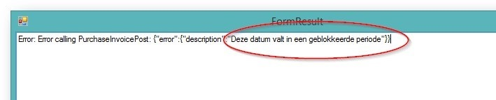
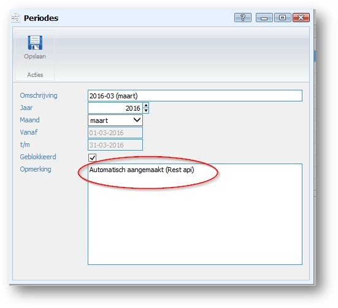
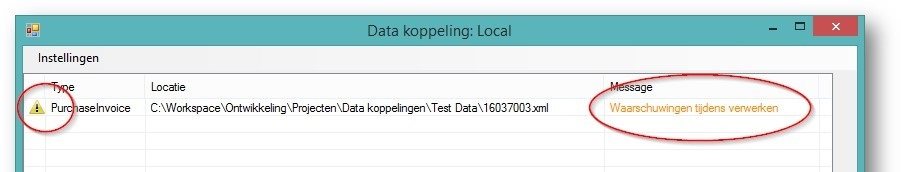

<properties>
	<page>
		<title>Importeren</title>
		<description>Importeren</description>
	</page>
	<menu>
		<position>Modules A - M / Inkoopbeheer / Importeren</position>
		<title>via Externe Applicatie </title>
		<sort>D</sort>
	</menu>
</properties>

# Inkoop facturen Importeren  #

Doormiddel van een externe applicatie kunnen er inkoopfacturen worden ingelezen in Hybrid SaaS van een bepaalde leverancier

### Installatie Applicatie  ###

Na het opstarten van de applicatie moet je deze nog koppelen aan jouw Hybrid SaaS account:

•	Kies voor de menuoptie **instellingen**

•	Kies voor de optie toevoegen

•	Vul het volgende scherm in:

- Het wachtwoord is gelijk aan het Hybrid SaaS wachtwoord

- De ‘Application name’  komt uit het tabblad Externe applicaties

- Indien er iets niet klopt geeft de applicatie een melding

In het hoofdscherm is er zichtbaar welke omgeving actief is.

 
 ### De gebruiker  ###

Deze omgeving is gekoppeld aan een gebruiker (met wachtwoord) en een externe applicatie. 

### Gekoppeld aan de omgeving  ###

De omgeving is gekoppeld met de gegevens van de gebruiker

### Gegevens ophalen ###

De bestanden kunnen worden opgehaald van de computer 

Na het kiezen voor verwerken zullen de facturen worden geïmporteerd

Tijdens het laden kan je de voortang zien recht onderin

### De inkoopfactuur  ###

Na verwerken zijn de facturen aangemaakt 

 
Hier word een voorbeeld van een artikel getoond

De inkoopfactuur is nu toegevoegd in Hybrid SaaS met de volgende eigenschappen:

Indien er een verschil in berekening van de btw op zit, zal deze automatisch worden gecorrigeerd.

De inkoopfacturen worden gekoppeld aan de standaard entiteit en standaard inkoop werkcode, daarnaast zoekt het systeem op de letterlijke naam van de leverancier die in de import staat, indien er ook producten zijn gevonden worden deze automatisch gelinked

De volgorde van opzoeken van de inkoop grootboek is als volgt:

-	Product -> Subgroep, (indien niet gevonden ->)
-	Product -> Hoofdgroep , (indien niet gevonden ->)
-	Entiteit standaard

### De periode  ###

•	De periode is nu goed gekoppeld bij aanmaken

•	Indien de periode geblokkeerd is, is dit in de melding terug te zien

•	Periodes worden ook automatisch aangemaakt indien deze niet bestaan:

### De foutmelding  ###

•	Indien er geen prognoseposten zijn gekoppeld krijg je een waarschuwing:

Door te dubbelklikken op de regel komt de meldingen in beeld:

•	Indien er fouten optreden tijdens het verwerken is dat terug te zien

Door te dubbelklikken op de regel komt de meldingen in beeld:

----------

