<properties>
	<page>
		<title>Importeren</title>
		<description>Importeren</description>
	</page>
	<menu>
		<position>Modules A - M / Inkoopfacturatie / Importeren</position>
		<title>via Externe Applicatie </title>
		<sort>D</sort>
	</menu>
</properties>

# Inkoop facturen Importeren #

Doormiddel van een externe applicatie kunnen er inkoopfacturen worden ingelezen in Hybrid SaaS van een bepaalde leverancier

### De Applicatie ###

In de applicatie kan de instelling van de omgeving worden ingesteld. In het hoofdscherm is er zichtbaar welke omgeving actief is.

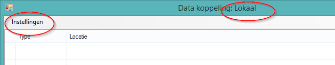
 
 ### De gebruiker ###

Deze omgeving is gekoppeld aan een gebruiker (met wachtwoord) en een externe applicatie. 

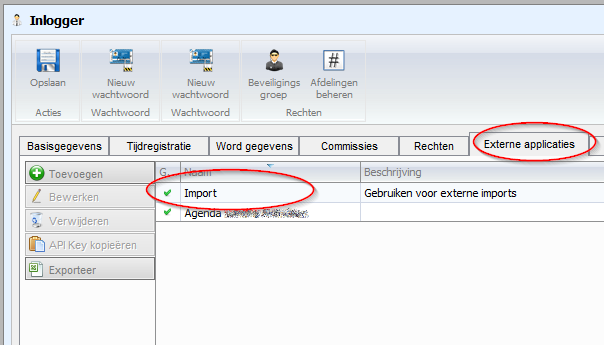

### Gekoppeld aan de omgeving ###

De omgeving is gekoppeld met de gegevens van de gebruiker

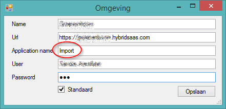

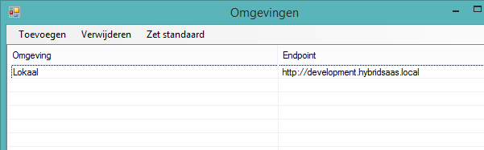

### Gegevens ophalen ###

De bestanden kunnen worden opgehaald van de computer 

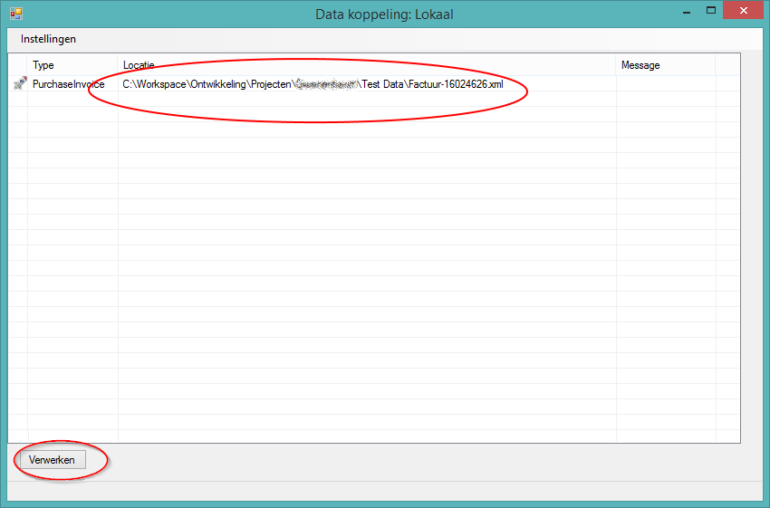

Na het kiezen voor verwerken zullen de facturen worden geïmporteerd

Tijdens het laden kan je de voortang zien recht onderin

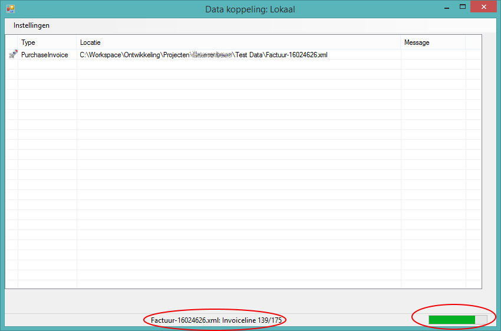

### De inkoopfactuur ###

Na verwerken zijn de producten aangemaakt 

 
Hier word een voorbeeld van een artikel getoond

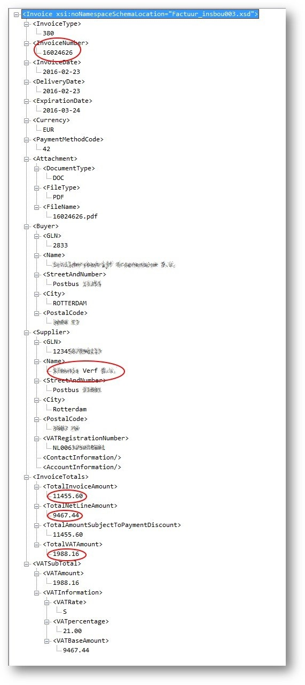

De inkoopfactuur is nu toegevoegd in Hybrid SaaS met de volgende eigenschappen:

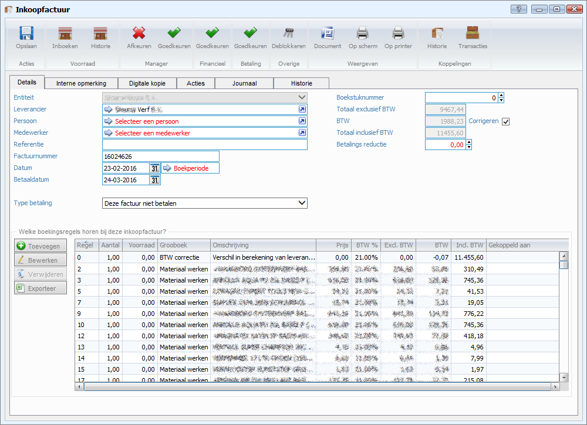

Indien er een verschil in berekening van de btw op zit, zal deze automatisch worden gecorrigeerd.

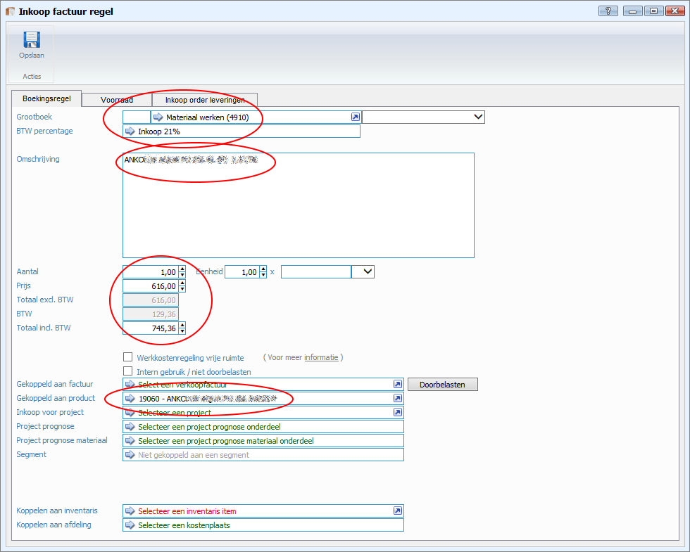

De inkoopfacturen worden gekoppeld aan de standaard entiteit en standaard inkoop werkcode, daarnaast zoekt het systeem op de letterlijke naam van de leverancier die in de import staat, indien er ook producten zijn gevonden worden deze automatisch gelinkt

### De foutmelding ###

Indien er fouten optreden tijdens het verwerken is dat terug te zien

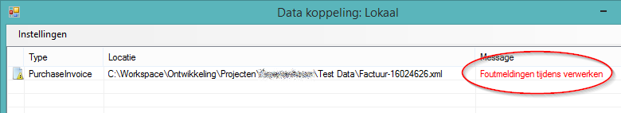

Door te dubbelklikken op de regel komt de meldingen in beeld:

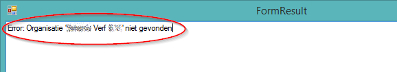

----------

