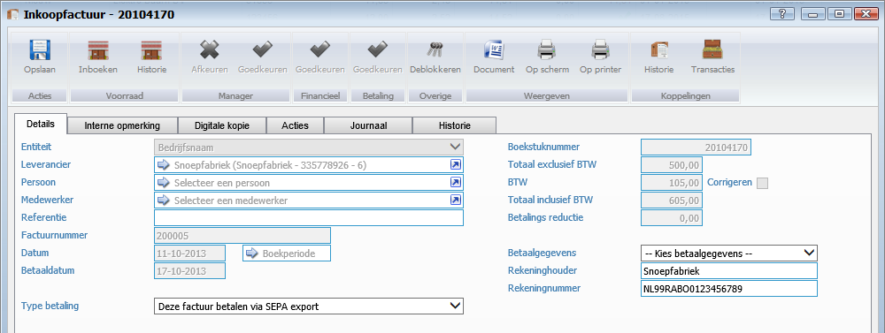
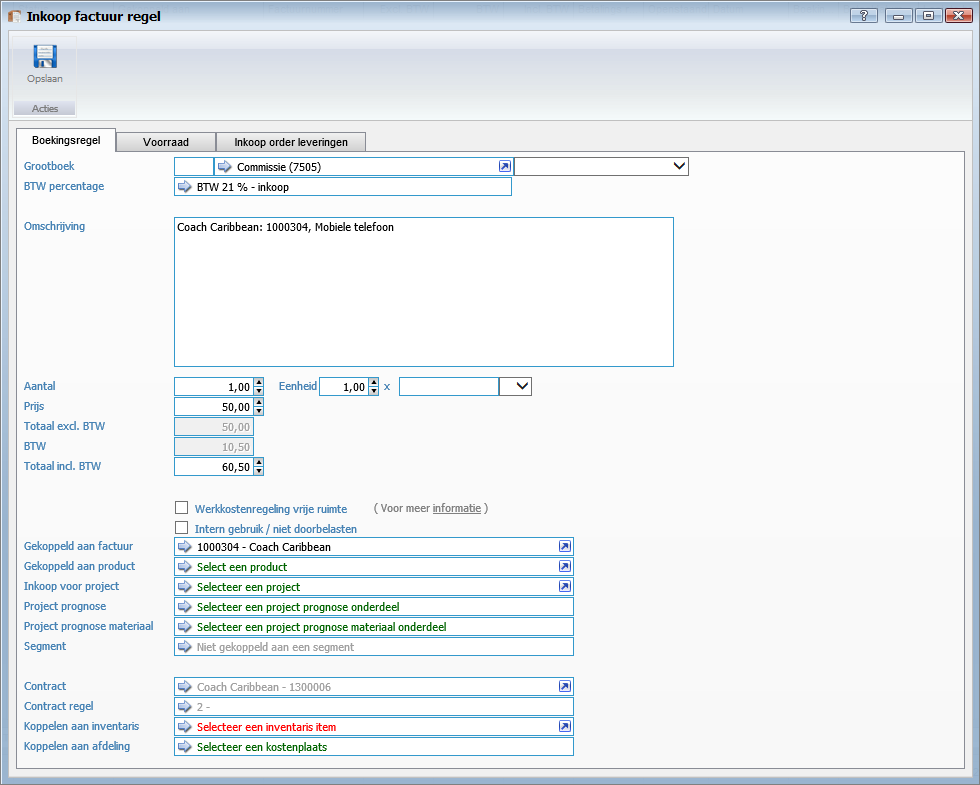

<properties>
	<page>
		<title>Invoervenster</title>
		<description>Invoervenster</description>
	</page>
	<menu>
		<position>Modules A - M / Inkoopbeheer</position>
		<title>Invoervenster</title>
	</menu>
</properties>

## Invoervenster inkoopfactuur ##

Om een inkoopfactuur te kunnen inboeken zijn er een aantal gegevens nodig die ingevuld moeten worden

 
- **Entiteit**
	- Hier kunt u de entiteit selecteren. Wanneer u werkt met één entiteit zal dit veld automatisch ingevuld worden door het systeem.
- **Leverancier**
	- Hier kunt u een Leverancier selecteren. 
		- U bent verplicht om een leverancier of persoon of een medewerker te selecteren.
- **Persoon**
	- Hier kunt u een Persoon selecteren. 
		-  bent verplicht om een leverancier of persoon of een medewerker te selecteren.
- **Medewerker**
	- Hier kunt u een Medewerker selecteren. 
		- U bent verplicht om een leverancier of persoon of een medewerker te selecteren.
- **Referentie**
	- Hier kunt u een omschrijving van de inkoopfactuur ingeven. (Optioneel)
- **Factuurnummer**
	- Hier kunt u het factuurnummer van de inkoopfactuur ingeven.
- **Datum**
	- Hier kunt u de datum selecteren van de factuur.
- **Betaaldatum**
	- Hier kunt u de betaaldatum van de factuur ingeven.
- **Type betaling**
	- Hier kunt u de betaalwijze selecteren.

Welke boekingsregels horen bij deze inkoopfactuur?

Klik op Toevoegen om factuurregels in te voeren
	

Boekingsregels toevoegen

- **Grootboek**
	- Hier kunt u een werkcode selecteren.
- **BTW Percentage**
	- Hier kunt het btw-percentage selecteren.
- **Omschrijving**
	- Hier kunt u de omschrijving ingeven van het product.
- **Aantal**
	- Hier kan je het aantal aangeven
- **Prijs**
	- Hier kan je de prijs aangeven
- **Intern gebruik/ niet door belasten**
	- Dit vinkje kunt u aanzetten als de inkoopfactuur voor intern gebruik is en u de factuur niet wilt door belasten.
	
Daarnaast kan je de regel nog koppelen aan verschillende onderdelen o.a. een factuur; product; project; contract; inventaris 

Door een boekstuknummer te kunnen geven aan de inkoopfactuur dien je de factuur goed te keuren. Deze heeft 3 stappen, deze kan onderverdeeld zijn onder meerdere medewerkers
Bij het tabblad interne opmerking kan je zien wie de inkoop geeft goed gekeurd of eventueel heeft afgekeurd 

----------

