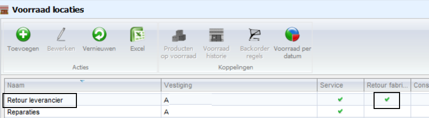
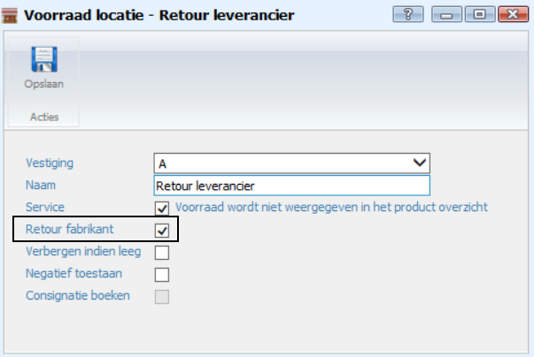
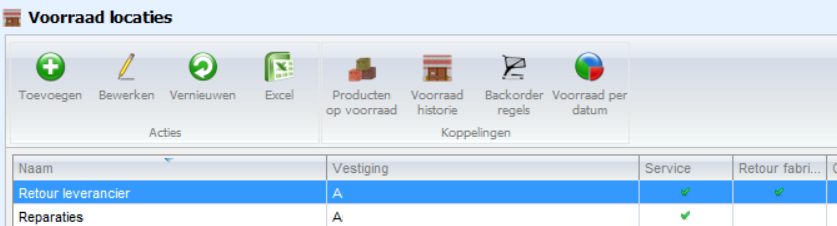
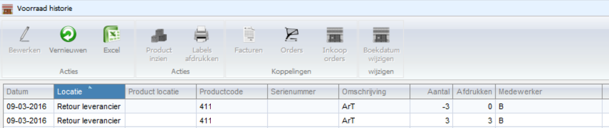

<properties>
	<page>
		<title>inkooporde-retour-leverancier</title>
		<description>inkooporde-retour-leverancier</description>
	</page>
	<menu>
		<position>Modules A - M / Inkooporder</position> 
		<title>Inkooporde retour leverancier</title>
	</menu>
</properties>

## Inkooporde retour sturen aan de leverancier ##

Wat te doen als je een inkooporder retour wilt sturen aan de leverancier.

 
Hier staat een inkooporder op de status **“Wachten op levering”**. Zodra de spullen binnen komen gaan we deze d.m.v de knop **“Binnen melden”** in ontvangst nemen.

Maar dit doen we niet in het standaard magazijn maar in een **“Retour leverancier”** magazijn. (deze moet dan wel bestaan, anders moet je deze aanmaken).
 

 

Binnen melden goederen op retour magazijn.
Druk op de knop **“binnenmelden”**

 

Ga op één van de producten staan en kies bewerken.
Je komt in de regel en pas het magazijn en het aantal aan.

Doe dit voor alle regels.
Resultaat:

En druk nu bovenin op de knop **“Ontvangsten verwerken”**

 

Resultaat:
 

Nu staan deze producten op het magazijn **“Retour leverancier”**.
Ga nu naar de voorraadlocaties.

Selecteer de voorraadlocatie **“Retour leverancier”** en druk op de knop **“Producten op voorraad”**.

Selecteer het juiste product en druk op de knop **“Retour naar leverancier”** .

 

Je komt nu in de nieuwe inkooporder. Als je meerdere producten wilt terugsturen, ga dan terug naar het producten scherm van het **“Retour leverancier”** en voer de actie opnieuw uit. Alle regels komen dan in één inkooporder terecht. Weliswaar negatief. Je kan ook meerdere regels selecteren en dan op de knop **“Retour leverancier”** drukken

Open de inkooporder.
Loop nu het proces door. Goedkeuring aanvraag, goedkeuren manager en als laatste de knop **“Besteld”**. De order hoeft niet binnen gemeld of in ontvangst te worden genomen.
De voorraad wordt meteen weer afgeboekt.

LET OP! Bij "geleverd" dient het aantal stuks in de min "-" weergegeven te worden. Als dit niet het geval is zal de voorraad niet worden verwerkt en worden afgeboekt. 

 
Resultaat is:

Voorraad historie:
 

Producten zijn nu tijdelijk opgeboekt geweest in het  Retour leverancier magazijn en van daaruit weer retour gestuurd. Per saldo dus 0.

----------
