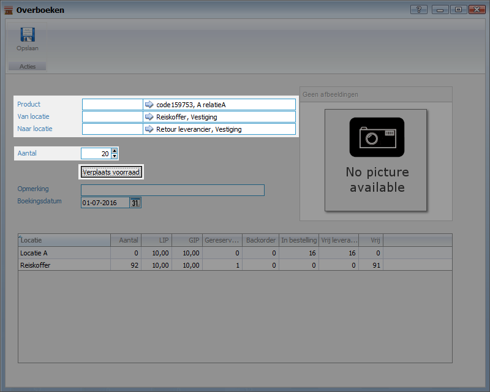
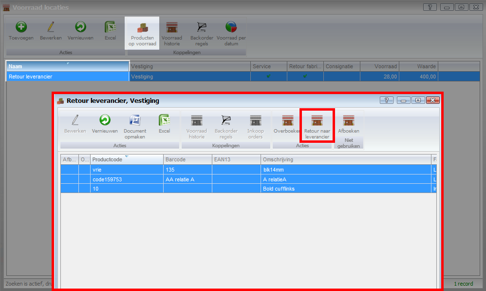
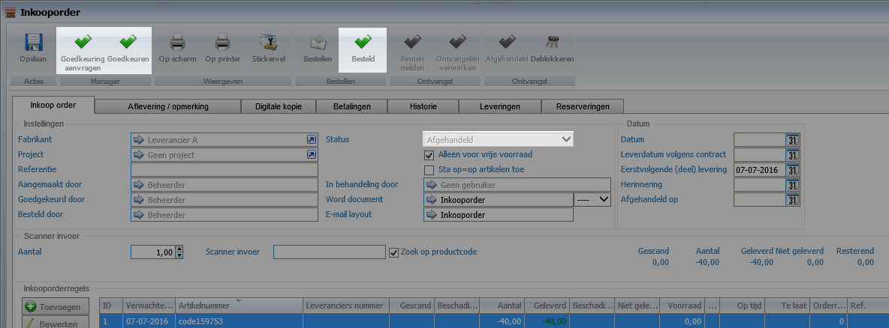

<properties>
	<page>
		<title>inkooporde-vanuit-magazijn-retour-leverancier</title>
		<description>inkooporde-vanuit-magazijn-retour-leverancier</description>
	</page>
	<menu>
		<position>Modules A - M / Inkooporder</position> 
		<title>Inkooporde vanuit magazijn retour leverancier</title>
	</menu>
</properties>

## Inkooporde retour sturen vanuit magazijn aan de leverancier ##

Om producten uit het standaard magazijn terugsturen naar de leverancier dient er een overboeking te moeten plaatsvinden dit kan uitgevoerd worden bij **Direct overboeken**.
 

- Zoek het juiste product op
- Voer de **van locatie** en de **naar locatie** in
- Vul vervolgens het aantal in en druk op de knop **verplaats voorraad**
- Er hoef nu alleen maar voor de volgende producten het productnummer en het aantal in te geven en dan op de knop **Verplaats voorraad** te drukken de rest blijft gewoon staan, indien er een andere van locatie is dient deze te worden aangegeven.

Nu zijn de aantallen verplaatst naar het magazijn **Retour leverancier**. Via de voorraadlocatie kunnen de producten op voorraad worden opgevraagd, selecteer de producten en klik op de button **retour leverancier**

Er word nu een scherm getoond waarin er een inkooporder is aangemaakt, open de juiste inkooporder en loop het proces door **Goedkeuring aanvraag**, **goedkeuren manager** en als laatste de knop **Besteld**. De order hoeft niet binnen gemeld of in ontvangst te worden genomen.
De voorraad wordt meteen weer afgeboekt, en de inkooporder komt na deze stappen als afgehandeld te staan

 
 ----------
