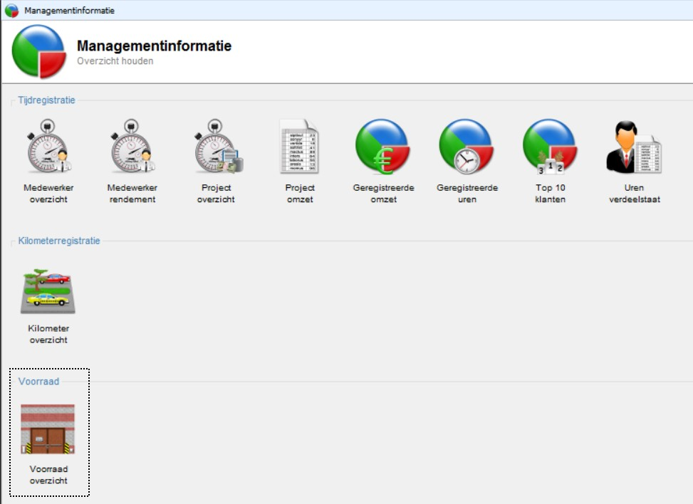
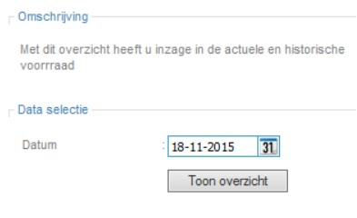
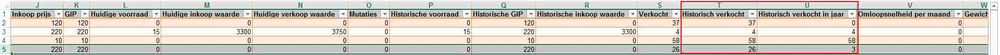
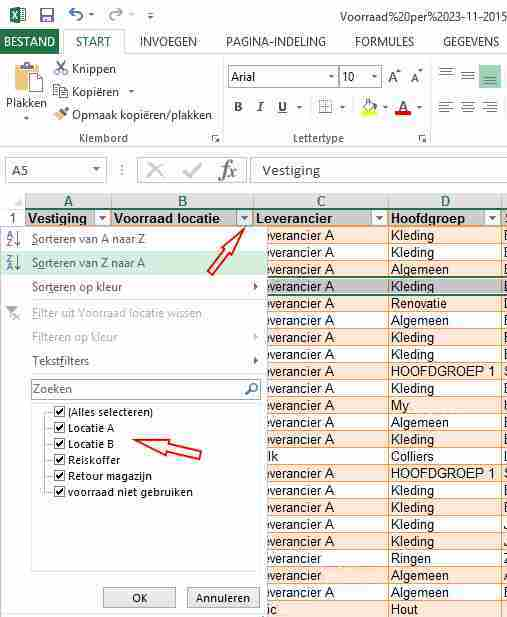

<properties>
	<page>
		<title>Automatische incasso</title>
		<description>Automatische incasso</description>
	</page>
	<menu>
		<position>Modules A - M / Management </position> 
		<title>Overzicht producten</title>
	</menu>
</properties>

## Overzichten verkochte producten per jaar ##

Ga naar:   Overzichten / Management overzichten
Kies voorraad overzicht

Selecteer rechts de periode, als je het hele jaar wilt hebben laat je de datum van vandaag staan.

 
Resultaat is een excel sheet.
Veld historisch verkocht geeft het aantal verkopen vanaf introductie weer.
Veld historisch verkocht in jaar geeft het aantal verkopen van dit lopende jaar weer.

 PS. Als je in Excel zit is het wel verstandig om een filter te maken op magazijn. Er kunnen diverse magazijnen actief zijn, hierdoor ik het makkelijker zoeken naar een product

---------