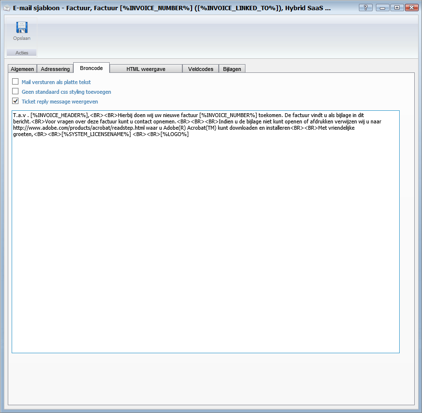
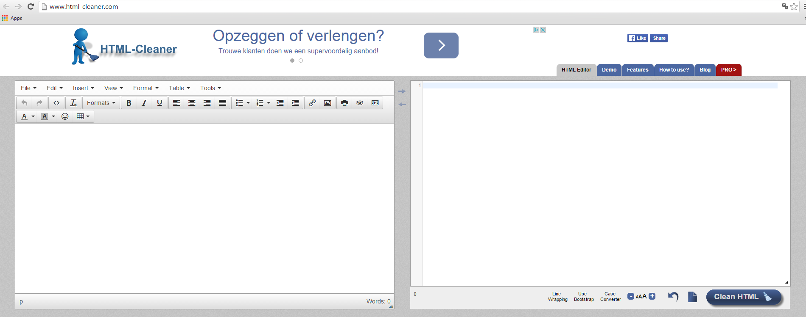
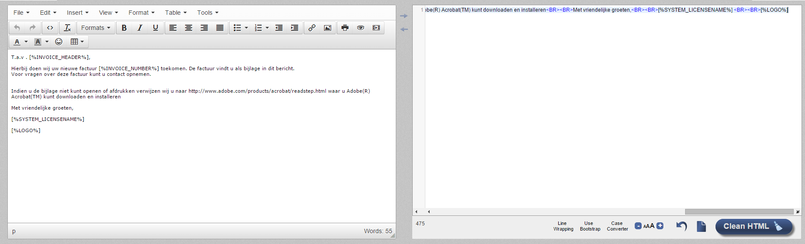
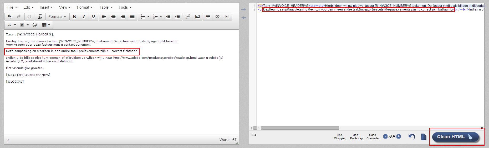
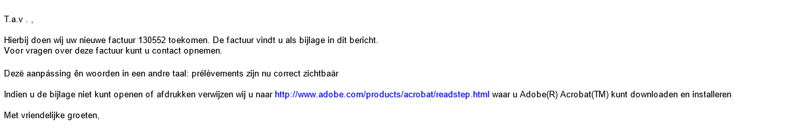

<properties>
	<page>
		<title>handige-weetjes</title>
		<description>handige-weetjes</description>
	</page>
	<menu>
		<position>Modules N - Z/ Outlook Add-in</position>
		<title>Handige weetjes</title>
		<sort>a</sort>
	</menu>
</properties>

## Handige weetjes ##

# Speciale tekens #

Om speciale tekens of accolade te gebruiken in de e-mail template, moet er goed gekeken worden of deze juist word overgenomen in de broncode van de template. als het hierin niet correct ingevuld staat kan het voorkomen dat het anders word weergegeven dan bedoeld

hieronder een aantal stappen om dit eenvoudig te kunnen uitvoeren

* Zoek ik Hybrid SaaS je e-mail lay-out op
* Ga naar het tabblad "Broncode" 
* Kopieer hiervan de tekst
* Ga nu naar de website [http://www.html-cleaner.com/](http://www.html-cleaner.com/) 
* De gekopieerde tekst plak je in het rechter tabel Je ziet dan de uitkomst aan de linkerkant.
* Links kan je de tekst aanpassen naar het gewenste resultaat, en klik dan op clean HTML 
* Kopieer de tekst in het rechter tabel en plak deze over de oude tekst in de broncode van va de e-mail lay-out
* Als volgt komt de email er dan zo uit te zien 

----------