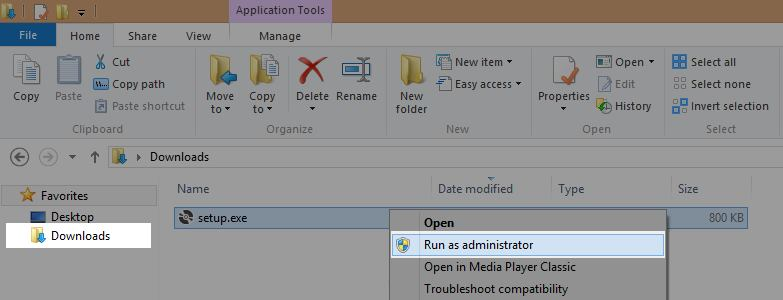
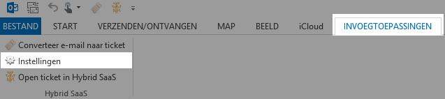
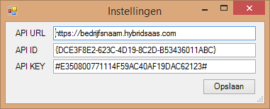
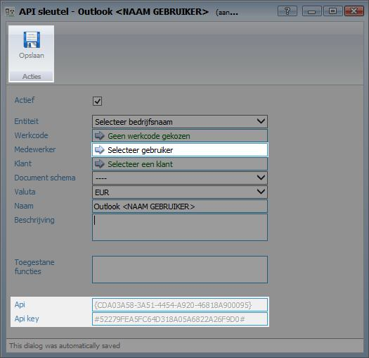

<properties>
	<page>
		<title>Outlook Add-in installeren</title>
	</page>
	<menu>
		<position>Modules N - Z / Outlook Add-in </position> 
		<title>Outlook Add-in installeren</title>
	</menu>
</properties>

# Outlook ADD-in #

Door middel van de Outlook ADD-in krijg je de mogelijkheid om e-mails vanuit Microsoft Outlook mailbox om te zetten in tickets. Op deze manier kan je je mailbox leeg houden en sla je e-mails netjes op bij de juiste relaties en/ of projecten.

## Downloaden van de Outlook ADD-in ##

De outlook ADD-in kan je [hier](http://hybridsaas.com/support) downloaden.

## ADD-in installeren ##

Nadat de download is voltooid dient deze geïnstalleerd te worden. Hiervoor klik je op het bestand wat zojuist is gedownload. 

Afhankelijk van de internetbrowser waarin het bestand is gedownload verschijnt deze onderin de taakbalk van de browser. Indien deze niet wordt weergegeven open dan de map "downloads" op je pc. 

Indien er bij het installeren een foutmelding verschijnt, dient de installatie als "administrator" uitgevoerd te worden. Klik hiervoor met de rechtermuisknop op het "setup.exe" bestand en kies voor de optie: "Uitvoeren als administrator". 

## ADD-in instellen ##

Om de ADD-in te activeren in je mailbox dienen er instellingen gewijzigd te worden. Indien Microsoft Outlook nog actief is dient deze eerst afgesloten en opnieuw opgestart te worden.

Afhankelijk van je Outlook versie verschijnt erboven in de taakbalk de optie "invoegtoepassingen". Klik vervolgens op "Instellingen"

Verschijnt deze niet? Kan dan op [deze](https://support.office.com/nl-nl/article/Invoegtoepassingen-in-of-uitschakelen-in-Office-programma-s-3e533d0f-a6cf-44b7-b6b4-3d9185b5e025#bm9) website hoe je deze kunt activeren.

Vul bij de gegevens in. API URL: https://**BEDRIJFSNAAM**.hybridsaas.com (vul op de plaats van "bedrijfsnaam" je bedrijfsnaam in) en geef de API ID en API KEY in.

API ID en API KEY kunnen worden aangemaakt in Hybrid SaaS. Zie de onderstaande beschrijving hoe je deze aanmaakt.

## API-sleutel aanmaken ##

Zoek in Hybrid SaaS naar "API-sleutels" 

Klik op toevoegen om een nieuwe sleutel aan te maken. 

Voor iedere gebruiker (medewerker) dient een aparte sleutel aangemaakt te worden.

Selecteer bij "Medewerker" de juiste gebruiker. Geef de sleutel een naam door bij "Naam" een naam in te geven.

Klik eenmaal op "Opslaan" zodat de API-gegevens worden aangemaakt.

----------

