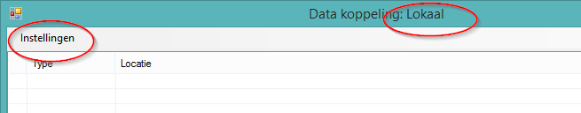
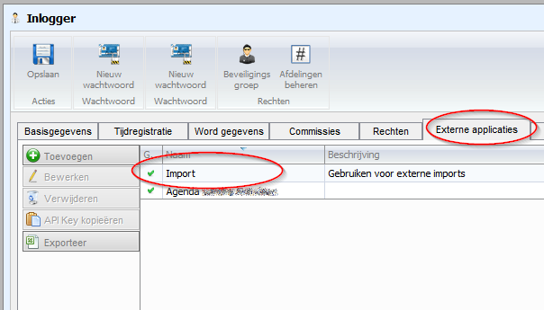
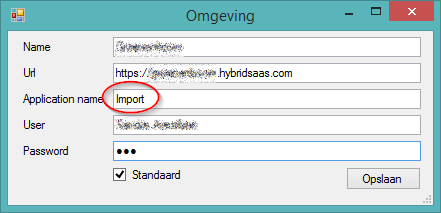
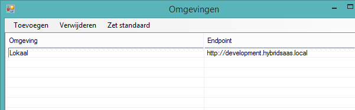
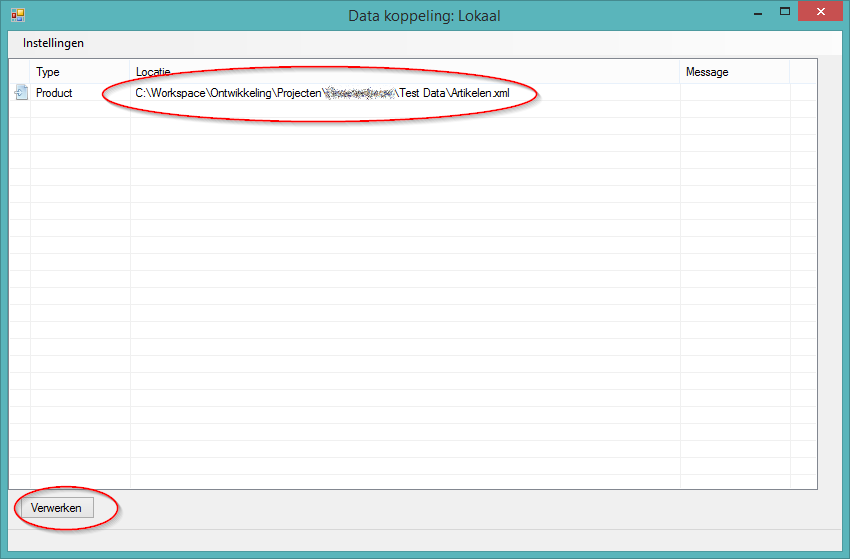
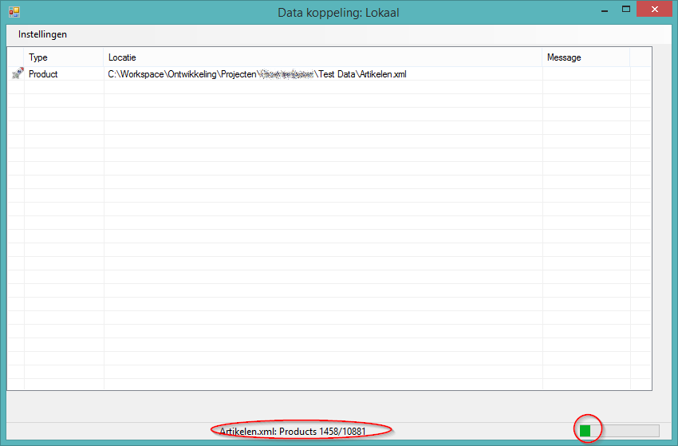
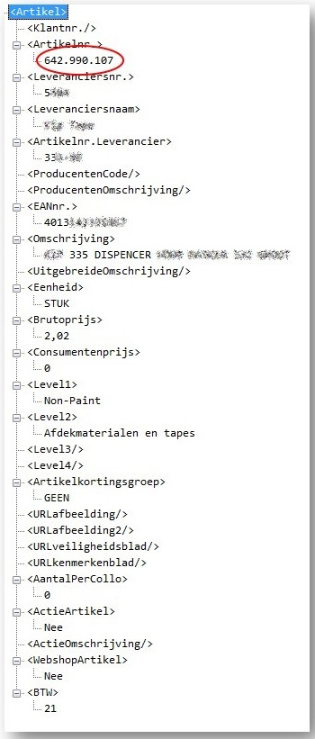
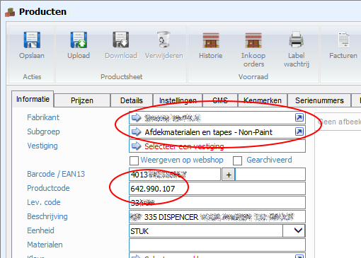
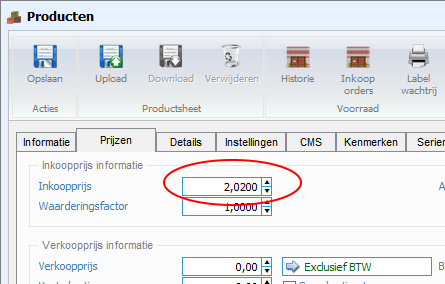

<properties>
	<page>
		<title>Importeren</title>
		<description>Importeren</description>
	</page>
	<menu>
		<position>Modules N - Z / Productenbeheer / Importeren</position>
		<title>via Externe Applicatie </title>
		<sort>D</sort>
	</menu>
</properties>

# Producten Importeren #

Doormiddel van een externe applicatie kunnen er producten worden ingelezen in Hybrid SaaS van een bepaalde leverancier

### De Applicatie ###

In de applicatie kan de instelling van de omgeving worden ingesteld. In het hoofdscherm is er zichtbaar welke omgeving actief is.

 
 ### De gebruiker ###

Deze omgeving is gekoppeld aan een gebruiker (met wachtwoord) en een externe applicatie. 

### Gekoppeld aan de omgeving ###

De omgeving is gekoppeld met de gegevens van de gebruiker

### Gegevens ophalen ###

De bestanden kunnen worden opgehaald van de computer 

Na het kiezen voor verwerken zullen de producten worden geïmporteerd

Tijdens het laden kan je de voortang zien recht onderin

### Producten ###

Na verwerken zijn de producten aangemaakt 

 
Hier word een voorbeeld van een artikel getoond

Het product is nu toegevoegd in Hybrid SaaS met de volgende eigenschappen:

----------

