<properties>
	<page>
		<title>uitleg</title>
		<description>Uitleg</description>
	</page>
	<menu>
		<position>Modules N - Z/ Projectbeheer</position>
		<title>Project marge informatie</title>
	</menu>
</properties>

# Project marge informatie #

Deze rubriek zal meer duidelijkheid geven over hoe de waarde word opgebouwd in de projectkaart onder de tabbel Marge informatie.

## Begin bedrag van €20.000,00 ##

Er is een offerte aangemaakt van € 20.000,00 en deze is omgezet naar een prject.
Het projectwaarde heeft hierdoor een waarde van € 20.000,00

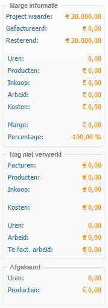

## Tijdregistratie's nog niet goedgekeurd ##

Er zijn 5 lossen tijdregistraties op dit project gemaakt met als uurtarief van €10,00 en een intern uurtarief van €5,00

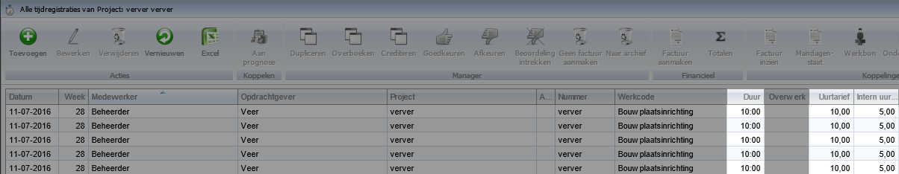

De uren zijn nog niet goedgekeurd

**Nog niet verwerkt**

- Uren: 50 (5 registratie's a 10 uur)
- Arbeid: €250,00 (50 uur a €5 intern uurtarief)
- Te fact. arbeid: €500,00 (50 uur a €10 uurtarief)

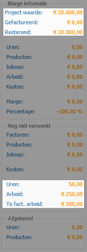

## Werkbon aanmaken nog niet goedgekeurd ##

Er is een werkbon gemaakt met daarin een tijdregistratie van 15 uur met als uurtarief €10,00 en een intern uurtarief van €5,00

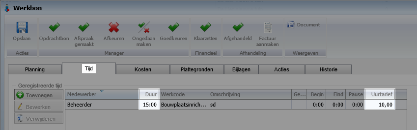

Ook zijn er kosten gemaakt op de werkbon 1 product van €15,00 excl btw

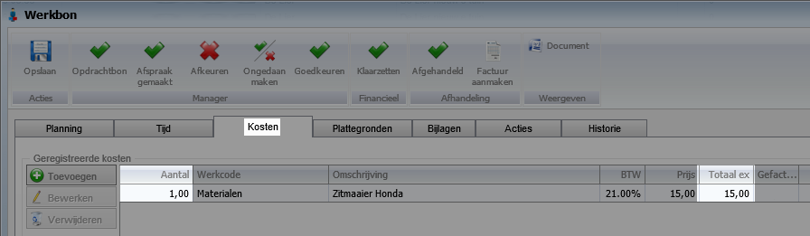

De werkbon is nog niet goedgekeurd

**Nog niet verwerkt**

- Uren: 65 (5 registratie's a 10 uur en 1 registratie van 15 uur)
- Arbeid: €325,00 (65 uur a €5 intern uurtarief)
- Te fact. arbeid: €650,00 (65 uur a €10 uurtarief)

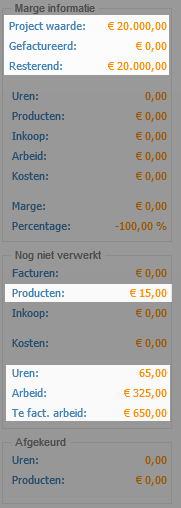

## Werkbon goedkeuren maar nog niet factureren ##

De werkbon is goedgekeurd tot de laatste stap maar nog niet gefactureerd. Hierdoor is 1 tijdregistatie goedgekeurd en mag het product gefactureerd gaan worden.

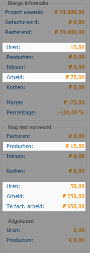

De werkbon is goedgekeurd maar er is nog geen factuur van gemaakt

**Marge informatie**

- Uren: 15 (1 registratie van 15 uur)
- Arbeid: €75,00 (15 uur a €5 intern uurtarief)

**Nog niet verwerkt**

- Uren: 50 (5 registratie's a 10 uur)
- Arbeid: €250,00 (50 uur a €5 intern uurtarief)
- Te fact. arbeid: €650,00 (65 uur a €10 uurtarief)

## De factuur van de werkbon nog niet verstuurd ##

Er is nu een factuur aangemaakt van de werkbon. Deze is nog niet goedgekeurd en nog niet als verzonden genoteerd.

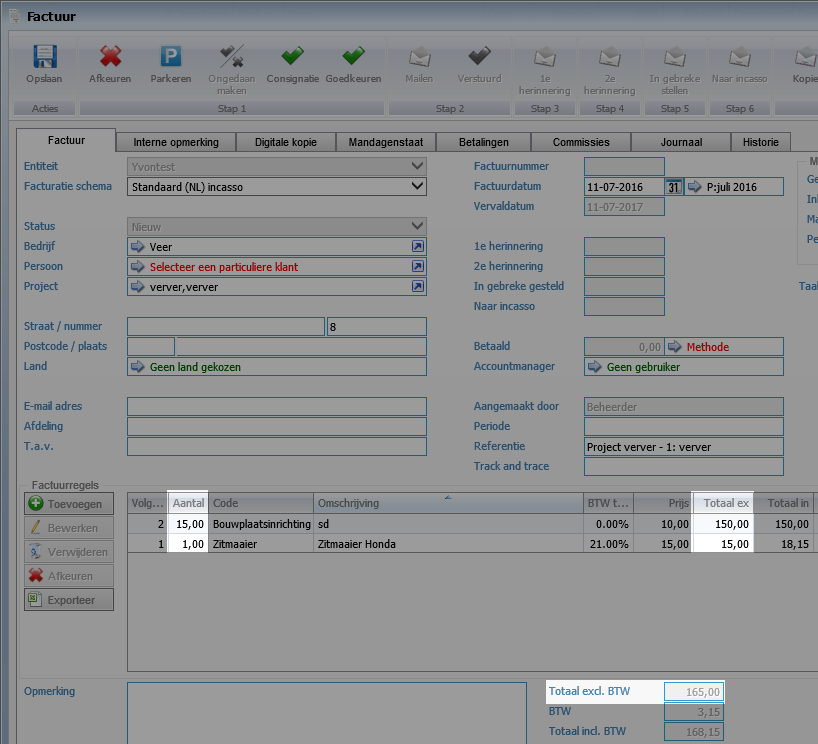

De tijdregistratie en de kosten van de werkbon worden nu gefactureerd

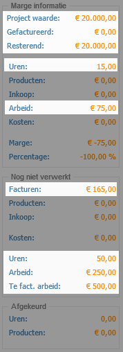

**Marge informatie**

- Uren: 15 (1 registratie van 15 uur)
- Arbeid: €75,00 (15 uur a €5 intern uurtarief)

**Nog niet verwerkt**

- Facturen: €165,00 (het totaalbedrag van de **nieuwe** factuur excl. btw)
- Uren: 50 (5 registratie's a 10 uur)
- Arbeid: €250,00 (50 uur a €5 intern uurtarief)
- Te fact. arbeid: €500,00 (50 uur a €10 uurtarief)

## De factuur van de werkbon status verstuurd ##

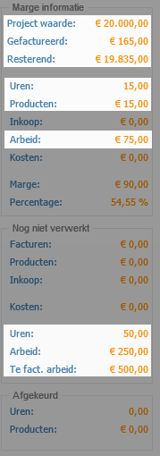

De status van de factuur is nu verstuurd, nu heeft het de waarde van gefactureerd (het is verstuurd naar de klant)

**Marge informatie**

- Gefactureerd: €165,00 (totaal van verzonden facturen)
- Resterend: €1.9835,00 (Projectwaarde minus gefactureerd)

**Marge informatie**

- Uren: 15 (1 registratie van 15 uur)
- Producten: €15,00 (Het product van de werkbon)
- Arbeid: €75,00 (15 uur a €5 intern uurtarief)

**Nog niet verwerkt**

- Uren: 50 (5 registratie's a 10 uur)
- Arbeid: €250,00 (50 uur a €5 intern uurtarief)
- Te fact. arbeid: €500,00 (50 uur a €10 uurtarief)

## De losse uren goedkeuren ##

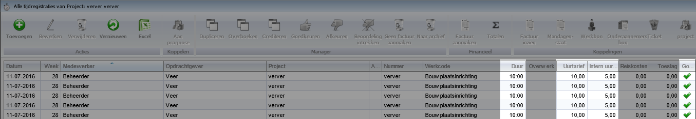

De tijdregistratie zijn goedgekeurd maar nog niet doorgezet als factuur

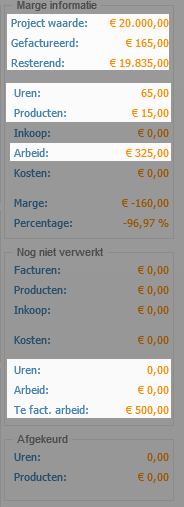

**Marge informatie**

- Gefactureerd: €165,00 (totaal van verzonden facturen)
- Resterend: €1.9835,00 (Projectwaarde minus gefactureerd)

**Marge informatie**

- Uren: 65 (5 registratie's a 10 uur en 1 registratie van 15 uur)
- Producten: €15,00 (Het product van de werkbon)
- Arbeid: €325,00 (65 uur a €5 intern uurtarief)

**Nog niet verwerkt**

- Uren: 0,00 (er zijn geen nog goed te keuren tijdregistaties)
- Arbeid: 0,00 (er zijn geen nog goed te keuren tijdregistaties)
- Te fact. arbeid: €500,00 (50 uur a €10 uurtarief)

## De losse uren doorzetten tot factuur ##

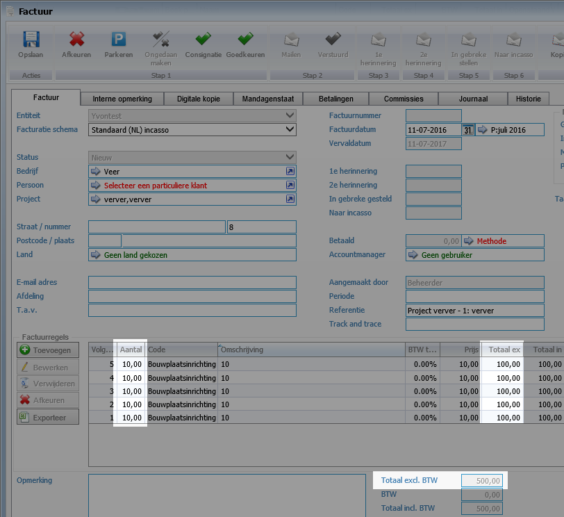

De tijdregistraties zijn verwerkt en hiervan is een factuur gemaakt maar heeft nog niet de status verzonden

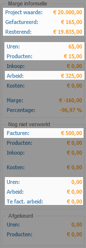

**Marge informatie**

- Gefactureerd: €165,00 (totaal van verzonden facturen)
- Resterend: €1.9835,00 (Projectwaarde minus gefactureerd)

**Marge informatie**

- Uren: 65 (5 registratie's a 10 uur en 1 registratie van 15 uur)
- Producten: €15,00 (Het product van de werkbon)
- Arbeid: €325,00 (65 uur a €5 intern uurtarief)

**Nog niet verwerkt**

- Facturen: €500,00 (het totaalbedrag van de **nieuwe** factuur excl. btw)
- Uren: 0,00 (er zijn geen nog goed te keuren tijdregistaties)
- Arbeid: 0,00 (er zijn geen nog goed te keuren tijdregistaties)
- Te fact. arbeid: 0,00 (er zijn geen nog goed te keuren tijdregistaties)

## Factuur status verstuurd  ##

Alle facturen hebben de status verstuurd en alle tijdregistraties zijn verwerkt

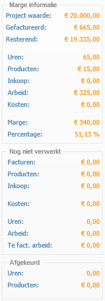

**Marge informatie**

- Gefactureerd: €665,00 (totaal van verzonden facturen)
- Resterend: €1.9335,00 (Projectwaarde minus gefactureerd)

**Marge informatie**

- Uren: 65 (5 registratie's a 10 uur en 1 registratie van 15 uur)
- Producten: €15,00 (Het product van de werkbon)
- Arbeid: €325,00 (65 uur a €5 intern uurtarief)

De informatie bij marge infomratie is verwerkt in het stukje van gefactureerd en resterend

**Nog niet verwerkt**

- Facturen: 0,00 (er zijn geen nog goed te keuren facturen)
- Uren: 0,00 (er zijn geen nog goed te keuren tijdregistaties)
- Arbeid: 0,00 (er zijn geen nog goed te keuren tijdregistaties)
- Te fact. arbeid: 0,00 (er zijn geen nog goed te keuren tijdregistaties)

-------

