<properties>
	<page>
		<title>Overwerk</title>
		<description>Overwerk</description>
	</page>
	<menu>
		<position>Modules N - Z / Tijdregistratie</position>
		<title>Overwerk</title>
	</menu>
</properties>

## Overwerk ##

*In dit voorbeeld gebruiken we de gegevens van werkdagen van maandag t/m vrijdag, met een totaal aantal uur per dag van 7.40 met een pauze van 1 uur*

Een Rooster aanmaken (via de startknop roosters)
Geef een naam in en druk op de knop genereer data:

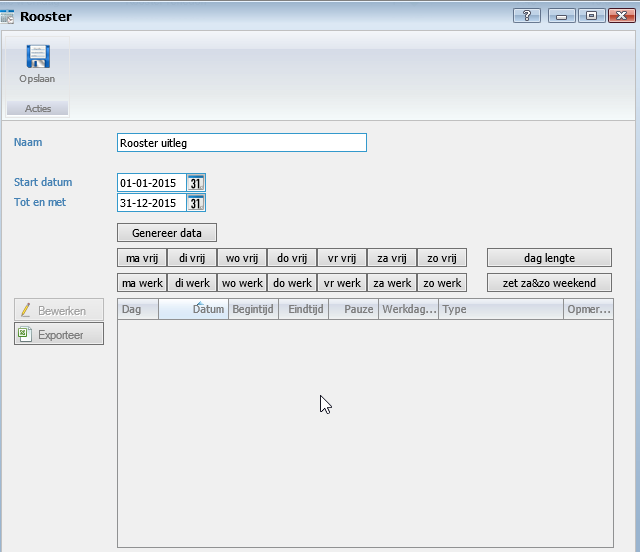

Resultaat:

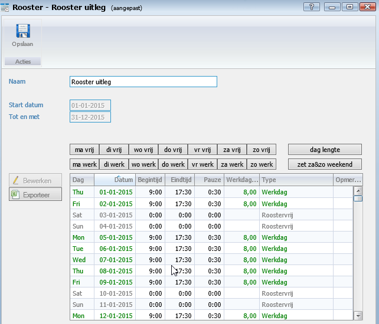

Stel nu de juiste daglente in als deze afwijkt van 8 uur. Knop dag lengte

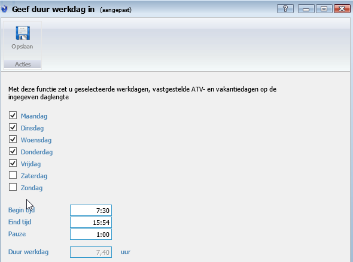

Maandag t/m vrijdag wordt gewerkt. 7.40 uur per dag en 1 uur pauze word de eindtijd 15.54 is.
Sla deze gegevens op.
 
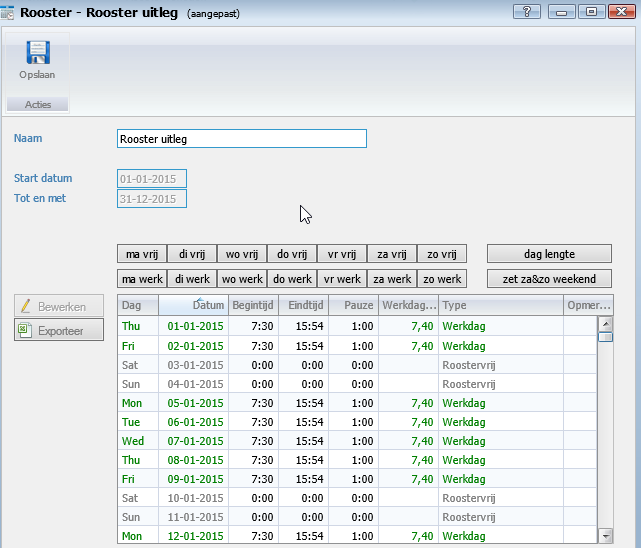

Koppel dit rooster aan de medewerker.
Ga naar medewerkers en dan naar tabblad Verlof
Met de knop toevoegen kan je een rooster selecteren. En sla deze op.

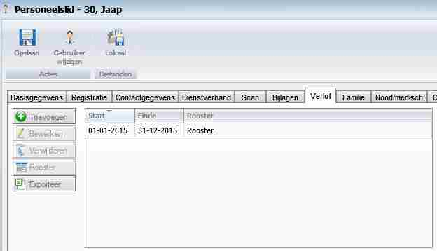

**Overwerk**

Een overwerk schema aanmaken (via de startknop Overwerk schema's)
Hierin leg je vast hoe de verdeling van uren op bepaalde dagen plaats gaat vinden.

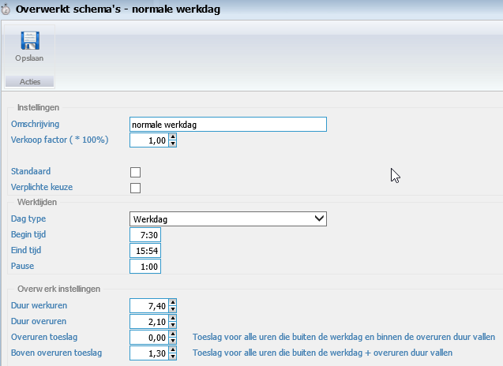

Kies een naam, zoals normale werkdag, weekenddag, feestdag, schooldag, etc.  Je voert hier in wat hoe er gewerkt wordt en wanneer er een toeslag plaatsvindt. In dit voorbeeld : Duur werkuren 7.40; gewone uren. Duur overuren 2.10; uren die binnen normaal overwerk vallen, in dit geval zonder extra toeslag (Overuren toeslag). Alles wat hierboven (9.50 uur ) gewerkt wordt krijgt een toeslag van 1.30 per uur.

Zet bij de gebruiker een vinkje aan die er voor zorgt dat er toeslagen en overuren worden verwerkt
(via de startknop Gebruikers wijzigen, tabblad Tijdregistratie).

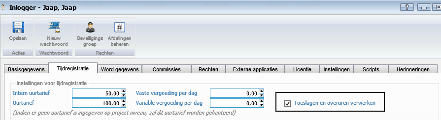

Nu kan je werkbonnen invoeren en goedkeuren.

Deze komen dan in het bakje: Te controleren over uren en toeslagen

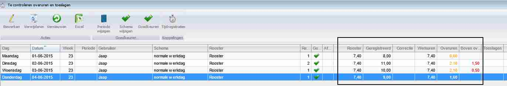

Alles selecteren en dan kan je ze met de knop goedkeuren allemaal goedkeuren (je kan eventueel nog het schema wijzigen van een bepaalde registratie) 

Ze komen nu in het bakje : Gecontroleerde overuren en toeslagen, hierin kan je ze totaliseren

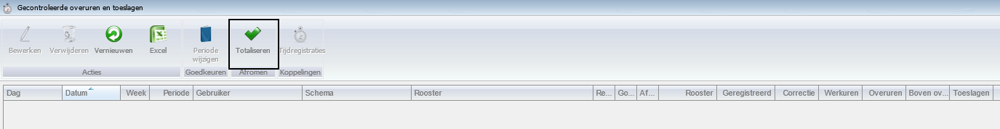

Nu staan ze in het bakje: Totaal van overuren en toeslagen – te controleren
 
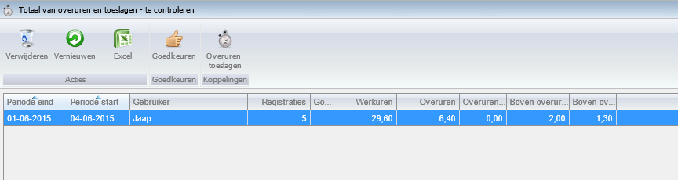

**Crediteren van een tijdregistratie.**

Bij alle tijdregistraties kan je een registratie crediteren

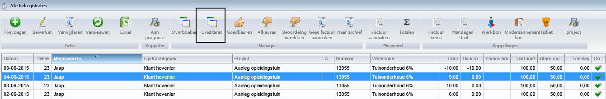

Na het crediteren komen ze weer te staan bij: Te controleren overuren en toeslagen.
Nu kan je deze registratie op de zelfde manier weer goedkeuren.

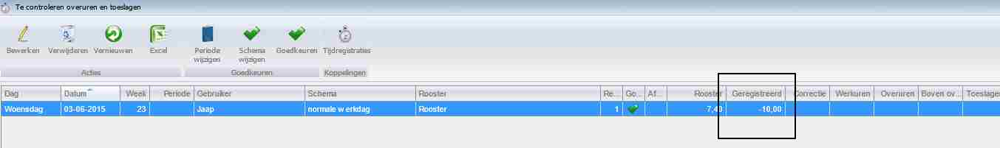

Resultaat is zichtbaar in het bakje: Totaal van overuren en toeslagen – verwerkt.

* Het aantal registratie is omhoog (was 5 is nu 6 ; plus 1)
* Het aantal werkuren is omlaag (was 29.6 is nu 22.2 ; min 7.40)
* Het aantal overuren is omlaag (was  6.40 is nu 4.30 ; min 2.10 )
* Het aantal boven overuren is omlaag (was 2.00 is nu 1.30 ; min 0.30)

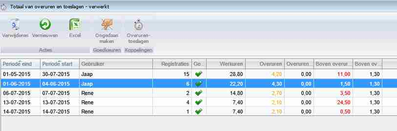

Met de knop Overurentoeslag kan je naar de registraties per datum

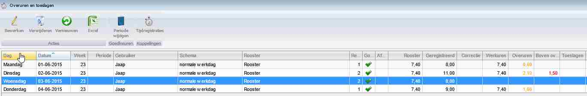

Je ziet op datum 03-06-2015 nu geregistreerd 0, dit komt door de creditering.
Door op de knop Tijdregistratie te drukken krijg je deze registraties te zien.

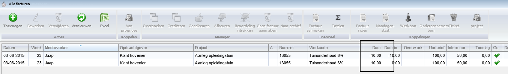

Om de dagstaten in het menu te activeren moet je het recht :** menuoverwerk schemas** beheren aan zetten.

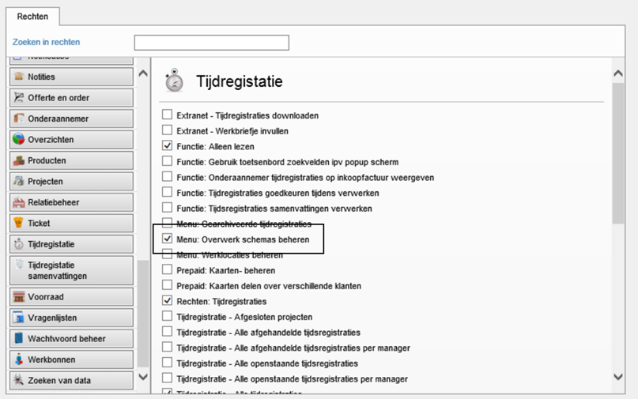

het resultaat is dan:

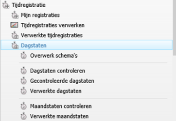
--------------

