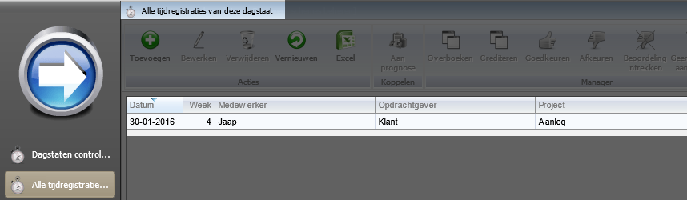

<properties>
	<page>
		<title>uren-per-medewerker-per-dag</title>
		<description>Verwerking verschillende overuren</description>
	</page>
	<menu>
		<position>Modules N - Z / Tijdregistratie</position>
		<title>Uren per medewerker per dag</title>
	</menu>
</properties>

## Uren per medewerker per dag ##

Per medewerker per dag kunnen inzien waar ze gewerkt hebben en hoeveel uur

Met het bakje **dagstaten controleren** kan je per dag de medewerkers zijn, met de geregistreerde tijd.

In dit scherm kan de rijen sorteren op datum, als je je ziet dan op datum/medewerker hoeveel uur er geregistreerd is. 

In het voorbeeld zie je dat Jaap op 30-01-2016 6 uur heeft geregistreerd. 

Dit heeft hij gedaan d.m.v. 1 registratie.

Als je de registratie wilt inzien dan selecteer je de rij (deze kleurt dan blauw) en dan druk je op de knop **Tijdregistraties**.

Knop tijdregistraties geeft onderstaand scherm:
Door op een registratie dubbel te klikken kom je in de registratie en dan kan je zien wat er gebeurd is.
 

Voorbeeld van de registratie: 
 

--------------

