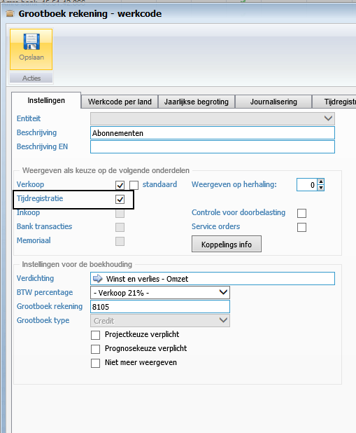
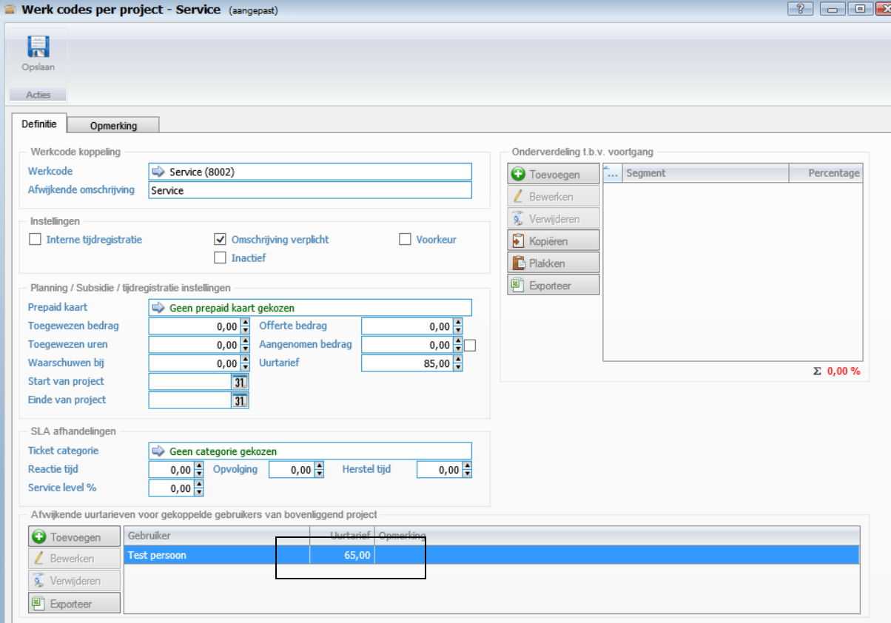
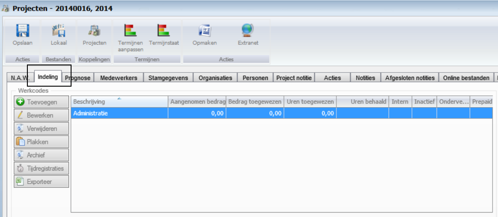
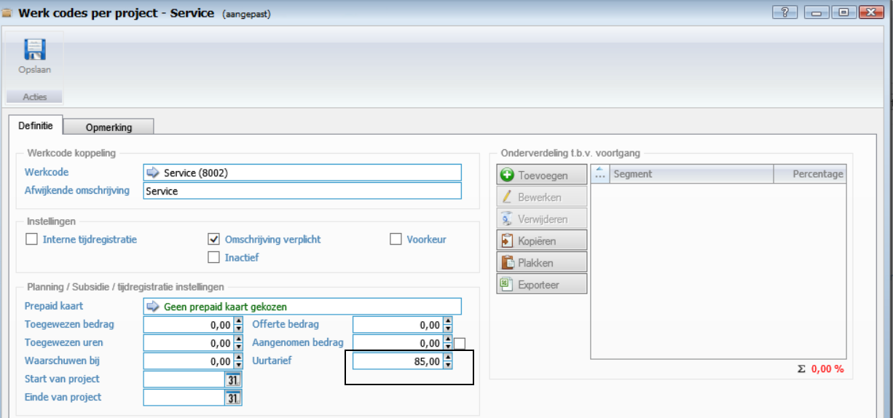
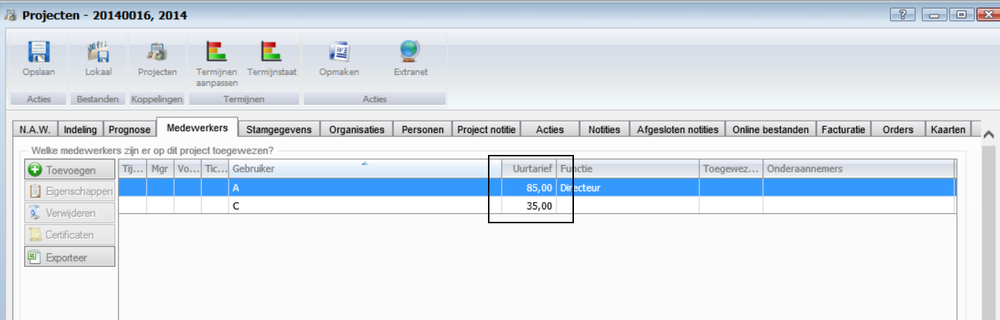
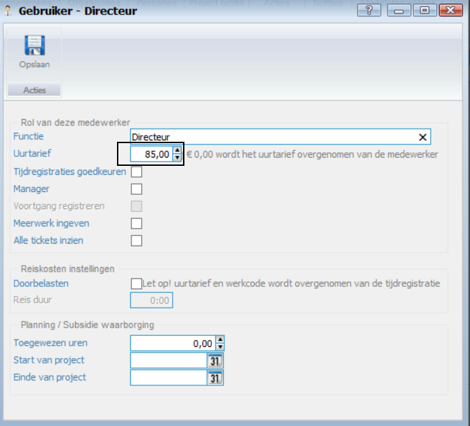
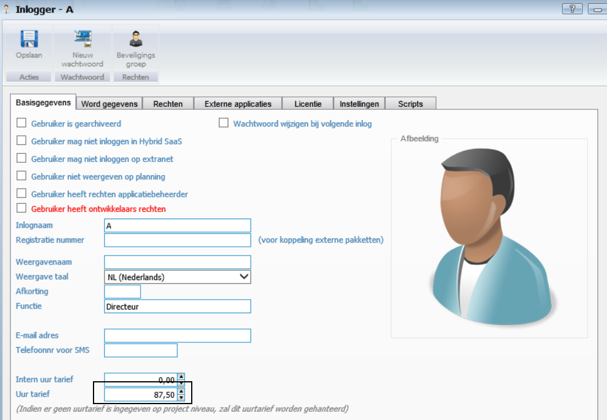

<properties>
	<page>
		<title>uurtarief-gebruiker</title>
		<description>uurtarief-gebruiker</description>
	</page>
	<menu>
		<position>Modules N - Z / Tijdregistratie</position>
		<title>Uurtarief gebruiker</title>
	</menu>
</properties>

## Uurtarief gebruiker instellen ##

Je kan op 4 manieren het uurtarief invullen voor een gebruiker.

* Niveau 1: Via de gebruiker op de projectkaart op de werkcode.
* Niveau 2: Via de projectkaart op de werkcode.
* Niveau 3: Via de gebruiker op de projectkaart.
* Niveau 4: Via de gebruiker op de gebruikerskaart.

Voor alle niveau dien je op de werkcode het vinkje van tijdregistratie aan te zetten

**Niveau 4 (laagste niveau)**

Afwijking uurtarief voor gekoppelde gebruikers van bovenliggend project

**Niveau 3**

Uur tarief Planning / subsidie / tijdregistratie instellingen op de werkcode van het project
Uur tarief op indeling werkcode van het project.

**Niveau 2**

Tarief van de toegewezen medewerker op het project

**Niveau 1** 

Uur tarief dat op de gebruikers kaart is ingegeven.
 

--------------

