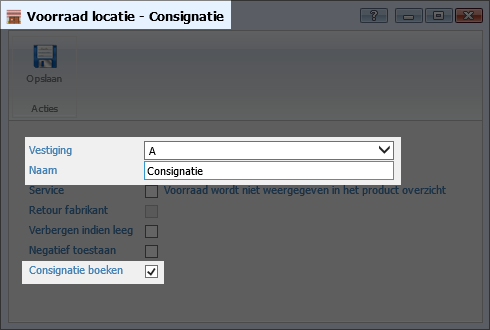
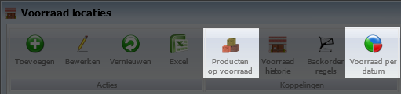
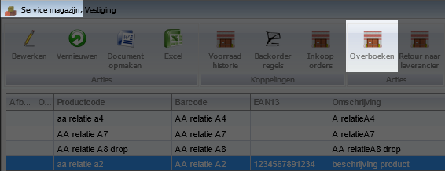
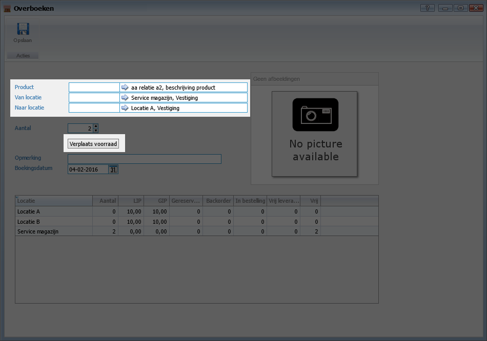
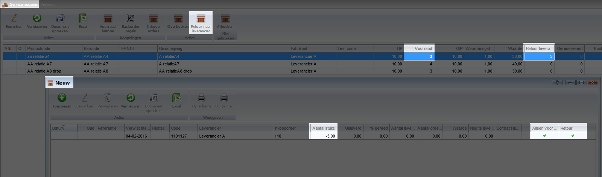
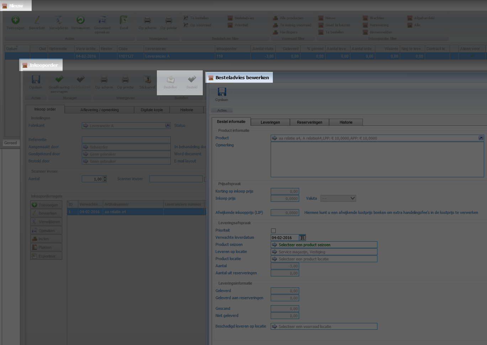
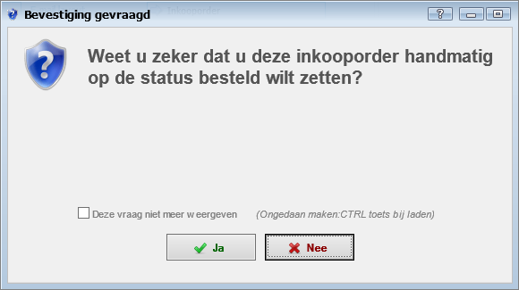

<properties>
	<page>
		<title>Vooraad consignatie</title>
		<description>vooraad-consignatie</description>
	</page>
	<menu>
		<position>Modules N - Z / Voorraadbeheer</position>
		<title>Vooraad consignatie</title>
		<sort>a</sort>
	</menu>
</properties>

# Werking consignatie facturen en voorraad #

De consignatie facturen wordt nu als voorraad geboekt, op dit te activeren dien je een magazijn aan voor de consignatie

 

Als je op opslaan klikt zal het systeem de huidige consignatie stand gaan op boeken in het magazijn, de factuurdatum wordt als boekdatum aangehouden, **Let op! Dit kan even duren!**

Dit is een eenmalige actie en kan niet meer ongedaan worden gemaakt. Bij het retour boeken of facturen van een consignatie factuur zal de voorraad worden afgeboekt.

Via de voorraad locaties heb je direct inzage in de huidige voorraad via **producten op voorraad**, ook kun je de stand per 31-12 opvragen via de **rapportage knop Voorraad per datum**.

  

Indien je in een service magazijn zit kun je direct een aantal voorraad acties uitvoeren, 

  

Overboeken naar een andere locatie, systeem houdt rekening gereserveerde voorraad.

  

Direct afboeken naar 0, dit is voor handig voor de prullenbak, (werkt alleen in service en retour leverancier magazijnen) **let wel op afboeken gaat wel heel erg makkelijk!**

Retour naar leverancier boeken, (werkt alleen in service en retour leverancier magazijnen) 
Maakt direct een inkoopfactuur aan, je ziet in het voorraad overzicht hoeveel je er al retour hebt gezet.

  

Indien een artikel 2 leveranciers heeft dan komt het bij het besteladvies te staan, je zult het dan handmatig moeten aanpassen voor die regels.

Een artikel gaat tegen 0 euro in de inkooporder.

  

Indien je de knop besteld hebt gebruikt worden de goederen afgeboekt en is de inkooporder direct afgehandeld, je hoeft dit dus niet meer binnen te melden (je stuurt het immers weg).
Zendingen voor de inkoop kunnen niet worden gecombineerd met retour zendingen.

  

De template geeft ook de negatieve aantallen weer.

----------

