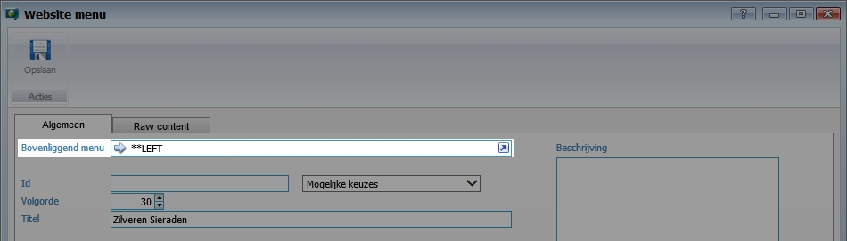
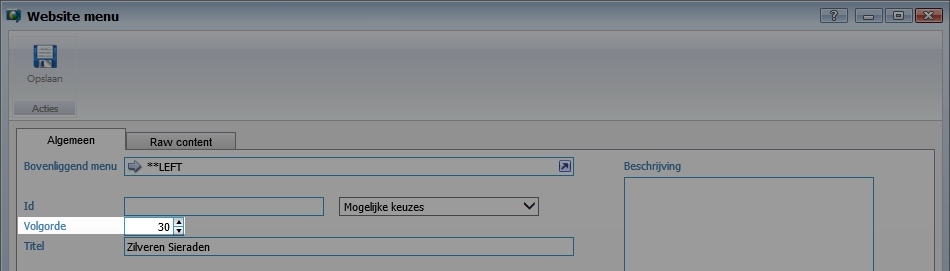
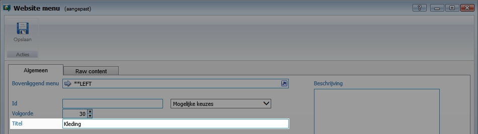
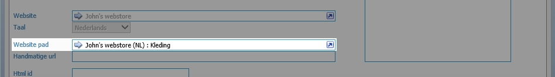
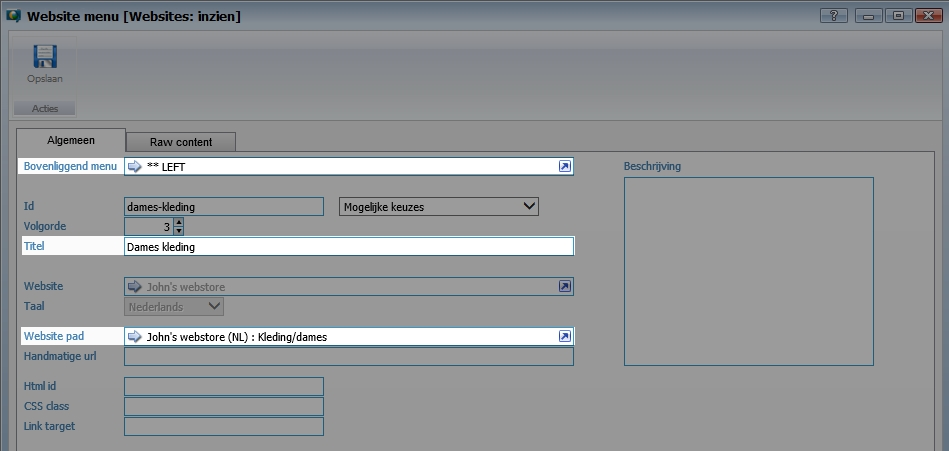

<properties>
	<page>
		<title>Menu items</title>
		<description>Menu items</description>
		<context>Menuitem</context>
	</page>
	<menu>
		<position>Modules N - Z / Webshop</position>
		<title>Menu items</title>
		<sort>f</sort>
	</menu>
</properties>

# Menu #

In deze rubriek zal worden beschreven hoe navigatie menu’s worden aangemaakt. Afhankelijk van de website kunnen de menu’s op verschillende plaatsen worden weergegeven (bijv. links, boven en beneden).

## Introductie menu items ##

Het idee bij het aanleggen van een menu is dat van groot naar klein wordt gedacht. Bijvoorbeeld: 
- Menu Links
	- Kleding
		- Dames
			- Broek
				- Spijkerbroek

Als we bovenstaande in een URL zouden weergeven zit het er als volgt uit:
www.voorbeeldsite.nl/kleding/dames/broek/spijkerbroek

Dit voorbeeld zullen wij gebruiken gedurende deze handleiding.

## Menu-item aanmaken ##

Het is de bedoeling dat ieder menu item gekoppeld wordt aan het bovenliggende item.

Ga naar **Website menu's**

Klik op **Toevoegen** om een menu item aan te maken.

Maak het hoogste menu-item aan (bijv. kleding)

Selecteer het bovenliggende menu (LEFT, TOP, BUTTOM)

Geef met een nummer de volgorde aan. Met de volgorde wordt bepaald op welke plaats het menu item wordt weergegeven.

Indien er geen getal wordt ingevuld zal de sortering op alfabetische plaatsvinden.

Vul de naam van het menu-item in (bijv. kleding)

Selecteer het website pad. Het website pad is de locatie waar het menu item naar toe verwijst.

Het is raadzaam om de paden en menu-items zo veel mogelijk het hetzelfde te houden en dezelfde termen te gebruiken.

Voor meer informatie raadpleeg de rubriek website pad.

### volgend Menu-item aanmaken ###

Herhaal de hierboven genoemde stappen met de onderliggende menu.

Op basis van het eerdergenoemde voorbeeld zal het volgende menu item er als volgt uit komen te zien.

